# UI 레퍼런스 — 목표 레이아웃

레퍼런스 게임(햄지·매옹이 계열 방치형 RPG) 스크린샷 22장을 화면별로 정리한 문서입니다.
**이 문서의 레이아웃이 목표이며, 현재 `index.html`의 UI는 이 방향으로 교체합니다.**

- 화면 이름은 **기획에서 지정한 명칭**을 사용 (모달 안에 찍힌 제목과 다를 수 있음 — 목차 참고)
- **앱 프레임 `1080×2280` (9:19)로 확정** (2026-08-25 변경. 레퍼런스 캡처 1080×2340 의 상단 84px 은 상태바이므로 **프레임 y = 레퍼런스 y − 84**, 가로 1:1. 9:16 등 짧은 기기는 전투 캔버스만 줄어듦)
- 따라서 **스크린샷에서 잰 좌표·크기·폰트·여백을 변환 없이 그대로 사용**한다 (1:1 대응)
- `#app`은 고정 프레임을 `transform: scale()`로 화면에 맞추는 구조라 내부 좌표계를 키워도 표시 크기는 동일
- **스크린샷 원본은 `docs/ref/` 에 번호순으로 들어 있습니다** (`01-오프라인보상-팝업.jpg` …). 각 항목 제목 아래에 첨부되어 있으니 작업 세션에서 바로 열어 보면 됩니다
- 작업 지시는 **번호로** 하면 됩니다 — 예: “UI-REFERENCE.md 10번대로 상점 소환 탭 다시 만들어줘”

### 설계 확정 (2026-08-24) — 레퍼런스와 다르게 가는 것

레퍼런스 게임은 **캐릭터 2명(햄지·매옹이)을 한 번에 키우는** 구조지만, 우리 게임은 다음으로 확정한다.
아래 항목은 화면별 절과 24번 체크리스트에도 반영돼 있다.

1. **캐릭터는 «용사» 1명.** 햄지·매옹이 2명 구조를 따르지 않는다. 06 장비 팝업의 캐릭터 카드는
   **1개**(이름 리본 `용사`)로 하고, 훈련·스탯·퀘스트 등에서 «햄지 공격력 / 매옹이 공격력» 처럼
   캐릭터별로 갈라진 항목은 전부 **단일 «공격력»** 으로 합친다.
2. **장비 부위는 3종 — 무기 · 방패 · 목걸이.** 부위 슬롯은 2칸(무기/방어구)이 아니라 **3칸**이다.
   레퍼런스의 잠금 슬롯 행(반지·목걸이·탈것)은 폐기한다(목걸이는 정식 부위로 승격, **반지·탈것 없음** — 2026-08-25 재확인).
3. **하단 탭 «모험» 은 없애고 그 자리를 «던전» 으로.** 탭 라벨을 `던전` 으로 바꾸고, 탭을 누르면
   중간 화면 없이 **03 던전 팝업(페이지)이 바로 열린다.**
4. **영웅 서브탭 «동료» 는 잠금이 아니라 정식 화면.** UI 는 **07 스킬 팝업과 같은 구조**를 그대로 쓰되
   **장착 슬롯만 8칸 → 3칸**이다. 스펙은 **26번** 참고.
5. **하단 탭 «성장» 은 «훈련» 으로.** 탭 라벨을 `훈련` 으로 바꾸고, 탭을 누르면 중간 화면 없이
   **23번 훈련 팝업이 바로 열린다** — 레퍼런스 23 이미지 나온 그대로 구현한다. **⚑ 최우선 순위 작업이다**(작업 단위 23).
6. **보스전 규칙 (2026-08-25 확정 — 작업 28, 레퍼런스 39·40번).**
   - 보스는 **공격력·체력 모두 일반 몬스터(좀비 기준) ×22** (기존 코드의 dmg ×3.0 을 ×22 로 변경).
   - **보스전에는 보스만 스폰된다** — 일반 몹이 같이 나오지 않는다 (39번 이미지).
   - **제한 시간 30초** — 전투 중 스테이지 헤더에 ⏱ 남은 시간 표시(02 ② 도전 모드 타이머 규격).
   - **지면(사망 또는 시간 초과) 스테이지를 되돌리지 않는다.** 그 스테이지에 **맴돌며 일반 몹을 계속
     잡는(파밍) 상태**로 전환되고, 스테이지 헤더 **아래에 «재도전» 버튼**이 뜬다 (40번 이미지).
   - «재도전» 을 누르면 보스전 재시작. **보스를 클리어하면 원래대로 자동 진행(다음 스테이지로 미는 형태)이
     재개된다.**
7. **룰렛은 «원판» 이다.** 지금의 8칸 그리드 하이라이트 방식이 아니라, **실제로 회전하는 원판 휠**
   (세그먼트 8칸 + 상단 고정 포인터, 돌리기 → 감속 → 포인터가 가리킨 칸 당첨)로 바꾼다.
   **인터넷의 오픈소스 스피너 휠 코드를 가져와도 된다** — 단 `index.html` 에 인라인으로 포함(외부 CDN 요청 금지)하고,
   세그먼트 아트·텍스트만 우리 보상 8종(`ROULETTE` 배열)으로 교체한다. 보상·확률·횟수(하루 5회)는 기존 로직 그대로.
8. ~~**03 던전 팝업·14 보물상자 팝업의 상단 골드·다이아는 «팝업 자체에 포함된» 재화 바다**~~ (2026-08-25, 작업 41)
   → **완료(2026-08-24, sess-2113-22980).** 공용 컴포넌트 `.pcb` 로 신설 — 03·14 의 바는 레퍼런스에서 **픽셀 동일**이라
   하나를 두 페이지가 같이 쓴다. 메인 HUD 와 다른 점: 프로필 플레이트 없음 · 본체 **하드 2단 톤** · 알약 **254×49**(HUD 211×48).
   측정표 `docs/measure/41-팝업내장재화바.md` · 기록 `docs/review/41-팝업내장재화바.md` (비평 ①~④ 최저 **E 10 / F 8** 통과).
9. **전투 화면 터치 시 가상 조이스틱으로 캐릭터 이동 조절** (2026-08-25, 작업 42). 현재는 완전 자동 이동뿐이다.
   - **전투 캔버스 영역**을 누르면(pointerdown) **그 자리에 플로팅 조이스틱**(반투명 베이스 원 + 노브)이 뜬다.
     HUD·사이드 아이콘·탭바·열린 팝업 위를 누를 때는 뜨지 않는다(캔버스 직접 터치만).
   - 누른 채 드래그하면 노브가 따라오고(베이스 반경 안으로 clamp), **노브 방향·거리로 캐릭터 이동 벡터를 직접 제어**한다
     — 이 동안 자동 카이팅(적과 거리 유지·접근/후퇴) 로직은 꺼지고, 벽 경계 clamp 만 유지. 데드존은 베이스 반경의 15%.
   - 손을 떼면(pointerup/cancel) 조이스틱이 사라지고 **자동 이동으로 즉시 복귀**한다.
   - 공격·스킬 자동 발동과 조준(가장 가까운 적)은 수동 이동 중에도 그대로 동작한다. 이동 속도는 `stat.speed` 그대로.
   - 레퍼런스 이미지 없음 — 일반 모바일 게임 관례대로(베이스 Ø약 220px·노브 Ø약 100px, 흰색 반투명 15~35%).
     기계적 작업이므로 비평 루프 없이 [3]-(가) 검증(헤드리스에서 pointer 이벤트 합성 → 이동 벡터 반영·복귀 확인).
10. ~~**상점 재화 탭에 다이아 판매 + 마일리지** (2026-08-25, 작업 44). 1만/1,000원 · 7만/5,000원 · 15만/11,000원 ·
    90만/55,000원(쿠폰+1) · 200만/110,000원(쿠폰+2). **마일리지 쿠폰 10개 → 다이아 500만개 교환**(«마일리지 상품» 섹션).
    상세 표는 13번 «우리 게임 설계». 결제 연동은 아직 없음 — UI·로직 먼저, 구매 버튼은 «준비 중».~~
    → **✅ 구현 완료 (2026-08-24, sess-2227-9859)**. 기록 `docs/review/44-다이아상품마일리지.md`.
11. **상점 카테고리 탭은 «소환 · 재화» 2개** (2026-08-25, 작업 45). 특별·일일주간은 상품이 없으므로 탭에서 뺀다.
12. ~~**03 던전 페이지의 왼쪽 자물쇠 서브탭은 «레이드»** (2026-08-25, 작업 46) — 서브탭 `레이드 · 던전`. 레이드 = **DPS 측정
    던전**(제한 시간 동안 샌드백 보스를 때려 총 피해량·DPS 측정, 최고 기록 저장). **디자인은 던전 페이지와 동일**(카드 리스트·
    카드·서브탭·세부 팝업 규격 재사용). 제한 시간·보상은 미정 — 3번 절 인용구 참고.~~
    → **✅ 구현 완료 (2026-08-24, sess-2314-22983)**. 기록 `docs/review/46-레이드DPS던전.md` · 회귀 `node tools/verify46.js`.
    확정한 가정(주인 확인 필요): 제한 시간 **30·60·120초 3종**(해금 스테이지 1/15/30) · 입장 **무제한** · **보상 없음**(기록만) ·
    중단(포기하기)은 기록 미저장. 바꾸려면 `RAIDS` 배열 한 곳만 고치면 된다.
13. ~~**23 훈련 팝업의 서브탭은 «훈련 · 스탯 훈련» 2개만** (2026-08-25, 작업 23 범위 / 이미 완료됐으면 47). 🔒·🔒·마법상판 탭 제거.~~
    → **✅ 구현 완료 (2026-08-24, sess-2328-25951, 워커 B)**. 칸 폭 240×4 → **474×2**, 바 껍데기(960×97 · 상검정 8/하검정 6 ·
    상하 밝은 립 6 · 구분선 55)와 활성 알약(253×62 · r31)은 실측 유지하고 위치만 칸 중앙(110.5)으로 재배치.
    기록 `docs/review/47-훈련서브탭2개.md`. **이후 23 을 채점할 비평가에게는 «서브탭 칸 수 2 는 우리 설계라 감점 대상이 아니다» 를 반드시 알린다.**
14. ~~**메인 좌측 사이드의 «던전» 아이콘 제거** (2026-08-25, 작업 48) — 하단 «던전» 탭과 중복. 아래 아이콘은 한 행 위로.~~
    → **✅ 구현 완료 (2026-08-24, sess-2343-24937, 워커 C)**. 기록 `docs/review/48-좌측사이드던전아이콘제거.md` · 회귀 `node tools/verify48.js`.
    좌측은 이제 **출석(solo)·룰렛·우편·퀘스트·승급전 5행 + 빈 6행**. 던전 진입은 `setTab('dun')` 하나뿐이다.
    **`SIDE.N` 은 5 로 유지**한다 — `layoutSide()` 가 N 으로 `--ih/--igap/--itop` 을 역산하므로 4 로 줄이면
    짧은 화면비에서 아이콘이 커지며 행 pitch 가 전부 달라진다. 실측: 1~4행 Δ0, 승급전만 −134(1 pitch), 화면비 5종 동일.
15. **메인 우측 사이드(이벤트 · 특권 · 시설 배너) 전부 제거** (2026-08-25, 작업 49). 우측엔 ▦ 메뉴 버튼만 남는다.
    → **✅ 구현 완료 (2026-08-25, sess-2358-8360, 워커 D)**. 기록 `docs/review/49-우측사이드제거.md` · 회귀 `node tools/verify49.js`.
    `#sideR` 컬럼(잠금 아이콘 2 + `#facb` 시설 배너)을 DOM·CSS·핸들러째 삭제했다. 우측에 남는 것은 `#menub` 하나뿐이다.
    `drawFac()` 는 **널 가드**를 넣어 배너 DOM 없이도 안 던지고(계산부 `facLeftText()`/`facFreeCount()` 로 분리·보존),
    `layoutSide()` 는 `#sideR` 을 참조한 적이 없어 CSS 규칙만 지우면 좌측 전용이 된다. 실측: 좌측 5행 Δ0 · 콘솔 에러 0 · SMOKE PASS.
16. **영웅 서브탭은 `장비 · 스킬 · 코스튬 · 동료` 4개** (2026-08-25, 작업 25·50). 자물쇠로 가려진 탭은 전부 없앤다.
    **코스튬** = 기존 «아바타» 기능(다이아 구매·보유 효과·외형 변경)을 이 탭으로 이관 — 화면 스펙은 50번.
    → **✅ 구현 완료 (2026-08-25, sess-0015-9094, 워커 A)**. 서브탭은 이제 세 곳(`06 .eqtb` · `07 .sk-tab` · `26 .sk-tab`)
    전부 **`장비 · 스킬 · 코스튬 · 동료`** 이고 **자물쇠 탭은 하나도 없다**(`.eqli` CSS·`data-eqlock` 핸들러까지 폐기).
    `HEROBODY` 에 `cos:'bCos'` 를 같은 커밋에서 넣었고, 07·26·50 이 각자 갖고 있던 바 마크업 3벌은
    **`subTabs(cur, attr)` 하나로 합쳤다** — 다음에 칸이 바뀌면 이 함수 한 곳만 고치면 된다.
    > **순서 판단 기록**: 인계 메모는 «**4번 칸**(기타)을 코스튬으로» 였는데 이 항목·§6·§7 세 곳이 순서를
    > `장비 · 스킬 · 코스튬 · 동료` 로 못박고 있어 **순서 쪽을 따랐다**(코스튬 3번 · 동료 4번).
    > 바 기하(셀 경계·폭·구분선)는 1px도 바꾸지 않았다.
17. ~~**넓은 화면에서 바닥 시트가 잘리는 것 수정**~~ (2026-08-25, 작업 51 ⚑) — **구현 완료 (2026-08-24, sess-1927).**
    시트 `max-height` = 프레임 높이 − 104 − 180 + 공통 본문 뷰포트 `.shsc` 내부 스크롤(헤더·서브탭 고정).
    실제로 잘린 건 **장비 164px · 스킬/동료 64px** 이고 **훈련은 안 잘렸다**(1245 < 상한 1316).
    0번 «높이 배분 규칙» 아래 ⚠️(작업 51) · 기록 `docs/review/51-와이드화면바닥시트잘림.md` 참고.
18. **구버전(파란 스킨) 장비 팝업 완전 폐기** (2026-08-25, 작업 57). 방패 등 슬롯을 열었다 닫으면 `#bEq` 배너 패널이 드러나던 경로 제거 —
    장비 서브탭은 항상 06 시트, 슬롯 클릭은 05 팝업만. 같은 원칙으로 **신규 화면이 올라간 곳의 구버전 패널은 전부 폐기**한다
    (스킬→07, 동료(26 구현 시)→`bPet` 배너 폐기, 코스튬(50)→구 아바타 패널 폐기).
    → **완료(2026-08-24, sess-2028-24871)**. 원인은 `#eqCards` 의 **클릭 리스너 2개**(정식 `openWeapon` + 구버전 `eqPageOn=false`)였다.
    `#bEq`·`renderEq`·`EQ_BANNERS`·`eqPageOn`·두 번째 리스너·`TABBODY/HEROBODY` 의 `eq` 항목을 전부 제거했고,
    본문이 없어진 장비 서브탭에서는 `#panel` 자체를 접는다. `repro57.js` 13건 FAIL → PASS · `geom57.js` 200항목 회귀 0 ·
    smoke PASS. 상세 `docs/review/57-구버전장비패널폐기.md`.
    ⚠️ 남은 잔재 — `#herosub`(구버전 하위 서브탭 3칸)는 이제 안 보이지만 DOM 이 남아 있다. **50(코스튬)이 서브탭 3곳을 고칠 때 같이 삭제**할 것.
19. **UI 연출(피드백 이펙트)도 8점 기준** (2026-08-25, 작업 58). 퀘스트 클리어·보상 수령·강화/업그레이드·소환·**재화 획득** 등
    «무언가 얻거나 올랐을 때» 반드시 눈에 보이는 연출이 있어야 한다 — 재화 획득 시 코인/젬이 HUD 재화 알약으로 날아가 꽂히고
    숫자가 롤링, 보상 수령 시 아이템 팝+버스트, 강화 성공 시 카드 플래시+숫자 상승, 퀘스트 완료 시 체크 애니+토스트.
    채점은 연속 프레임 캡처로 ROUTINE [3]-(다). 상세는 **58번 절**.
20. **플레이어 자동 이동 AI — 구석에 몰리지 않게** (2026-08-25, 작업 59). 현재는 «가장 가까운 적과 135px 유지 → 가까우면
    직선 후퇴 + 벽 마진 150px» 이라 적에게 밀리면 구석에 박혀 심심하다. 목표: **구석·벽 체류를 최소화하고 맵 중앙 근처를
    돌며 싸우게** 한다 — ① 중앙 인력(중심에서 멀수록 강해지는 끌림) ② 벽 마진 150→약 260 으로 넓히고 가까울수록 제곱으로
    강해지는 반발 ③ 벽·구석 근처에서 후퇴할 때는 **직선 후퇴 대신 적을 축으로 옆으로 도는(스트레이프) 방향**을 고른다
    ④ 사거리 안에 적이 없으면 천천히 중앙으로 복귀. 수치 검증: 헤드리스 자동 플레이 5분 동안 플레이어 위치를 샘플링해
    **구석(모서리 200px 이내) 체류 < 10%, 벽(가장자리 150px 이내) 체류 < 25%** 를 통과 기준으로. 조이스틱(42) 수동 조작 중엔 미적용.
    - [x] **✅ 완료 (2026-08-25, sess-0042-5139, 워커 C · 2회차)** — 기록 `docs/review/59-플레이어이동AI.md` · 게이트 `node tools/verify59.js`(→ `V59 PASS`).
      `AI_WALL_M 260`·`AI_WALL_K 2.6`(제곱 반발)·`AI_PULL 0.9`·`AI_HOME 0.6` + `wallProx()`, 후퇴·회피를 한 벡터로 모아 벽 근처에서
      바깥 성분만 접선으로 이전(스트레이프). 시뮬 5분 ×4회 실측 — 구석 **43.8~86.3% → 0.0~0.7%**, 벽 **63.2~89.7% → 0.0~17.3%**,
      사망은 stage10 25→20(감소)·stage30 은 before 자체 편차 범위. 속도·사거리·피해 불변(밸런스 불변).
21. **UI 를 더 «쥬시»하게 — 전역 마이크로 인터랙션** (2026-08-25, 작업 60, 8점 기준). 58 이 «얻을 때» 연출이라면 60 은
    **모든 조작에 손맛**을 주는 것이다. 상세는 **60번 절**.
22. **우선순위 재편 + 기능 완성 규칙** (2026-08-25). **버그(T1) → 기능 TODO(T2) → 미구현 화면(T3, 기능까지) → 레이아웃 폴리시(T4, 맨 나중).**
    **주인이 지시한 기능(T2)은 «실제 데이터로 동작하고 저장·HUD 에 반영» 돼야 완료다**(ROUTINE [-1] 기능 완성 규칙).
23. **가이드 미션 시스템은 실제로 동작하게** (2026-08-25, 작업 61) — 32번 참고. (전 화면 실동작 감사 62 는 주인 지시로 **보류**.)
    - [x] **완료 (2026-08-25, sess-0113-7314, 워커 A)** — 구 «튜토리얼»(`TUTO`/`S.tuto`)을 **가이드 미션 체인 20개**
      (`GUIDE`/`S.guide={idx,prog}`)로 교체. 델타형(«지금부터 n회 더», 기준선 `prog`) + 절대형(`abs:1`, «스테이지 N 도달») 2종.
      배너 2상태(`#tuto.todo` = `[미션-n] 목표 (진행/목표)` / `#tuto.ready` = `[보상받기]`), 배너 전체가 수령 버튼,
      완주 시 배너 소멸. 보상은 전부 다이아 300→3,000. 수령 = 58 연출(`fxAt`/`fxPop`/`fxReward`/`fxToast` + `fxWatch` 자동 비행),
      수령 모달은 체인 완주 때만. **03 던전 잠금이 「가이드미션 14·17·20 클리어」로 연결**(구 조건 스테이지 15·25·40 이
      그 미션들의 목표 자체라 게이팅 보존). `KEY` 유지 + 구 `S.tuto` 이관(44 교훈 2).
      `node tools/verify61.js` → **VERIFY61 PASS 69/69** · **SMOKE PASS**. 기록 `docs/review/61-가이드미션시스템.md`
    - [x] **개편 완료 (2026-08-25, sess-0733-4783, 워커 C · 작업 73)** — 주인 지시 4가지. 기록 `docs/review/73-가이드미션배너.md` ·
      게이트 `node tools/verify73.js` → **VERIFY73 60/60 PASS** · **SMOKE PASS**.
      **① 미완 클릭 → 이동**: 미션마다 `go()`, `#tuto` 전체가 «완료면 수령 / 미완이면 이동»(`gmGo`). 20개 전수 확인.
      미완 배너를 살리는 건 **CSS 2줄**로 했다 — `#tuto.todo{cursor:pointer}` + `#tuto .tbtn:disabled{pointer-events:none}`
      (`disabled` 버튼은 클릭이 안 나므로 배너로 흘린다. 기하 불변이고 60 쥬시가 «죽은 버튼 흔들림» 대신 누름 피드백을 낸다).
      **② 보상 체인**: `m.dia` 를 함수 허용 → 소환 미션 직전 보상 `() => summonCost(b,10)` = 1,000, `DEF().dia` 300 → **1,000**.
      **③ 소환 차단**: `ban` + `gmBlocked()` 를 `doSummon`/`doSummonFree` 진입부 **와 무료 10연 호출부 2곳(차감 전)** 에.
      룰렛 «펫 소환권» 보상만 `doSummonFree(b,n,1)` 예외(막으면 보상이 증발한다). 유물은 대상 아님.
      **④ 소환가 통일**: `skill/weapon/shield/amulet` = `cost:100 + flat:1` → **10회 1,000 · 30회 3,000(=10회×3)**.
      «펫·유물 현행 유지» 지시 때문에 0.9 할인을 전역으로 빼지 않고 **배너 플래그로 갈랐다**(펫 2,250 · 유물 3,600 불변).
      10 상점 카드 가격 표기만 `fmt()`(«1.00K») → 쉼표(«1,000») — 측정표 10 §21·§26 레퍼런스 실측과 일치(글자 수 5자로 같아 기하 불변).
      **담당 결정**: 5번 미션은 «동료 1회 소환» → **«방어구 1회 소환»**(펫 상자를 상점에 넣으면 레퍼런스 3칸인 10 화면을 건드린다).
      순서·개수는 유지하고 `S.guide.gv` 로 기준선만 재확정(KEY 유지). **남은 문제: 펫 소환 경로가 여전히 막다른 길**(26/10 담당).
24. **기준 화면비 9:16 → 9:19 (1080×2280)** (2026-08-25 확정, 작업 63). 레퍼런스의 실제 콘텐츠 영역(상태바 84px 제외 1080×2256)에
    맞춘 것. 세로 변환은 «레퍼런스 y − 84» 하나로 통일, 세이프에어리어는 프레임 바깥, 9:16~9:21 전부 캔버스 가변으로 지원.
    구현된 화면 전부를 2280 으로 재캡처해 회귀 확인(63, T1).
    - [x] **1회차(2026-08-24, sess-2158-14615)** — 26화면 2280 재캡처(`docs/shots/63-*.png`) + 기하 감사(`node tools/aspect63.js`).
      1920 프레임 전용 절대 top 을 쓰던 **09·12·18·19 를 `ref−84` 로 재배치**(62~335px 어긋나 있었다).
      고정 요소(HUD·사이드 아이콘·슬롯·미션 배너·탭바)는 1920/2280/2520 에서 앵커 기준 값 동일 —
      **변하는 것은 전투 캔버스뿐**(1636/1996/2236). 기록 `docs/review/63-화면비전환.md`.
    - [x] **2회차(2026-08-24, sess-2243-14187)** — 중앙 정렬 다이얼로그 **12화면 정렬 완료**(01·04·05·08·11·16·19·20·21·22·29·33).
      1회차의 목표 유도식 «`top(2340) − 84`» 는 **중앙 정렬이면 무엇을 넣어도 +54 가 나오는 항등식**이라 폐기하고
      **측정표의 레퍼런스 절대 y 와 직접 대조**로 바꿨다 → **01 만 −54 가 아니라 «+34» 가 정답**이었다
      (`.ofrs` 는 상자가 아니라 ref 원점 **y772** 인 1:1 좌표 프레임).
      처방은 **껍데기의 «패딩 위 − 아래» 한 줄**(이동량 = 그 절반, 상자 높이와 무관):
      `#modal`·`#wpnw` `126/42`→`126/150` · `#dgdw`·`#prbw`·`#ciw`·`#specw` 0→`126/234` ·
      `#collw` 0→`168/276`(`.cl` 의 `translateY(-42)` 보정) · `#offw` 0→`126/58`.
      짧은 기기 가드는 `padding-top:126` 을 **그대로 두고** 이동분을 전부 `padding-bottom` 에 넣어 유지했고,
      `.mbox`(`max-height:min(1497px,100%)`)·`.cl`·`.dgd-box` 에 100% 캡을 더해
      **1600 프레임 HUD 침범 2건 → 0건**. 게이트 `node tools/dlg63.js` → `DLG63 PASS`(편차 ≤0.5px).
    - **⇒ 24번 완료.** 남은 문제 없음.

    > 교훈 — **«프레임 높이가 다른 두 캡처의 차이» 로 목표값을 유도하지 마라.** 중앙 정렬 요소는
    > 프레임이 ΔH 늘면 top 이 ΔH/2 늘기 때문에, 그런 식은 **오차가 0이어도 같은 상수를 뱉는 항등식**이 된다.
    > 목표값은 항상 **측정표의 레퍼런스 절대 y** 에서 가져올 것(63 2회차에서 01 이 88px 어긋날 뻔했다).
25. **훈련 업그레이드 버튼 꾹 누르면 연속 강화** (2026-08-25, 작업 64). 길게 누르는 동안 자동 반복(가속), 떼면 정지. 재화 부족·상한 도달 시 자동 정지.
26. **룰렛 회전 중 팝업 흔들림 제거** (2026-08-25, 작업 65). 원판만 돌고 모달 박스·딤·배경은 정지. 60 쥬시 규칙에서도 «흔들림(shake)» 은 실패·재화 부족 피드백에만 쓴다.
    - **⇒ 완료(2026-08-25, sess-0143-14999).** 회전 중 `#modal` 에 `rou-spin` 표식 → CSS 3줄로 `animation-name/scale/translate/rotate` 를 끈다.
      60 은 독립 변형 속성만 쓰고 원판은 `transform:rotate` 라 **원판만 계속 돈다**(60 코드 0줄 수정).
      실측 결과 흔들림의 정체는 박스가 아니라 **버튼**이었다 — 누름 스프링이 회전 첫 290ms 를 먹었고,
      회전 중 `disabled` 버튼을 다시 누르면 `jz-sh` 좌우 6px 흔들림이 났다. 둘 다 제거.
      오버슈트는 **원판에만** — 목표를 6° 지나쳤다 260ms 되감아 안착(반칸 22.5° 안이라 당첨 칸을 안 벗어난다).
      게이트 `node tools/verify65.js` → `VERIFY65 PASS`(회전 중 40프레임 Δ0 + 당첨 칸 역산 8칸 전수).
27. **보스는 도망치지 않는다 — 플레이어에게 다가와서 공격** (2026-08-25, 작업 28 범위 / 이미 완료됐으면 66). 보스전에서 보스가
    플레이어 반대쪽으로 빠지는 것처럼 보이는 현상 금지. 보스 AI 는 «항상 플레이어를 향해 접근 → 사거리 안이면 공격» 만 한다.
    - **⇒ 완료(2026-08-25, sess-0258-19821 워커 D).** 원인은 «도망» 이 아니라 **접선 스월(±0.55)·적 간 분리(×2.9)로 접근
      성분이 깎인 상태 + 플레이어 절반 속도**(56 vs 115px/s)였다. 보스에게만 두 힘을 끄고 속도 바닥을
      `max(e.sp, stat.speed×BOSS_CHASE)`(1.08)로 연동, 공격 «모션 중»(`atkT>0`)에만 정지.
      **지시서 하한 0.9 로는 부족하다** — 플레이어 자동 AI(59)가 사거리 안에서 전속력 후퇴하므로 1.0 이하는 30초 안에 못 붙는다.
      계측(30초 보스전): 붙어있음 **0% → 54~66%**, 보스 공격 **0회 → 5~11회**, 수렴 평균 거리 **78px**(사거리 76px).
      게이트 `node tools/verify66.js` → `V66 PASS` · 기록 `docs/review/66-보스추격AI.md`.
28. **맵 가로·세로 2배 + 카메라 무빙 연출** (2026-08-25, 작업 67). 전투 월드(`WORLD.w/h`)를 각각 2배로 넓히고, 카메라는 «플레이어에
    딱 붙은 고정» 이 아니라 **부드러운 추적(감쇠) + 이동 방향 앞쪽을 미리 보여주는 리드 + 월드 경계 클램프**. 보스 도전 시
    **연출**: 보스 스폰 지점으로 카메라가 잠깐 팬/줌인(0.8초) → 플레이어로 복귀, 처치 시 줌인+슬로모 0.3초 + 플래시(60 연계).
    적 스폰은 «플레이어 반경 안» 으로 바꿔 넓어진 맵에서도 밀도가 같게(밸런스 불변).
29. **구버전(파란 스킨) 상점 패널 완전 폐기** (2026-08-25, 작업 68 «버그»). 18번(작업 57)이 세운 «신규 화면이 올라간 곳의
    구버전 패널은 전부 폐기» 원칙의 **상점 차례**다. 01 오프라인 보상 [이동] 과 10 상점 §6 평생 광고 제거 [이동] 이
    `goTab('shop', true)` 로 **구버전 배너 패널 `#bShop`** 을 열던 버그를 제거했다.
    → **완료(2026-08-25, sess-0607-4284 워커 A)**. `renderShop()`·`#bShop`·`$('bShop')` 리스너·`TABBODY.shop`·
    `bodyOf()` 의 shop 분기·`goTab()` 의 `forceOpen` 상점 분기·`PACKS`·`buyPack()` 을 전부 삭제했고,
    **상점은 어떤 경로로 불려도(`forceOpen` 포함) 10 페이지 `#shopw` 로만 간다.**
    구 패널의 3개 섹션 처리: **다이아 패키지** → 작업 44 의 `DIA_PACKS`(재화 탭) 가 이미 대체 → 폐기 ·
    **👤 아바타** → 작업 50 이 코스튬 탭으로 이관 완료(구 진입점은 그때 제거됨) ·
    **🔮 유물석 교환소** → 대체물이 광고 상품뿐이라 폐기하면 기능 손실 → **재화 탭 §9 로 이관**
    (`EXCHANGE` 데이터·교환 규칙 불변, §5·§7 과 같은 격자 x111/401/691 · 278×309, `.cn-wrap` 3066 → 3636).
    `#ofrGo` 는 `openShopPage()` 직행, `#cnMove` 는 같은 페이지 §7 다이아 상품으로 스크롤.
    회귀 16항목 PASS(구 UI 노출 0 · 콘솔 에러 0) · smoke PASS. 상세 `docs/review/68-구버전상점패널폐기.md`.
    ⚠️ 덤 — `S.cnt.paid` 가 «누적 원화»(구 `buyPack`) / «결제 횟수»(신 `grantDiaPack`) 로 갈려 있던 것이
    구 경로 삭제로 **«횟수» 하나로 정리**됐다.

## 목차

화면 이름은 **전부 기획에서 지정한 명칭**입니다. 작업 지시는 번호 또는 이름으로 하면 됩니다.

| # | 화면 이름 | 종류 | 모달 안 제목 |
|---|---|---|---|
| 0 | 공통 프레임 | 레이아웃 | — |
| 1 | 오프라인보상 팝업 | 팝업 | `오프라인 보상` |
| 2 | 기본 메인 화면 (전투 화면) | 메인 | — |
| 3 | 던전 팝업 | 팝업 | — |
| 4 | 던전 세부 팝업 | 팝업 | `보석 던전` |
| 5 | 무기 팝업 | 팝업 | `무기` |
| 6 | 장비 팝업 | 팝업 | `장비` |
| 7 | 스킬 팝업 | 팝업 | `스킬` |
| 8 | 스킬 세부 팝업 | 팝업 | `털실`(아이템명) |
| 9 | 일괄 강화 결과 팝업 | 결과 연출 | `강화 결과` |
| 10 | 상점 팝업 — 소환 탭 | 팝업 | — |
| 11 | 소환 부분 정보 팝업 | 팝업 | `확률 정보` |
| 12 | 소환 결과 팝업 | 결과 연출 | `소환 결과` |
| 13 | 상점 팝업 (재화 탭) | 팝업 | `재화 상점` |
| 14 | 유물 팝업 — 보물상자 탭 (뽑기) | 팝업 | `나무 상자`(상자명) |
| 15 | 유물 팝업 — 유물 탭 (강화) | 전체화면 페이지(`#rlw`) | — |
| 16 | 유물 세부 팝업 | 팝업 | `오우거의 돌망치`(아이템명) |
| 17 | 스탯업 보너스 팝업 연출 | 결과 연출 | `능력 획득` |
| 18 | 패배 화면 | 결과 연출 | `패배하였습니다` |
| 19 | 프로필 팝업 | 팝업 | — |
| 20 | 프로필 팝업 — 플레이어 스펙 정보 | 팝업 | `종합 스탯` 탭 |
| 21 | 도감 보너스 팝업 | 팝업 | `도감` |
| 22 | 퀘스트 팝업 | 팝업 | `퀘스트` |
| 23 | **훈련 팝업** (+ 훈련/스탯 훈련 설계) | 팝업 | `훈련` |
| 24 | 현재 구현과의 차이 (TODO) | — | — |
| 26 | **동료 팝업** (신규 설계 — 레퍼런스 스크린샷 없음) | 팝업 | `동료` |
| 30 | 던전 입장 연출 | 연출 | — |
| 31 | 던전 클리어 화면 | 결과 연출 | 던전 클리어 시 자동 (`openDunClear`) |
| 32 | 가이드 미션 — 미완료 상태 | 메인 화면 부분 | ✅ 완료 (2026-08-25, 9회차, ①~④ 8 · R 8/S 8 통과). 기록 `docs/review/32-가이드미션미완료상태.md` · 측정표 정오표 `docs/measure/61-가이드미션.md` §9 |
| 33 | 재화 정보 팝업 | 팝업 | 모든 재화 아이콘(`[data-cur]`) |
| 34 | 축복(버프) 팝업 | 팝업 | `축복` |
| 35 | 패스 — 스테이지 패스 | 팝업 | `패스` |
| 36 | 패스 — 출석 패스 | 팝업 | `패스` |
| 39 | 보스전 — 메인 화면 | 메인 화면 상태 | — |
| 40 | 보스 재도전 대기 상태 — 메인 화면 | 메인 화면 상태 | — |
| 50 | **코스튬 팝업** (신규 설계 — 기존 아바타 이관) | 팝업 | `코스튬` |
| 52 | 메뉴 (▦ 버튼 클릭 시) | 팝업 | `메뉴` |
| 53 | 가방 팝업 | 팝업 | `가방` |
| 54 | 랭킹 팝업 | 팝업 | `랭킹` |
| 55 | 설정 팝업 | 팝업 | `설정` |
| 56 | 절전 모드 | 전체화면 상태 | — |
| 58 | **UI 연출 (피드백 이펙트)** — 재화 획득·보상·강화·퀘스트 | 연출 공용 모듈 | — |
| 60 | **UI 쥬시니스** — 버튼 손맛·팝업 스프링·탭 전환·수치 롤링 등 전역 마이크로 인터랙션 | 연출 공용 모듈 | ⏸ 보류(9회, 최저 5) — 모듈 완성·전역 부착 완료 |

> 27~29 는 화면이 아니라 작업 단위 번호(PROGRESS 표)로 이미 쓰여서 건너뛴다.
> 30~36 은 2026-08-24 에 저장소 주인이 추가한 레퍼런스 7장 — **파일 제목이 곧 요구사항이다.**

---

## 0. 공통 프레임

모든 화면이 아래 프레임 위에 얹힙니다. 전투 화면은 항상 뒤에서 계속 돌아가고, 콘텐츠는 **패널 또는 모달**로 위에 덮입니다.

```
┌───────────────────────────────────────────┐
│ [초상화] 닉네임 / 칭호        💰 54.65A     │  ① 상단 HUD (고정)
│          🔥 1.33B            💎 4,600      │
├───────────────────────────────────────────┤
│ 🔒                STAGE 37           ▦    │  ② 스테이지 헤더 + 우상단 메뉴
│ 패스              ●───────●──💀           │     (진행바 + 보스 노드)
│ 퀘스트                              이벤트 │
│ 휴식보너스        [ 전 투 화 면 ]    특권  │  ③ 좌/우 사이드 아이콘
│ 도감                               [집 4] │
│ 길드                               1D 22H │
│ 💬                                        │
│ 마을                    [보상받기 미션]    │  ④ 좌하단 유틸 / 우하단 미션
│  ⓵ ⓶ ⓷ 🔒 🔒 🔒 🔒 🔒                    │  ⑤ 스킬 슬롯 8칸 (원형)
├───────────────────────────────────────────┤
│  영웅   성장   모험   보물상자   상점       │  ⑥ 하단 탭바 5개
└───────────────────────────────────────────┘
```

### ① 상단 HUD
| 위치 | 요소 |
|---|---|
| 좌 | 정사각 **초상화**(테두리 프레임) + 우측에 닉네임(`U_1787501115822`), 그 아래 **칭호** 알약(`칭호 없음`) |
| 좌 하단 | 🔥 + **전투력** (`1.33B`) — 초상화 아래로 살짝 걸침 |
| 우 | 골드 알약(`💰 54.65A`) / 보석 알약(`💎 4,600`) 2개 가로 배치 |
| 클릭 | 초상화 → **프로필 모달**(19·20번 화면) |

### ② 스테이지 헤더
- 중앙 상단 `STAGE 37` (외곽선 있는 굵은 폰트)
- 바로 아래 **진행바**: 좌측 시작 노드 ─ 중간 노드 ─ 우측 끝에 **보스 해골 아이콘**
- 전투 중이 아닐 때(클리어 상태)는 진행바 대신 해골 엠블럼 + 빨간 **[스테이지 재도전]** 버튼
- 도전/특수 모드에서는 헤더 위에 ⏱ **남은 시간**(`53.6`)과 빨간 **[포기하기]** 버튼이 추가됨
  > **설계 확정(2026-08-24)**: 우리 게임은 **보스 스테이지에 제한 시간 30초**를 건다. 보스전 중 이 ⏱ 타이머
  > 규격으로 남은 시간을 표시하고, 30초 안에 못 잡으면 실패 처리(패배 → 재도전. 18번 패배 화면 생기면 연결).
- 우상단: ▦ 4분할 메뉴 버튼(레드닷)

### ③ 좌/우 사이드 아이콘 (세로 스택)
- **좌**: 🔒(잠금 슬롯) · 패스 · 퀘스트 · 휴식 보너스 · 도감 · 길드
- **우**: 이벤트 · 특권 · 시설 배너(집 아이콘 + `4` 뱃지 + `1D 22H` 타이머)
  > **설계 확정(2026-08-25, 작업 48)**: 우리 구현의 좌측 컬럼(출석·룰렛·우편·퀘스트·**던전**·승급전)에서 **던전 아이콘은 뺀다**
  > — 하단 «던전» 탭(작업 24)과 중복. 아래 아이콘(승급전)은 한 행 위로 당기고 행 그리드 규격(A2 측정표)은 유지.
  > **설계 확정(2026-08-25, 작업 49)**: **우측 컬럼(이벤트 · 특권 · 시설 배너)은 전부 없앤다.** 우측에는 우상단 ▦ 메뉴 버튼(02)만 남는다.
  > **설계 확정(2026-08-25, 작업 71)**: 좌측 컬럼에서 **우편 아이콘도 뺀다** — 52 메뉴 안의 «우편» 과 중복. 우편 레드닷은 ▦ 메뉴 버튼 뱃지로 이동.
- 아이콘 = 정사각 일러스트 + 아래 라벨. 미해금은 자물쇠 오버레이
- 알림은 **좌상단 빨간 점(레드닷)**

### ④ 좌하단 / 우하단
- 좌하단: 💬 채팅 버튼, 🌳 **마을** 버튼
- 우하단: 진행형 미션 배너 — `[보상받기]` / `적 50마리 처치하기` / 보상 아이콘(상자 ×3)
- 우하단 구석: 배속 버튼(`×1.3`, 잠금 상태면 자물쇠)
- 전투 화면 아래쪽에 `[미션-124] 보물상자 1개 오픈 (0/1)` + 보상(💎1,000) 형태의 **가이드 미션 바**도 존재

### ⑤ 스킬 슬롯
- **원형** 슬롯 8개, 전투 화면 최하단에 가로 배치
- 장착 슬롯은 캐릭터/스킬 아이콘 + 컬러 링(노랑=활성, 파랑=대기), 미해금은 자물쇠
- 쿨타임은 슬롯 위에 오버레이

### ⑥ 하단 탭바 (5개 고정)
`영웅 · 성장 · 모험 · 보물상자 · 상점`
- 각 탭 = 큰 아이콘 + 라벨, 레드닷 지원, 신규는 **NEW** 리본
- 패널/모달이 열려 있으면 해당 탭 자리가 **✕(닫기)** 버튼으로 바뀜

> **설계 변경(2026-08-24)**: 우리 게임의 탭 구성은 `영웅 · 훈련 · 던전 · 보물상자 · 상점` 이다.
> - 2번째 탭 `성장` → **`훈련`** — 누르면 **23번 훈련 팝업이 바로** 열린다 (⚑ 최우선, 작업 단위 23)
> - 3번째 탭 `모험` → **`던전`** — 누르면 **03 던전 페이지가 바로** 열린다 (작업 단위 24)
> 둘 다 중간 화면을 만들지 않는다. 레이아웃(칸 크기·위치·측정값)은 A1 측정표 그대로,
> 라벨 문자열과 연결 동작만 다르다.

### 화면비 대응 — 폭 고정 · 세로 가변

**디자인 기준은 `1080×2280` (9:19) 입니다.** (2026-08-25 확정 — 08-24 의 9:16 은 폐기. 9:19.5 → 9:16 → 9:19 로 두 번 바뀐 것이며 이것이 최종)
9:16(짧은 기기)부터 9:21(긴 기기)까지 전부 지원해야 합니다 — **폭 1080 고정, 세로는 전투 캔버스가 흡수**.

> **레퍼런스 스크린샷은 1080×2340 인데 최상단 84px 이 상태바(안전영역)** 라 실제 콘텐츠는 1080×2256 ≈ 9:19 입니다. 기준 프레임을
> 여기에 맞췄으므로 변환 규칙은 **단 하나 — 프레임 y = 레퍼런스 y − 84** (가로 1:1). 남는 24px 은 전투 캔버스가 흡수.
> 옛 «위쪽 −84 / 아래쪽 −419 / 다이얼로그 −210» 식 화면별 변환은 **전부 폐기**합니다(잘못 읽히는 주범이었음).
> 세이프에어리어(노치·카메라)는 프레임 **바깥**(`#wrap` inset / 유니티 `Screen.safeArea`)에서 흡수합니다.
> 이유: 이 게임이 목표로 하는 «9:19 + 세이프에어리어» 가 레퍼런스 게임의 실제 설계이고, 9:16 은 캔버스가 360px 줄어드는 것뿐이라 자연히 지원됩니다.

**세로 폰에서 프레임을 통째로 레터박스하면 안 됩니다.**
더 긴 기기에서 높이가 먼저 걸리면 좌우에 여백이 생기고 UI 전체가 작아집니다.

**규칙: 폭은 1080 고정, 높이는 기기 비율에 맞춰 가변. 스케일은 폭·높이 중 작은 쪽.**

```js
const AW = wrap.clientWidth, AH = wrap.clientHeight;        // 안전영역 제외된 값
const frameH = clamp(Math.round(1080 * AH / AW), 1600, 2600); // 극단 비율 방어
app.style.width  = '1080px';
app.style.height = frameH + 'px';
const sc = Math.min(AW / 1080, AH / frameH);                 // ★ min — clamp 가 걸린 비율에서 넘침 방지
app.style.transform = 'scale(' + sc + ')';
// 프레임은 화면 중앙 정렬, 남는 영역(필러박스/레터박스)은 검정
```

> **⚠️ 버그 수정(2026-08-24, 작업 37)**: 이전 스펙은 `scale(AW/1080)` 로 **항상 폭에 꽉** 맞췄다.
> 세로 폰에서는 frameH 가 화면비를 그대로 따라가므로 문제없지만, **9:16 보다 넓은 화면**(가로 모드·
> 데스크톱 창·태블릿)에서는 frameH 가 1600 으로 clamp 되는데 스케일은 폭 기준이라 **프레임이 세로로
> 넘쳐 게임 화면이 잘려 보인다**(사이드 아이콘만 거대하게 보이는 증상). `min()` 스케일이면
> 세로 폰 동작은 그대로(clamp 미적용 구간에서는 두 값이 같다)이고, 넓은 화면에서만 세로에 맞춰
> 축소되며 좌우가 필러박스(검정)가 된다.

| 화면비 | frameH | 2280 대비 |
|---|---|---|
| 9:21 | 2520 | +240 |
| 9:19.5 | 2340 | +60 |
| **9:19 (기준)** | **2280** | **—** |
| 9:18 | 2160 | −120 |
| 9:16 | 1920 | −360 (전투 캔버스만 줄어듦) |
| 4:3 (태블릿) | 1600 (clamp) | 세로 맞춤 축소 + 필러박스(37) |

**높이 배분 규칙**

| 구분 | 요소 | 높이 |
|---|---|---|
| 고정 | 상단 HUD, 튜토리얼 배너, 하단 탭바 | 레퍼런스 측정값 그대로 |
| **가변** | **전투 화면(캔버스)** | **남는 높이를 전부 흡수** |
| 가변 | 패널(탭 콘텐츠) | 내부 스크롤로 흡수 |

> **⚠️ 설계 확정(2026-08-24, 작업 38) — 패널·팝업은 전부 «오버레이»다. 열려도 메인 화면에 영향 0.**
> **→ 구현 완료(2026-08-24, sess-1658). 아래 내용은 «지켜야 할 규칙»으로 유효하다 — 되돌리지 말 것.**
> 이전 구현은 하단 패널이 flex 흐름 안에 있어 **패널이 열리면 전투 캔버스가 줄어들고, 그에 따라
> 사이드 아이콘이 위로 밀리며 찌그러졌다**(캔버스 1636→792, 스킬 시트에서는 사이드 아이콘 높이 0).
> 이렇게 하면 안 된다:
> - `#panel` 을 포함한 **모든 탭 콘텐츠·팝업은 `position:absolute/fixed` 오버레이**로 띄운다
>   (탭바 위에 얹히는 바닥 시트 / 딤 위 다이얼로그 / 전체화면 페이지 — 이미 그런 껍데기는 그대로).
> - **전투 캔버스 크기는 «패널 닫힘» 기준으로 항상 고정** — 패널이 열리고 닫혀도 `#stagearea` 크기,
>   사이드 아이콘 위치·크기, 메인 화면의 어떤 요소도 **절대 재배치·재축소되지 않는다.**
> - 패널 열림/닫힘이 `ResizeObserver`·`layoutSide()` 재계산을 **유발하지 않아야** 한다.
> - 위 «가변 — 전투 화면» 은 **기기 화면비에 따른** 가변이지, 패널 개폐에 따른 가변이 아니다.

> **⚠️ 버그 수정(2026-08-25, 작업 51 · ⚑ 우선) — 넓은 화면에서 바닥 시트 팝업이 잘린다.**
> **→ 구현 완료(2026-08-24, sess-1927). 아래 규칙은 «지켜야 할 규칙»으로 유효하다 — 되돌리지 말 것.**
> 실측 결과 잘린 건 **장비 `.eqp`(1584 → 164px)·스킬/동료 `#panel`(1484 → 64px)** 이고,
> **훈련 `.tr-sheet`(1245)는 상한 1316 아래라 안 잘렸다.** frameH 최솟값이 1600 이라
> 16:9 가로·4:3·3:4 의 잘림 폭은 전부 같다(= 가장 나쁜 경우가 곧 1600).
> 구현은 **① 상한 `max-height`** + **② 공통 본문 뷰포트 `.shsc`/`.shsc-in`** 2단이다.
> 뷰포트를 **헤더·서브탭 바의 «형제»** 로 두고 시트 `top:0` 에서 시작시킨 뒤 헤더를 `z-index` 로 얹어,
> **자식 좌표를 시트 local 그대로 두고**(측정값 재계산 0) 본문만 헤더 뒤로 스크롤되게 했다.
> `.shsc-in` 높이 = 본문 마지막 bottom 이라 9:16 에서는 스크롤이 아예 안 걸린다(회귀 0 · 픽셀 Δ0).
> ⚠ `부모>*{position:absolute}` 규칙에 기대던 자식은 래퍼 안에서 static 이 되므로
> `.eqp>*,.eqp .shsc-in>*` 처럼 **래퍼 안쪽도 같이 적어야 한다.**
> ⚠ `setBody()` 가 `.shsc` 의 `scrollTop` 도 살려야 한다 — 안 그러면 재렌더마다 본문이 맨 위로 튄다.
> 37 로 프레임 자체는 전부 보이게 됐지만, 9:16 보다 넓은 화면에서는 frameH 가 **1600 으로 clamp** 되는데
> 바닥 시트형 팝업(`#panel` 성장 탭·`#trw` 훈련 시트 등)은 **1920 기준 고정 높이**라 시트 상단이 HUD 를
> 뚫거나 프레임 위로 잘려 보기 싫게 된다. 규칙:
> - **모든 바닥 시트·패널은 `max-height: frameH − HUD(104) − 탭바(180)`** 를 넘지 않는다. 넘치는 만큼은
>   **시트 내부 스크롤**(헤더·서브탭 바는 고정, 본문만 스크롤)로 흡수한다.
> - 시트 높이가 줄어도 폭 1080·가로 규격·헤더·서브탭 바 위치는 그대로(세로만 접힘).
> - 9:16(1920) 이상에서는 아무것도 달라지지 않아야 한다 — 회귀 금지.
> - 검증은 **16:9 가로·4:3·9:16** 세 비율에서 성장(훈련)·스킬·장비·유물 시트를 열어 캡처, 프레임 밖 잘림 0.

**현재 구현값** (역사적 기록 — 1920 기준 잠정값. 2026-08-25 부터 기준은 2280 이며 고정 요소는 절대값이라 그대로, 캔버스만 +360)

| 요소 | 높이 | 비고 |
|---|---|---|
| `#top` (상단 HUD) | 112 | 고정 |
| `#stagearea` (전투 캔버스) | **864 (가변)** | `flex:1` — 1920 기준 |
| `#tuto` (튜토리얼 배너) | 103 | 고정, 내용에 따라 auto |
| `#panel` (탭 콘텐츠 + 탭바) | 844 | 고정 (탭바 120 포함) |

- 고정 요소 합계 = `112 + 103 + 844 = 1059` → 캔버스 = `frameH − 1059`
- 9:16(1920) → 캔버스 861 / **9:19(2280, 기준) → 1221** / 9:19.5(2340) → 1281 / 9:21(2520) → 1461

- 각 화면의 측정값은 **가로 방향은 항상 그대로**, 세로는 고정 요소만 그대로 두고 나머지를 캔버스가 먹는다
- 전투 캔버스는 `VH`를 상수로 두지 말고 **프레임 높이에서 계산**할 것 (리사이즈 시 재계산 + 카메라 클램프 갱신)
- ~~**기준이 9:16 이므로 사이드 아이콘은 캔버스 861px 안에 들어가야 한다.**~~
  **(2026-08-24 해소)** 02 에서 기본 진입 상태가 «패널 닫힘» 이 되면서 캔버스가 **1636px** 로 늘었다.
  좌6 스택은 `72 + 101 + 60 + 5×114 + 4×20 = 883` 이라 **원본 크기(아트 82)로 그대로 들어간다.**
  `layoutSide()` 의 비례 축소는 1024×768(가로) 같은 짧은 캔버스에서만 걸린다.
- 모달은 세로 중앙 정렬 + `max-height: 프레임 높이 - 여백` + 내부 스크롤

### 안전 영역 (Safe Area) · 실기기 대응

레퍼런스 스크린샷은 **1080×2340 전체 화면 캡처**(기준 프레임은 1080×1920)이고 상태바가 보이지 않는 **몰입형(immersive)** 상태입니다.
반면 웹 빌드는 노치 · 상태바 · 홈 인디케이터를 직접 피해야 합니다.

| 문제 | 현재 상태 | 대응 |
|---|---|---|
| 노치/상태바가 상단 HUD를 가림 | `#wrap{inset:0}` 로 화면 전체를 덮음 | `#wrap` 에 `env(safe-area-inset-*)` 패딩 |
| 홈 인디케이터가 하단 탭바를 가림 | 미처리 | 위와 동일 (bottom inset) |
| 스케일 계산이 안전영역을 무시 | `fit()` 이 `window.innerHeight` 사용 | `#wrap` 의 `clientWidth/clientHeight` 기준으로 계산 |
| 모바일 브라우저 주소창 표시/숨김 | `resize` 만 처리 | `visualViewport` 의 `resize`·`scroll` 도 처리 |
| 기기별 화면비 편차(19.5:9 ~ 21:9) | 레터박스(위아래 여백) | 의도된 동작. 여백은 앱 배경색으로 채움 |

```css
#wrap{ position:fixed; inset:0; display:flex; align-items:center; justify-content:center;
  padding: env(safe-area-inset-top)  env(safe-area-inset-right)
           env(safe-area-inset-bottom) env(safe-area-inset-left); }
```
```js
function fit(){
  const AW = wrap.clientWidth, AH = wrap.clientHeight;         // 안전영역 제외
  const frameH = clamp(Math.round(1080 * AH / AW), 1600, 2600);
  app.style.height = frameH + 'px';
  app.style.transform = 'scale(' + (AW / 1080) + ')';
  resizeCanvas();                                              // 캔버스 높이 재계산
}
addEventListener('resize', fit);
if(window.visualViewport){ visualViewport.addEventListener('resize', fit); }
```

> 좌표는 **1080×1920 프레임 안에서만** 다룹니다. 안전영역은 프레임 **바깥**에서 흡수되므로
> 각 화면의 측정값은 안전영역과 무관하게 레퍼런스 그대로 쓰면 됩니다.

### 공통 규칙
| 요소 | 규격 |
|---|---|
| 모달 | 갈색 헤더 바(제목) + 베이지 본문 + 굵은 외곽선, 화면 중앙 |
| 리본 헤더 | 패널 상단에 걸친 **주황 리본**(`소환 결과`, `강화 결과`, `능력 획득`) |
| 닫기 | 결과 팝업은 하단에 흰 글씨 **“터치하여 닫기”** |
| 광고 | 버튼 좌하단에 **AD 뱃지**(`▶AD`), 잔여 횟수 `(1/1)` 병기 |
| 등급색 | 커먼(회색) · 언커먼(초록) · 레어(파랑) · 에픽(보라) · 그 이상(주황/빨강) — 카드 배경 전체를 등급색으로 |
| 레벨 표기 | 카드 좌상단 `Lv. 2`, 카드 하단에 **재료 진행바**(`4/5`) |
| 장착 표기 | 카드 중앙에 초록 `장착 중` 라벨 |
| 수치 단위 | `A`, `B` 등 알파벳 단위 접미사 (`54.65A`, `1.33B`) |

---

## 1. 오프라인보상 팝업

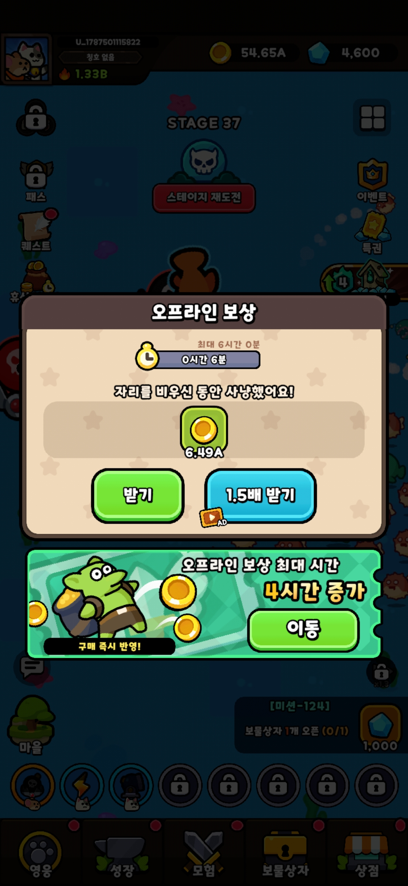

**진입**: 게임 재접속 시 자동

- 모달 상단: 작은 회색 텍스트 `최대 6시간 0분`
- ⏱ 아이콘 + 경과 시간 알약 `0시간 6분`
- 안내 문구: **“자리를 비우신 동안 사냥했어요!”**
- 보상 박스(연베이지, 별무늬 배경): 초록 프레임 골드 아이콘 + `6.49A`
- 버튼 2개: **[받기]**(초록) / **[1.5배 받기]**(파랑) + `▶AD` 뱃지
- 모달 **바깥 아래**에 상품 배너: 캐릭터 일러스트 + `오프라인 보상 최대 시간 4시간 증가` + **[이동]**(초록) + 좌하단 `구매 즉시 반영!` 라벨

> 포인트: 보상 팝업 하단에 **관련 상품 배너를 끼워 넣는** 구조가 핵심.

---

## 2. 기본 메인 화면 (전투 화면)

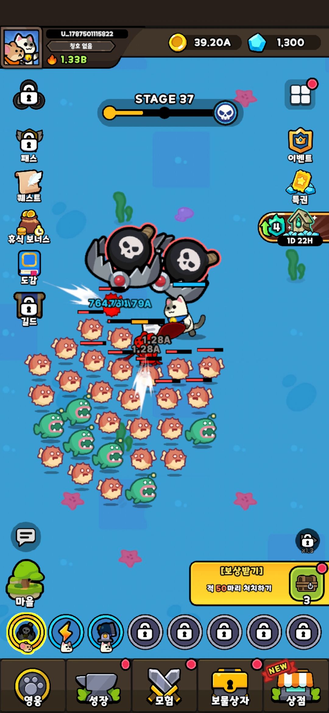

**진입**: 기본 화면

- 공통 프레임 ①~⑥ 전부 노출
- 전투 영역: 캐릭터가 화면 중앙, **몹 무리가 아래쪽에 격자로 밀집 정렬**되어 위로 올라옴
- 보스는 상단에 크게(해골 아이콘 머리) + 개별 HP 바
- 데미지 숫자는 굵은 외곽선, 큰 폰트로 표시 (`7647ㅎ179A`, `1.28A`)
- 배경은 스테이지 테마(수중/숲 등) + 장식 오브젝트(해초, 불가사리)

---

## 3. 던전 팝업

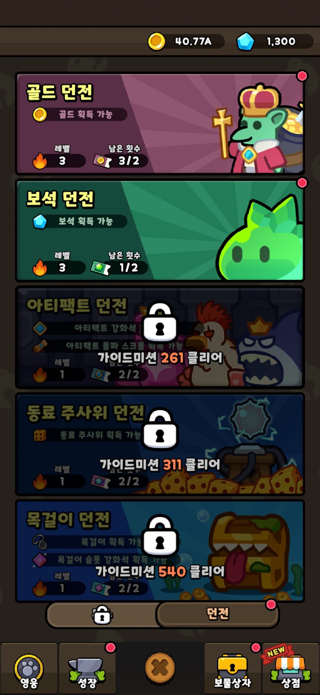

**진입**: 모험 탭 → 던전
> **설계 변경(2026-08-24)**: 우리 게임은 하단 탭 자체가 **`던전`** 이고, 탭을 누르면 이 화면이 **바로** 열린다
> (모험 중간 화면 없음 — 0번 ⑥ 참고).

> **✅ 구현 완료(2026-08-24, 작업 41)** — 공용 `.pcb`. 측정표 `docs/measure/41-팝업내장재화바.md`
> **설계 확정(2026-08-25, 작업 41)**: 상단의 **골드·다이아 표시는 메인 HUD(A3)를 그대로 재사용하는 게
> 아니라 이 팝업 «자체에 포함된» 재화 바다.** 원본(레퍼런스)도 실제로 그렇고, 그래서 메인 HUD 와 **형태가
> 다르다** — 레퍼런스 이미지에서 이 팝업의 재화 바를 별도로 실측해 팝업 내부 요소로 구현할 것 (14번 동일).

- 던전 카드 세로 리스트(카드 = 배경 일러스트 + 등급색)
  - `골드 던전` — 골드 획득 가능 / 레벨 3 / 남은 횟수 3/2
  - `보석 던전` — 보석 획득 가능 / 레벨 3 / 1/2
  - `아티팩트 던전` — **잠금**: 자물쇠 + `가이드미션 261 클리어`
  - `동료 주사위 던전` — 잠금: `가이드미션 311 클리어`
  - `목걸이 던전` — 잠금: `가이드미션 540 클리어`
- 카드 내부: 좌상단 던전명, 그 아래 획득 가능 재화 알약, 하단에 `레벨`(🔥) / `남은 횟수`(입장권 아이콘)
  > **설계 확정(2026-08-25, 작업 72)**: 카드 **우측 절반은 던전 대표 몬스터 썸네일** 자리다(카드 높이 꽉 채움, 하단 잘림). 현재 구현에 이 썸네일이 없다 — 레퍼런스 bbox 대로 슬롯을 만들고 대체 아트를 채울 것(«아트 자리 규칙»).
  > → **구현됨(2026-08-25, sess-0703-19500 워커 A, 7회차 후 «보류(아트 대기)»)**: 슬롯 실측치는
  > 카드1 **311×305 @ 카드top+36** · 카드2 **296×289 @ +52** · **잠금 카드 3~5 는 우측 썸네일이 아니라
  > «카드 이너 전면 씬 아트»(x57~1022 · top+11~+341)** 다(비평가 5명 교차 확인). 다섯 장 모두 카드 이너
  > 우단·하단에 붙어 두 방향으로 잘린다. 대체 아트는 이모지 🐉🐍🧌👺👹 (카드별 `font-size`·`scaleX` 정규화).
  > 남은 감점은 «실루엣이 bbox 를 못 채워 경계 접촉률이 REF 80~100% vs 14~40%» 하나뿐 —
  > **실제 일러스트가 들어오면 `.dnc>.th>em` 을 `background-image` 로 바꾸는 것만으로 회수된다**
  > (발주서: `docs/measure/03-던전팝업.md` 부록 D).
- 카드 우상단 레드닷
- 하단 서브탭: `[🔒] [던전]`
  > **설계 확정(2026-08-25, 작업 46)**: 왼쪽 자물쇠 탭은 **«레이드»** 다 — 서브탭 = `레이드 · 던전`.
  > 레이드는 **DPS 를 재는 던전**: 제한 시간 동안 죽지 않는 보스(샌드백) 한 마리를 때려 **총 피해량·초당 피해(DPS)** 를
  > 측정하고 최고 기록을 남긴다. **디자인은 이 던전 페이지와 동일** — 같은 카드 리스트 껍데기·카드 규격·서브탭 바를
  > 그대로 쓰고 내용(레이드 카드·기록)만 다르다. 세부 팝업도 04 규격 재사용(«도전» → 레이드 시작).
  > 가정(미정, 주인 확인 필요): 제한 시간 60초 · 보스는 무한 체력·공격 없음 · 결과 화면에 총 피해량/DPS/최고 기록 ·
  > 입장 횟수·보상표는 미정(우선 UI + 측정 로직 + 기록 저장 `S.raidBest`).
  >
  > **✅ 구현 완료(2026-08-24, 작업 46)** — 서브탭 = `레이드 · 던전`(자물쇠 칸 폐기). 레이드 카드 3장은
  > 03 카드 규격(980×350) 그대로이고 «레벨/남은 횟수» 자리가 «제한 시간(초)/최고 DPS» 다.
  > 04 세부 팝업 재사용(◀▶ = 다른 측정장, 「도전」 = 레이드 시작), 결과는 A5 공용 모달.
  > 확정 가정: 30·60·120초 · 해금 스테이지 1/15/30 · 입장 무제한 · 보상 없음.
  > 기록 `docs/review/46-레이드DPS던전.md` · 회귀 `node tools/verify46.js`(60항목).

---

## 4. 던전 세부 팝업

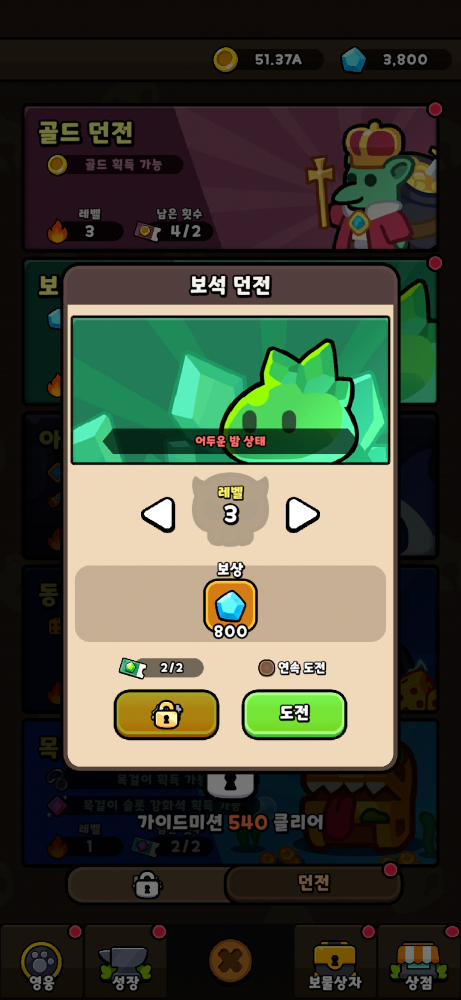

**진입**: 던전 목록에서 카드 선택

- 상단 배너 이미지(던전 몬스터 일러스트) + 하단에 상태 라벨 `어두운 밤 상태`
- 중앙: **◀ 레벨 3 ▶** — 좌우 화살표로 난이도 선택
- 보상 박스: 보상 아이콘 + 수량(`💎800`)
- 입장권 표시 `2/2` + **연속 도전** 체크박스
- 버튼 2개: **[🔒]**(비활성/유료) / **[도전]**(초록)

---

## 5. 무기 팝업

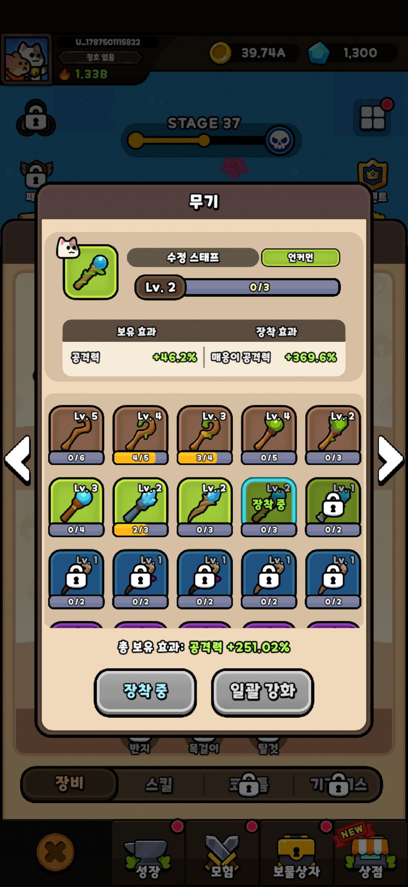

**진입**: 영웅 탭 → 장비 → 무기 슬롯

- 상단 선택 아이템 정보:
  - 아이콘 + 이름 알약(`수정 스태프`) + 등급 알약(`언커먼`, 초록)
  - `Lv. 2` 알약 + 재료 진행바 `0/3`
- **보유 효과 / 장착 효과 2열 표**
  - `공격력 +46.2%` / `매옹이 공격력 +369.6%`
- 아이템 그리드 **5×3**, 좌우 페이지 화살표(◀ ▶)
  - 카드: 좌상단 `Lv.n`, 하단 재료 진행바(`4/5`, 충족 시 주황), 장착 중 라벨, 미보유는 자물쇠
  - 등급별 배경색(갈색 커먼 → 초록 언커먼 → 파랑 레어 → 보라 에픽)
- 하단: **`총 보유 효과: 공격력 +251.02%`**
- 버튼: **[장착 중]**(비활성) / **[일괄 강화]**
- 최하단 서브탭: `장비 · 스킬 · 동료(🔒) · 기타(🔒)`
  > **설계 변경(2026-08-24 → 08-25 갱신)**: 우리 게임의 영웅 서브탭은 **`장비 · 스킬 · 코스튬 · 동료` 4개**(작업 25/50). 자물쇠 탭은 없다.
  > `동료` → 26번, `코스튬` → 50번(기존 아바타 기능 이관).

---

## 6. 장비 팝업

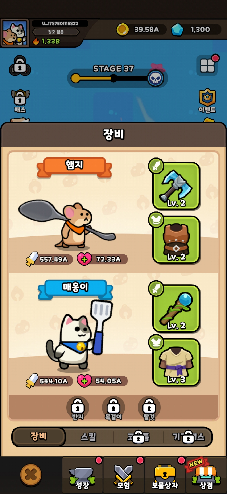

**진입**: 영웅 탭 → 장비

- 캐릭터별 카드 2개(`햄지`, `매옹이`)
  - 좌: 캐릭터 일러스트, 아래 ⚔ 공격력(`557.49A`) / ❤ 체력(`72.33A`)
  - 우: 부위 슬롯 세로 2칸(무기/방어구) — 슬롯 좌상단에 부위 아이콘 뱃지, 카드에 `Lv. 2`
- 카드 아래: 잠금 슬롯 3개(`반지`, `목걸이`, `탈것`)
- 서브탭 동일

### 우리 게임 설계 (레퍼런스와 다름 · 2026-08-24 확정)

위는 레퍼런스 기록이고, **우리 게임은 아래대로 만든다** (문서 서두 «설계 확정» 1·2번):

- **캐릭터 카드는 1개** — 이름 리본 `용사`. 카드 2행 구조를 버리고 카드 1개가 컨테이너를 쓴다
  (카드 내부 구성 — 일러스트·⚔/❤ 스탯 알약·`Lv.n`·이름 리본 — 은 레퍼런스 카드 1개 규격 그대로).
- **부위 슬롯은 세로 3칸: `무기` · `방패` · `목걸이`** (2칸 아님). 슬롯 규격(228×228 r40, 좌상단 Ø78 뱃지)은
  기존 측정값 재사용, 칸 수만 3으로.
- **잠금 슬롯 행(반지·목걸이·탈것)은 폐기** — 목걸이는 정식 부위로 승격됐고 반지·탈것은 없다.
- 서브탭은 **`장비 · 스킬 · 코스튬 · 동료` 4개** — 자물쇠(🔒) 탭은 전부 없앤다. `동료` → 26번, `코스튬` → 50번.
- **반지는 없다.** 반지·탈것 잠금 슬롯은 어디에도 남기지 않는다(2026-08-25 재확인).
- 무기 슬롯 → 05 무기 팝업 진입은 기존대로. **방패·목걸이 슬롯도 같은 방식**(부위별 아이템 팝업)으로
  붙인다 — 05 와 동일 구조의 화면을 부위만 바꿔 재사용.
- **구버전 장비 패널은 폐기한다(2026-08-25, 작업 57).** `#bEq` 배너 패널(`renderEq`·`EQ_BANNERS` 서브탭·파란 스킨)과
  `eqPageOn=false` 로 06 시트를 내리고 그걸 드러내는 경로를 **코드에서 제거**한다. 장비 서브탭은 **항상 06 시트(#eqw)** 이고,
  슬롯 클릭은 **오직 05 팝업(`openWeapon(part)`)** 만 연다. 05 를 닫으면 06 시트가 그대로 보인다. 어떤 경로로도 구버전이 보이면 안 된다.

---

## 7. 스킬 팝업

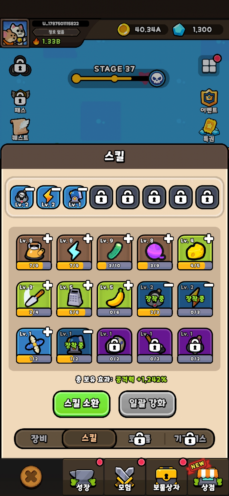

**진입**: 영웅 탭 → 스킬

- 상단 **장착 슬롯 8칸** 가로 배치(장착된 것은 `Lv.n` + `─` 해제 버튼)
- 아래 보유 스킬 그리드 **5×3**
  - 카드: 좌상단 `Lv.8`, 우상단 **[+] 장착 / [─] 해제** 버튼, 하단 재료 진행바(`7/9`)
  - 장착된 카드는 중앙에 `장착 중`
- 하단: `총 보유 효과: 공격력 +1,242%`
- 버튼: **[스킬 소환]**(초록) / **[일괄 강화]**
  > **설계 변경(2026-08-24)**: `[스킬 소환]` 버튼은 **그 자리에서 소환하지 않는다.**
  > 누르면 스킬 팝업을 닫고 **10번 상점 소환 탭(`#shopw`)으로 이동**한다(소환은 상점에서만).
  > 26번 동료 팝업의 `[동료 소환]` 버튼도 같은 규칙이다.

---

## 8. 스킬 세부 팝업

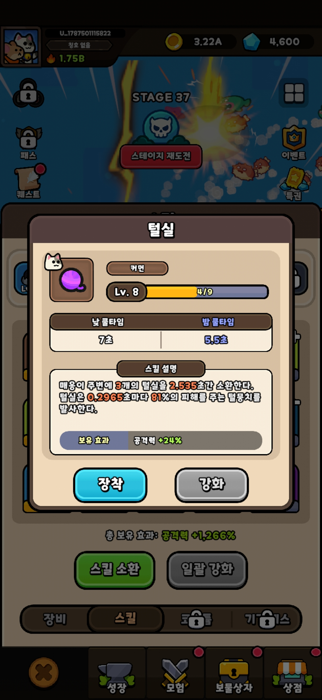

**진입**: 스킬 목록에서 카드 선택

- 아이콘 + 등급 알약(`커먼`) + `Lv. 8` + 진행바 `4/9`
- **낮 쿨타임 / 밤 쿨타임 2열 표** (`7초` / `5.5초`)
- `스킬 설명` 헤더 + 설명 박스
  - 예: “매옹이 주변에 3개의 털실을 2.535초간 소환한다. 털실은 0.2965초마다 81%의 피해를 주는 털뭉치를 발사한다.”
  - 수치는 **주황 강조**
- `보유 효과` 라벨 + `공격력 +24%`
- 버튼: **[장착]**(파랑) / **[강화]**(회색)

---

## 9. 일괄 강화 결과 팝업

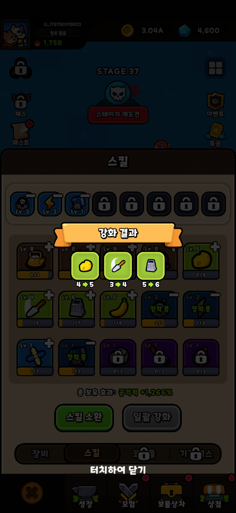

**진입**: 일괄 강화 실행 시

- `강화 결과` 주황 리본
- 강화된 아이템만 가로 나열 + 각 아래에 **`4 ➡ 5`** 형태의 레벨 변화
- 배경은 어둡게 처리, 하단 `터치하여 닫기`

- [x] **구현 완료 (4회차 통과 · G 9 / H 9.5, 최저 9).** 측정표 `docs/measure/09-일괄강화결과팝업.md` · 기록 `docs/review/09-일괄강화결과팝업.md`
  - **A5 3분류에 없는 «껍데기 없음» 4번째 유형** — 딤 `rgba(0,0,0,.80)` 위에 자유 배치. `.mbox` 미사용, 전용 오버레이 `#upw`
  - 리본 몸통 527×101 · 검정 6px · 하이라이트 3px + 채움 78px + 그늘 5px · radius 19
  - 제비꼬리는 몸통 앞(z:3) «ㄴ자 실루엣» 클립 — 꼬리↔몸통 사이 검정선 구조적으로 배제
  - 카드 137×138 · 검정 5px · gap 14 · pitch 151 · 초록 방사형 채움 · 3칸 등급색 동일
  - «n ➡ m»: 인라인 SVG 화살표 `#B4EC2C` (fill 명시 필수), 좌우 숫자 둘 다 흰색
  - «터치하여 닫기»: **외곽선 없음** — 다른 화면 라벨의 `-webkit-text-stroke` 를 여기 복사하지 말 것
  - `levelUpAll()` 이 `ups=[{it,from,to}]` 반환 → 스킬·무기·배너 일괄강화 3경로에서 `openUpAll(r.ups)` 호출

---

## 10. 상점 팝업 — 소환 탭

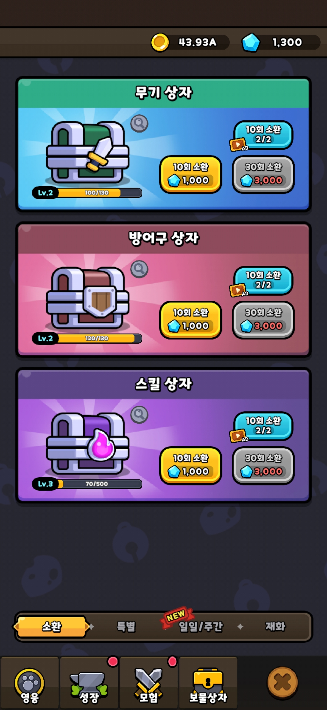

**진입**: 보물상자 탭 → 소환
> **설계 변경(2026-08-25, 작업 45)**: 하단 카테고리 탭은 **`소환 · 재화` 2개**만 둔다 — 특별·일일주간은 상품이 없어 제거.
> 탭바 폭·높이(990×107)는 유지하고 탭 2개를 균등 배치(활성 알약·✦ 구분선 규격 그대로).
> **✅ 완료(2026-08-24, sess-2258-4121)**: 칸 폭 50%(패딩박스 976 → 488) · 라벨/알약 칸 중앙 정렬 ·
> ✦ 는 칸 경계 1곳뿐이라 1개(바 중앙 485 — 레퍼런스 4탭의 «가운데 ✦» 실측치가 그대로 2탭 경계다) ·
> **NEW 리본은 제거**(탭2·3 경계 = «특별» 칸을 가리키던 리본이라 그 칸과 함께 사라진다).
> 아래 «하단 카테고리 탭» 줄의 4칸 · NEW 리본 기술은 레퍼런스 설명이며 우리 구현이 아니다.

- 상자 카드 세로 3개(`무기 상자`, `방어구 상자`, `스킬 상자`) — 카드 전체가 등급색 그라디언트
  - 좌: 상자 일러스트 + 좌하단 `Lv.2` + **경험치 진행바**(`100/130`)
  - 상단 가운데: 🔍 **확률 정보** 버튼
  - 우: **[10회 소환]** `▶AD 2/2` / **[10회 소환] 💎1,000** / **[30회 소환] 💎3,000**
- 하단 카테고리 탭: `소환 ✦ 특별 ✦ 일일/주간 ✦ 재화` (NEW 리본 지원)

---

## 11. 소환 부분 정보 팝업

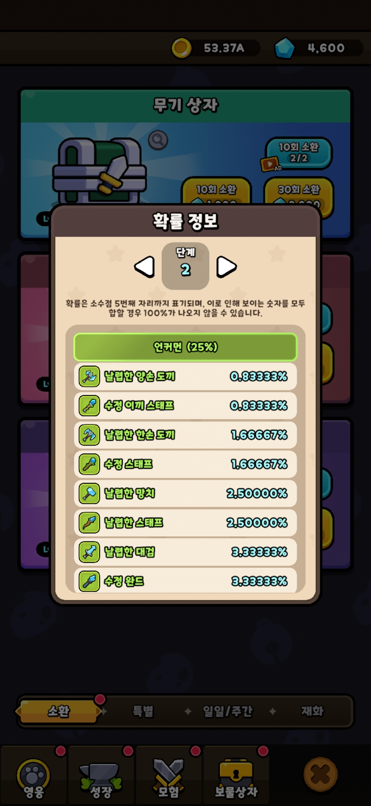

**진입**: 상자 카드의 🔍

- 모달 제목 `확률 정보`
- **◀ 단계 2 ▶** — 상자 레벨(단계)별 확률 열람
- 안내문: “확률은 소수점 5번째 자리까지 표기되며, 이로 인해 보이는 숫자를 모두 합할 경우 100%가 나오지 않을 수 있습니다.”
- 등급 헤더 바(`언커먼 (25%)`, 등급색) + 그 아래 아이템별 확률 행
  - 행 = 아이콘 + 이름 + `0.83333%`

---

## 12. 소환 결과 팝업

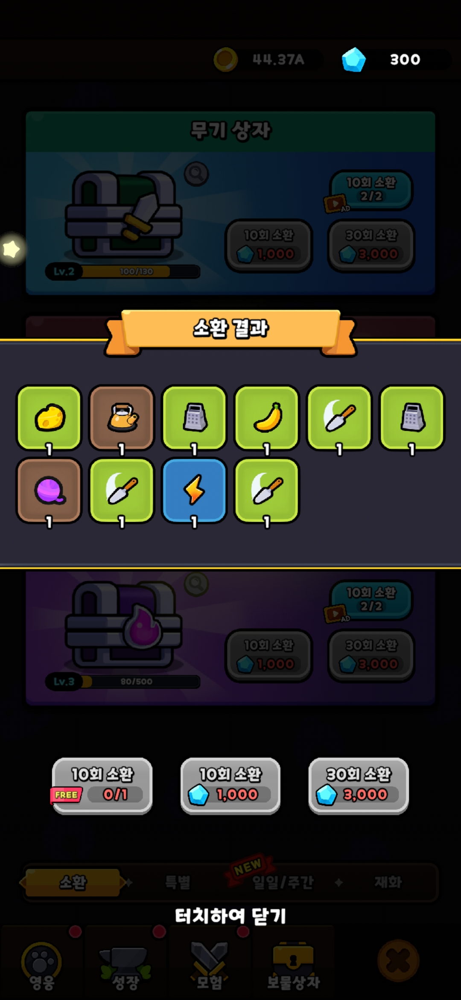

**진입**: 소환 실행 시

- `소환 결과` 주황 리본
- 획득 아이템 그리드(6열) — 등급색 배경 + 우하단 개수 `1`
- 하단 재소환 버튼 3개: **[10회 소환 FREE 0/1]** / **[10회 소환 💎1,000]** / **[30회 소환 💎3,000]**
- `터치하여 닫기`

---

## 13. 상점 팝업 (재화 탭)

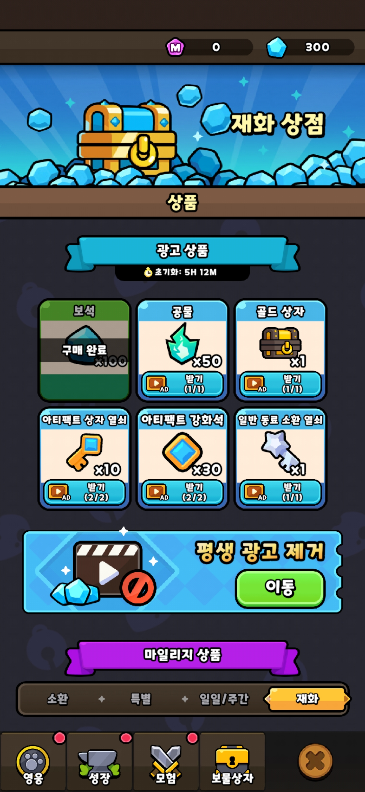

**진입**: 상점 탭 → 재화

- 상단 배너 이미지(보물상자 + 보석) + `재화 상점` 타이틀
- `상품` 섹션 헤더
- **광고 상품** 리본 + `⏱ 초기화: 5H 12M`
- 상품 그리드 3×2 — 카드 = 이름 헤더 + 아이템 이미지 + 수량 + **[받기]** `▶AD (n/n)`
  - 구매 완료 카드는 회색 처리 + `구매 완료` 오버레이
- **평생 광고 제거** 배너 + **[이동]**
- **마일리지 상품** 리본(하위 섹션)
- 하단 카테고리 탭

### 우리 게임 설계 (2026-08-25 확정 — 작업 44 · 45)

**① 다이아 판매 상품 (재화 탭 하단에 추가)** — 가격 오름차순, 카드 규격은 위 상품 그리드와 동일

| 상품 | 가격 | 보너스 |
|---|---|---|
| 다이아 **1만개** | 1,000원 | — |
| 다이아 **7만개** | 5,000원 | — |
| 다이아 **15만개** | 11,000원 | — |
| 다이아 **90만개** | 55,000원 | **마일리지 쿠폰 +1** |
| 다이아 **200만개** | 110,000원 | **마일리지 쿠폰 +2** |

**② 마일리지** — «마일리지 상품» 하위 섹션에 넣는다
- 마일리지 쿠폰 보유 수 표시(`n / 10`) + 진행바
- **쿠폰 10개 → 다이아 500만개 교환** `[교환]` 버튼 (10개 미만이면 회색 비활성). 교환 시 쿠폰 −10, 다이아 +500만
- 쿠폰은 90만/200만 상품 구매 시에만 지급. 저장 구조에 `S.mileage`(쿠폰 수) 추가 → 세이브 마이그레이션/KEY 버전

**③ 결제** — 이 HTML 게임에는 아직 결제 연동이 없다. UI·데이터·마일리지 로직을 먼저 만들고, 구매 버튼은
결제 연동 전까지 **가격 표시 + «준비 중» 처리**(디버그 지급은 디버그 메뉴에서만). 결제 붙일 때 버튼 핸들러만 교체.

**④ 카테고리 탭은 2개** — `소환 · 재화` 만 남긴다. **특별 · 일일주간 탭은 상품이 없으므로 뺀다**(10번 참고, 작업 45).

> **✅ ④ 구현 완료 (2026-08-24, 작업 45 · sess-2258-4121)** — 탭 2개(칸 폭 25%→50%) · ✦ 구분선 3개→1개(바 중앙 485) ·
> NEW 리본 제거(«특별» 칸을 가리키던 것) · «준비 중» 분기 제거. 바 껍데기(990×107·검정 7/재화 5·림 6·radius 33)와
> 알약 규격(소환 250×79 / 재화 256×76)은 실측 그대로 두고 **칸 중앙 정렬**만 새로 잡았다(소환 left 119 / 재화 117).
> 그 결과 13 측정표 §8 의 «알약이 바 우측으로 7px 돌출» 은 사라진다 — 4칸(폭 244)에 256 알약이라 넘쳤던 것이고
> 2칸(폭 490)에서는 넘칠 이유가 없다. 검증 `node tools/verify45.js` 41/41 · 기록 `docs/review/45-상점카테고리탭.md`.

> **✅ ①②③ 구현 완료 (2026-08-24, 작업 44 · sess-2227-9859)** — ④는 작업 45 몫이라 손대지 않았다.
> 레퍼런스 13 은 «마일리지 상품» 리본에서 끝나므로 그 아래는 새 좌표계를 만들지 않고 §5 상품 그리드의
> 열(x111/401/691) · 카드 278×309 · 행 pitch 319 · 리본↔본문 94 · 배너↔리본 75 를 그대로 이어 썼다.
> local y — 다이아 리본 **1698** / 카드 **1884·2203** / 마일리지 리본 **2587** / 마일리지 패널 **2773**,
> `.cn-wrap` 높이 1809 → **3066**. 카드는 헤더 «다이아» + 수량 «×1만…×200만»(우측 앵커) + 가격 버튼,
> 90만·200만 칸에만 «쿠폰 +n» 뱃지. 마일리지 패널은 §6 배너와 같은 x66 948폭.
> **결제는 붙이지 않았다** — 구매 버튼은 가격·쿠폰 안내 + «결제 준비 중» 팝업이고, 실제 지급은
> `grantDiaPack()` 한 곳으로 모아 뒀다(결제 콜백은 이 함수만 부르면 된다). 결제 없이 마일리지를
> 굴려 보는 디버그 경로는 **`window.devBuyDia('d1'…'d5')`** 뿐이다.
> 저장 구조에 **`S.mileage`** 추가 — KEY 는 그대로 두고 «없으면 0» 마이그레이션으로 흡수했다(KEY 를
> 올리면 전 진행도가 날아간다). 검증 `node verify44.js` **PASS 84항목** + `node tools/smoke.js` **PASS**.

---

## 14. 유물 팝업 — 보물상자 탭 (유물 뽑기)

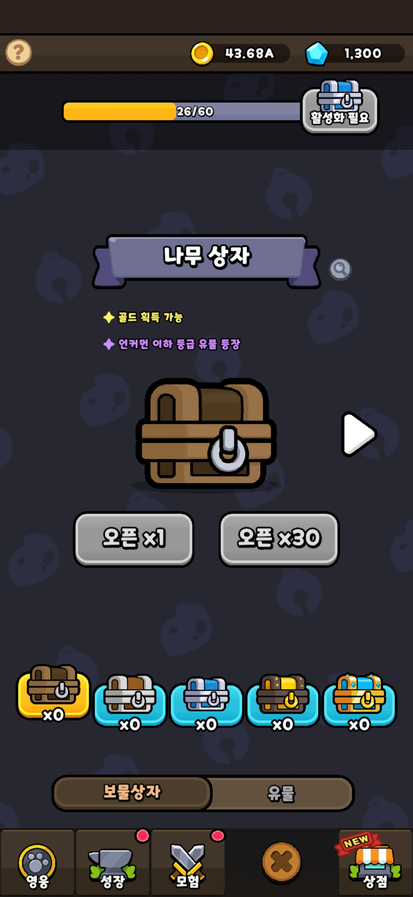

**진입**: 유물 팝업 → `보물상자` 탭

> **구조**: 유물 팝업 = `보물상자` 탭 + `유물` 탭.
> **보물상자 탭에서 상자를 열어 유물을 뽑고**, **유물 탭에서 뽑은 유물을 강화**합니다.

> **✅ 구현 완료(2026-08-24, 작업 41)** — 공용 `.pcb`. 측정표 `docs/measure/41-팝업내장재화바.md`
> **설계 확정(2026-08-25, 작업 41)**: 상단의 **골드·다이아 표시는 메인 HUD(A3) 재사용이 아니라 이 팝업
> «자체에 포함된» 재화 바다.** 원본도 실제로 그렇고 형태가 메인 HUD 와 다르다 — 레퍼런스 이미지에서
> 별도 실측해 팝업 내부 요소로 구현할 것 (03 던전 팝업 동일).

- 최상단: 진행바 `26/60` + **[활성화 필요]** 버튼(회색)
- `나무 상자` 리본 + 🔍
- 획득 가능 목록(✦ 불릿): `골드 획득 가능`, `언커먼 이하 등급 유물 등장`
- 중앙 상자 일러스트 + 우측 ▶(다음 상자 종류)
- 버튼: **[오픈 x1]** / **[오픈 x30]**
- 하단: 상자 종류 5칸 보유 수량(`x0`)
- 서브탭: `보물상자 · 유물`

**구현 (2026-08-24)**: 전체화면 페이지 `#relicw` (top:104 bottom:180, 03 던전·10 상점과 동종).
상단 클러스터는 `local y = ref y − 87` 절대매핑, 하단 5칸+서브탭은 프레임 하단 고정.
[오픈 ×1/×30] 은 `doSummon('relic', n)` 에 연결(저장 구조 미변경). 상자 5종은 **표시 전용 매핑**
(우리 게임은 유물 배너 1종). 「유물」 서브탭은 기존 `#bRel` 배너 패널(15번 담당 예정)로 연결.
4회차 통과 (G 7/H 7), 남은 감점은 아트 리소스 부재(상자 이모지 대체) — A1·A3·A4·03·06 과 동일 천장.
측정표 `docs/measure/14-유물팝업보물상자탭.md` · 비평 `docs/review/14-유물팝업보물상자탭.md`.

---

## 15. 유물 팝업 — 유물 탭 (도감 · 강화)

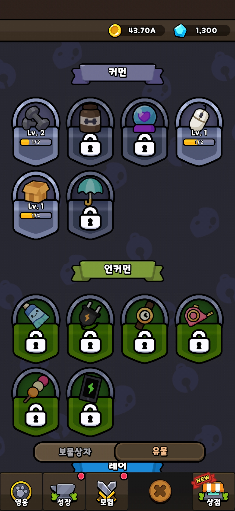

**진입**: 유물 팝업 → `유물` 탭

- 등급 리본(`커먼`, `언커먼`, `레어` …)으로 섹션 구분
- 유물 카드 = **아치형(위가 둥근) 슬롯** 4열
  - 보유: 아이콘 + `Lv. 2` + 진행바 `1/3`
  - 미보유: 자물쇠 + 어두운 실루엣
- 등급 섹션 배경색: 커먼 회색 / 언커먼 초록 / 레어 파랑

---

## 16. 유물 세부 팝업

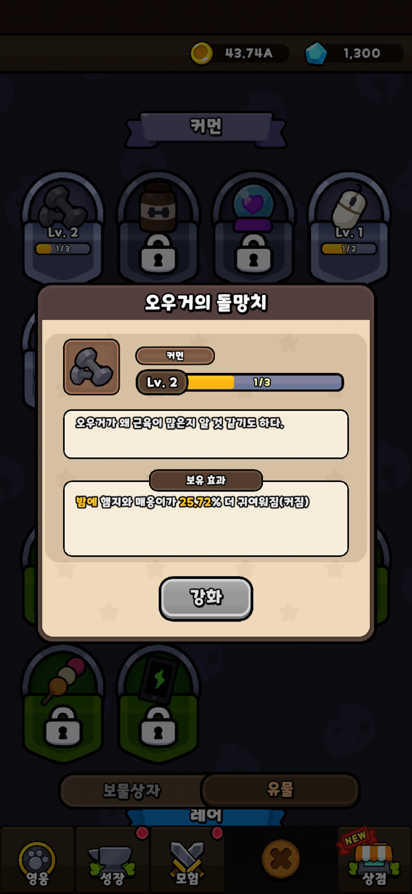

**진입**: 유물 도감에서 카드 선택

- 아이콘 + 등급 알약(`커먼`) + `Lv. 2` + 진행바 `1/3`
- **플레이버 텍스트 박스**: “오우거가 왜 근육이 많은지 알 것 같기도 하다.”
- `보유 효과` 헤더 + 효과 박스: “밤에 햄지와 매옹이가 25.72% 더 귀여워짐(커짐)”
- 버튼: **[강화]** 단일

> **구현 완료(2026-08-24, sess-1742)** — `showRelicDetail(id)` / `.rl16` + `.rld`.
> ⚠️ **측정표 §8·§10 정오표**: ref 본문은 «다크 텍스트» 가 아니라 **흰 채움 `#EFEFEF` + 검정 외곽선**이다.
> ⚠️ ref 본문·플레이버는 **각각 한 줄**이다(잉크 폭 548 / 615). `RELIC_FLAVOR` 를 21~23자로 맞춰 둘 것.
> ⚠️ 카드는 단색이 아니라 **위 36px 베이지 밴드 + 위쪽 모서리만 r34 인 `#D7C0A1` 패널 + 아래 베이지**,
>    하단 베이지에 **5각별 장식 2행**(54×50, pitch 235, 두 행 117 엇갈림, `#E9D0B1`)이 있다.
> ⚠️ `scaleX` 를 건 글자에는 **`-webkit-font-smoothing:antialiased` + `translateZ(0)`** 를 반드시 같이 줄 것 —
>    안 주면 서브픽셀(LCD) AA 로 **주황/청색 색번짐**이 생긴다(ref 는 완전 그레이스케일 AA).

---

## 17. 스탯업 보너스 팝업 연출

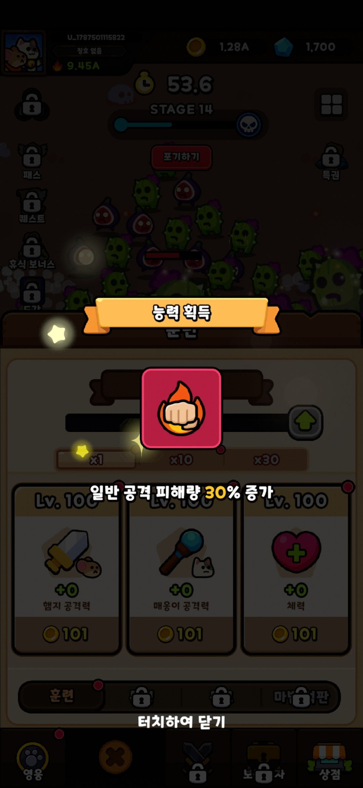

**진입**: 성장 탭 → 훈련 / 특수 도전 중 레벨업

- 상단: ⏱ `53.6` + `STAGE 14` + 진행바 + 빨간 **[포기하기]**
- `능력 획득` 주황 리본
- 중앙: 능력 아이콘(큰 정사각) + 좌측 진행바 + 우측 초록 ▲ 버튼
- 배수 선택 탭: `x1 / x10 / x30`
- 능력 설명 오버레이: **`일반 공격 피해량 30% 증가`**
- 아래 훈련 카드 3열: `Lv. 100` 헤더 + 아이콘 + `+0` + 이름(`햄지 공격력`, `매옹이 공격력`, `체력`) + 비용(`💰101`)
- 하단 서브탭: `훈련 · 🔒 · 🔒 · 마법상판(🔒)`
- `터치하여 닫기`

---

## 18. 패배 화면

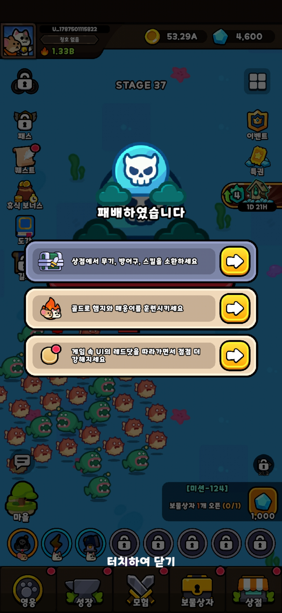

**진입**: 스테이지 실패 시

- 중앙 상단: 보스 해골 엠블럼 + **`패배하였습니다`**
- 안내 카드 3장(각각 아이콘 + 문구 + 노란 **[→]** 버튼)
  1. `상점에서 무기, 방어구, 스킬을 소환하세요`
  2. ~~`골드로 햄지와 매옹이를 훈련시키세요`~~ → **`골드로 훈련하세요`**
     > **설계 확정(2026-08-25, 작업 43)**: 우리 게임은 캐릭터가 «용사» 1명이므로 이 문구를 **`골드로 훈련하세요`** 로 바꾼다
     > (문서 서두 «설계 확정» 1번 적용). 카드 크기·배치는 그대로, 문구만 교체하고 가운데 정렬 유지.
     > → **[x] 완료(2026-08-24, sess-2213-12780)**. `.df-txt` 본문+외곽선 `.ov` 두 겹 교체, CSS 0줄 변경.
     > 카드 좌표·`align-items:center`·`scaleX(.875)` 전부 유지(`node verify43.js` 46/46). 기록 `docs/review/43-패배화면문구.md`
     > **남은 것(43 범위 밖)**: 이 카드 아이콘이 아직 🐹🐱 두 개다 — 아트 발주 때 훈련 아이콘 1개로 정리할 것.
  3. `게임 속 UI의 레드닷을 따라가면서 점점 더 강해지세요`
- 첫 카드만 강조(밝은 배경)
- `터치하여 닫기`

> 포인트: 실패를 **다음 행동 유도(레드닷 안내)** 로 연결.

---

## 19. 프로필 팝업

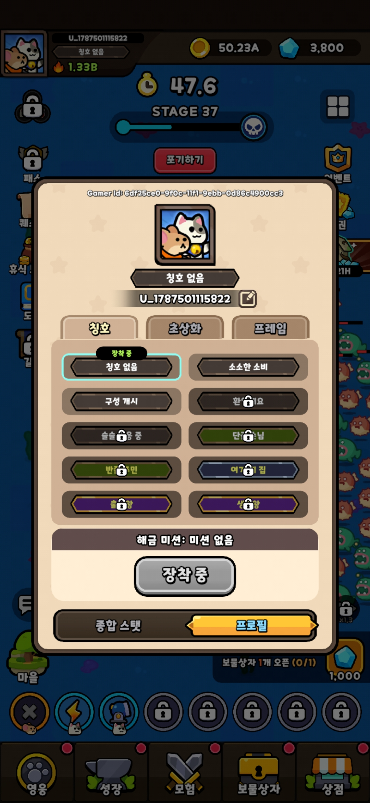

**진입**: 상단 초상화 클릭

- 최상단 작은 글씨 `Gamer Id: 6df25ce0-…`
- 초상화(프레임 포함) + 칭호 알약 + 닉네임 + ✏ 편집 버튼
- 탭 3개: `칭호 · 초상화 · 프레임`
- 칭호 그리드 2열 — 보유는 밝게(`장착 중` 뱃지), 미보유는 자물쇠 + 등급색 배경
- `해금 미션: 미션 없음` 안내 바
- **[장착 중]** 버튼
- 모달 하단 토글 탭: `종합 스탯 · 프로필`

---

## 20. 프로필 팝업 — 플레이어 스펙 정보

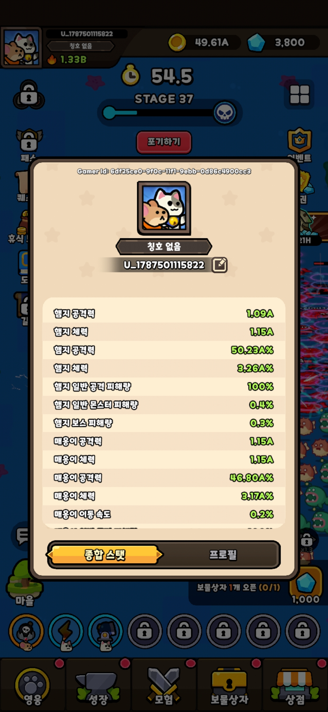

**진입**: 프로필 모달 → 종합 스탯

- 스탯 행 리스트(줄무늬 배경, 좌=이름 / 우=값)
  - `햄지 공격력 1.09A`, `햄지 체력 1.15A`
  - `햄지 공격력 50.23A%`, `햄지 체력 3.26A%` (초록 = 증가율)
  - `햄지 일반 공격 피해량 100%`, `햄지 일반 몬스터 피해량 0.4%`, `햄지 보스 피해량 0.3%`
  - `매옹이 …` 동일 구성
- 스크롤 가능, 하단 토글 탭 동일

### 구현 (2026-08-25, sess-0918-8803 워커 B) — ✅ **10회차 통과 (①~④ S 8 / T 8)**

측정표 `docs/measure/20-프로필팝업스펙정보.md`(§11 정오표) · 기록 `docs/review/20-프로필팝업스펙정보.md` ·
게이트 `node tools/verify20.js`(**32/32**) · 스캐너 `tools/s20b.py`(ref·캡처 공용) · 캡처 `docs/review/20-r5~r10.png`.

껍데기 = **(가) 딤(.55) 위 가운데 다이얼로그** `#specw` 896×1395, 세로 변환은 **`ref−84`** 하나.

| 요소 | 규격(캡처 좌표, ref−84) |
|---|---|
| 바깥 박스 `.spc` | x92 y431 896×1395 · 크림 본문 `.spc-body` x111 y450 858×1357 |
| 아바타 액자 `.spc-ava` | x451 y510 179×180 · 검정 외곽 **좌6·상4·우7·하8** · 갈색 밴드 **좌10 / 우9** · **«대각» 라운드 `5px 25px 3px 20px`**(우상·좌하만 크게) |
| 칭호 리본 `.spc-rib` | x380 y700 318×53 · 4겹(검정6/림5/면35/림4/검정6) |
| 닉 스트립 `.spc-nick` | x324 y761 372×48 · 좌측 페이드는 **S-커브 11스톱**(10% x340 · 50% x370 · 90% x392) |
| 편집 버튼 `.spc-edit` | x696 y760 53×54 · radius 10 · 테두리 6 |
| 스탯 리스트 `.spc-list` | x139 y898 800×**760** · 13행 × 피치 60(13행이 16px 노출 = 스크롤 어포던스) |
| 토글 바 `.spc-tabs` | x157 y1692 767×94 · radius 22 |
| 금색 탭 `.spc-tab-on` | x149 y1706 391×67 · **직선 몸통 + 가운데 화살촉**(육각형 아님) · 4모서리 라운드 **좌상7·좌하6.5·우상/우하4.5**(원호 3점 근사) · **촉 전체가 앰버**(밝은 금은 x174–514 에서 끊긴다) · 촉 apex 좌 x155.5 / 우 x534.3 |

**체크리스트**

- [x] 진입 경로 = HUD 초상화 → 19 프로필 → 하단 토글 «종합 스탯» (2단계, 실제 클릭으로 검증)
- [x] 값이 목업이 아니라 **실제 게임 데이터**(`stat`/`bonus`)이고 강화하면 그 자리에서 갱신된다
- [x] 닉 편집이 `S.nick` + localStorage + **상단 HUD** 까지 반영
- [x] 토글 왕복(종합 스탯 ↔ 프로필) · 딤 클릭 닫힘 · 박스 안 클릭 유지
- [x] 프레임 밖 요소 0 · 콘솔 에러 0 · `SMOKE PASS`
- [ ] **아트 대기** — 아바타 초상화(🛡️ 이모지 대체, bbox 147×156) · 금탭 촉 끝 크림빛 스페큘러 · 게임용 한글 서체

⚠ 짧은 기기(frameH 1600)에서 `.spc-tabs` 가 크림 박스 밖으로 나가는 **기존 문제**가 있다(20 이 만든 것이 아니다).
`.spc-body` 에 `overflow:hidden` 을 주면 토글이 통째로 사라지므로 주지 마라.

---

## 21. 도감 보너스 팝업

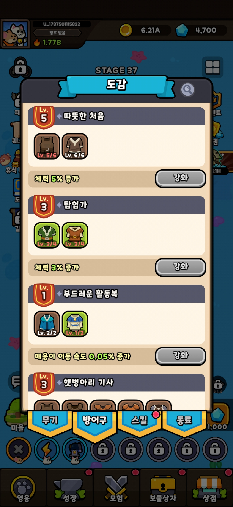

**진입**: 좌측 사이드 아이콘 → 도감

- 모달 헤더가 다른 화면과 다름: **파란 리본 배너**(둥근 깃발 모양)에 `도감`, 우측에 🔍 검색 버튼
- 본문은 **세트 단위 블록**의 세로 리스트. 블록 1개 구성:

```
┌─────────────────────────────────────────┐
│ ▨Lv.5 │ ✦ 따뜻한 처음                    │ ← 세트 헤더 (짙은 남색 바)
├─────────────────────────────────────────┤
│  [아이템]  [아이템]                       │ ← 세트 구성 아이템 그리드
│  Lv. 5/6   Lv. 6/6                      │
├─────────────────────────────────────────┤
│ 체력 5% 증가                    [ 강화 ] │ ← 효과 바 + 강화 버튼
└─────────────────────────────────────────┘
```

| 요소 | 규격 |
|---|---|
| 세트 레벨 뱃지 | 헤더 좌측에 **빨간 방패형 리본**, 안에 `Lv. 5` (2줄) |
| 세트 이름 | ✦ 아이콘 + 이름 (`따뜻한 처음`, `탐험가`, `부드러운 활동복`, `햇병아리 기사`) |
| 아이템 카드 | 등급색 배경(갈색 커먼 / 초록 언커먼 / 파랑 레어) + 하단 라벨 `Lv. 현재/필요` |
| 카드 라벨 색 | **미달 = 빨강**(`Lv. 5/6`), **충족 = 흰색**(`Lv. 6/6`) |
| 효과 바 | 연베이지 바, 좌측 효과 문구 — 수치만 **초록 강조**(`체력 5% 증가`, `매옹이 이동 속도 0.05% 증가`) |
| 강화 버튼 | 효과 바 우측, 조건 미충족 시 회색 비활성 |
| 서브탭 | 모달 **하단 바깥**에 **깃발형 탭 4개**: `무기 · 방어구 · 스킬 · 동료` (파란 배경 + 노란 테두리, 아래가 뾰족한 리본 모양, 레드닷 지원) |

> 포인트: 세트를 구성하는 아이템들을 **각각 요구 레벨까지 올려야** 세트 강화가 열리는 구조.
> 내 구현의 "컬렉션 보너스"를 이 형태로 바꾸면 됨 — 종수 수집이 아니라 **세트별 레벨 조건**.

---

## 22. 퀘스트 팝업

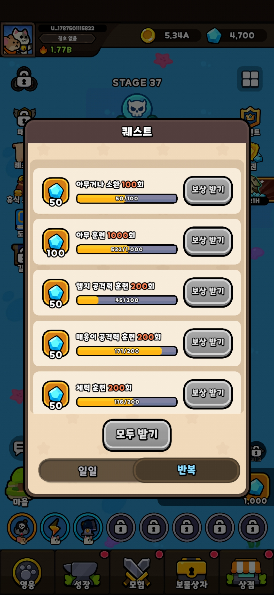

**진입**: 좌측 사이드 아이콘 → 퀘스트

- 모달 제목 `퀘스트`(갈색 헤더), 본문은 별무늬 베이지 + 안쪽 흰 카드 리스트
- 퀘스트 행 1개 구성:

```
┌──────────────────────────────────────────┐
│ [💎]   아무거나 소환 100회      [보상 받기] │
│  50    ▓▓▓▓▓░░░░░ 50/100                 │
└──────────────────────────────────────────┘
```

| 요소 | 규격 |
|---|---|
| 보상 | 좌측 **주황 사각 프레임** 안에 보상 아이콘, 프레임 아래 수량(`50`, `100`) |
| 제목 | 목표 수치만 **주황 강조** (`아무거나 소환 **100**회`) |
| 진행바 | 제목 아래 가로 바, 노란 채움 + 바 **중앙에 `50/100`** 텍스트 |
| 버튼 | 우측 `[보상 받기]` — 미완료는 회색 비활성 |
| 일괄 수령 | 리스트 아래 중앙에 **[모두 받기]** |
| 카테고리 | 모달 최하단 **2분할 토글**: `일일 · 반복` (선택된 쪽만 밝게) |

- 퀘스트 예시: `아무거나 소환 100회`(💎50) / `아무 훈련 1000회`(💎100) / `햄지 공격력 훈련 200회`(💎50) / `매옹이 공격력 훈련 200회`(💎50) / `체력 훈련 200회`(💎50)

> 포인트: 보상이 전부 **보석(유료 재화)** 이고, 목표는 전부 **행동 횟수**(소환·훈련) — 과금 동선과 직결된 지표를 목표로 잡음.

---

## 23. 훈련 팝업

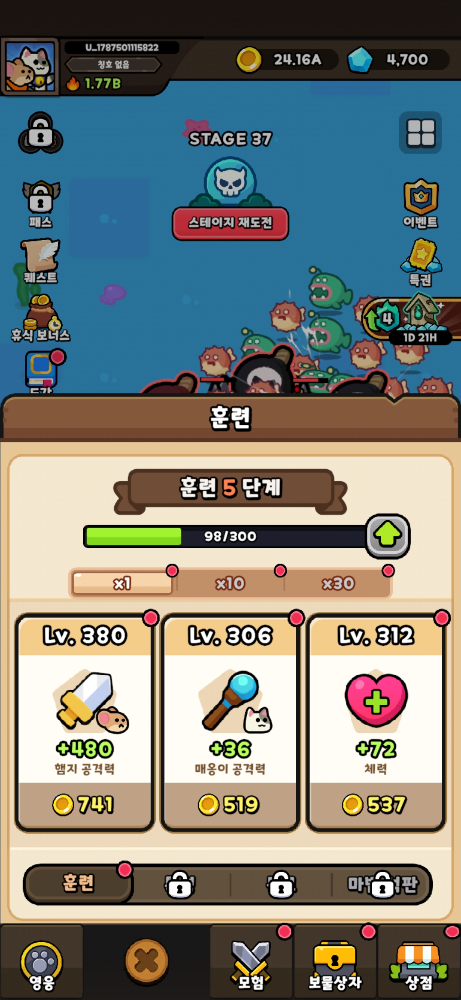

**진입**: 성장 탭 → 훈련
> **설계 변경(2026-08-24)**: 우리 게임은 하단 탭 자체가 **`훈련`** 이고(성장 탭 대체), 탭을 누르면 이 팝업이
> **바로** 열린다. **⚑ 이 화면이 최우선 순위다** — 이미지(레퍼런스 스크린샷) 나온 그대로 구현할 것.

### 레퍼런스 화면 구성

- 하단에서 올라오는 패널형(상단 테두리가 물결 곡선) + 갈색 헤더 `훈련`
- 안쪽 베이지 박스:
  - **리본 배너**: `훈련 5 단계` (숫자만 주황 강조)
  - **진행바**: 초록 채움 + 중앙 `98/300`, 우측에 **초록 ↑ 버튼**(단계 상승)
  - **배수 탭**: `x1 / x10 / x30` (선택된 항목만 밝게, 각 구간에 레드닷)
- **스탯 카드 3열** (카드 우상단 레드닷)
  | 영역 | 내용 |
  |---|---|
  | 상단 노란 헤더 | `Lv. 380` (해당 스탯 훈련 횟수) |
  | 중앙 | 아이콘 + 초록 증가치 `+480` + 스탯명 `햄지 공격력` |
  | 하단 갈색 바 | 골드 아이콘 + 비용 `741` |
- 하단 서브탭: `훈련` · 🔒 · 🔒 · `마법상판(🔒)`
  > **설계 확정(2026-08-25, 작업 23/47)**: 우리 게임의 서브탭은 **`훈련 · 스탯 훈련` 2개뿐**이다. 🔒 2개와 마법상판 탭은 없앤다.
  > 서브탭 바 폭·높이는 유지하고 2개를 균등 배치(활성 알약 규격 그대로). «스탯 훈련» 탭 내용은 아래 «스탯 훈련» 절.
  > **✅ 구현 완료(2026-08-24, sess-2328-25951 · 작업 47)** — 칸 474×2(경계 = 바 정중앙 480), 알약 253×62 를
  > 칸 중앙 110.5 에, 구분선 55px 을 경계에 물림, 레드닷은 알약 local 210 유지(→ 320.5).
  > **이 절의 «4칸» 은 레퍼런스 기록일 뿐 우리 설계가 아니다 — 칸 수로 감점하지 말 것.**

### 우리 게임 설계 (레퍼런스와 다름)

**훈련 = 골드 강화**를 이 구조로 대체합니다.

- 강화 대상을 **공격력 / 체력 / 체력회복** **3종으로 단순화**
- 각 스탯의 상한 = **훈련 단계 × 100**
  - 1단계 → 각 100까지 / 2단계 → 각 200까지 / 3단계 → 각 300까지 …
- **3종 모두 상한까지** 찍으면 진행바 우측 **↑ 버튼 활성화**
- ↑ 버튼을 누르면 **[17. 스탯업 보너스 팝업 연출]** 이 재생되고 **훈련 단계 +1**
- **단계가 오를 때마다 훈련 보너스: 공격력 · 체력 · 체력회복 각 +10%** (누적)
- 상한이 다시 열리므로 계속 반복 — **무한 구조**
- 구매 단위 `x1 / x10 / x30` 지원

```
훈련 1단계:  공격력 0→100  체력 0→100  체력회복 0→100   (전부 100)
             ↓ ↑버튼 → 연출 → 2단계, 훈련 보너스 +10%
훈련 2단계:  상한 200으로 확장 → 전부 200
             ↓ ↑버튼 → 연출 → 3단계, 보너스 누적 +20%
...  무한 반복
```

### 스탯 훈련 (캐릭터 레벨 포인트)

- 캐릭터 레벨업으로 얻는 **스탯 포인트**도 이름을 **“스탯 훈련”**으로 바꾸고 **같은 구조**로 운영
- 동일하게 공격력 / 체력 / 체력회복 3종 · 단계별 상한 · ↑ 버튼 · 단계 보너스
- 차이는 **소모 재화**뿐 — 훈련은 **골드**, 스탯 훈련은 **스탯 포인트**

---

## 24. 현재 구현과의 차이 (작업 TODO)

| 항목 | 레퍼런스 | 현재 `index.html` |
|---|---|---|
| 하단 탭 | **5개** (영웅/성장/모험/보물상자/상점) — **우리는 모험 대신 «던전»**(03 직행, 2026-08-24 확정) | 6개 (강화/스킬/장비/펫/유물/상점) |
| 콘텐츠 표시 | 대부분 **모달**, 배경 전투는 계속 노출 | 하단 패널 고정 영역 |
| 스킬 슬롯 | **원형** 8칸, 전투 화면 최하단 | 사각 8칸 |
| 상단 HUD | 초상화+닉네임+칭호+전투력 / 재화 2개 | 프로필+재화 4칸 |
| 사이드 아이콘 | 좌 6 · 우 3 (+시설 타이머 배너) | 좌 3 · 우 3 |
| 아이템 카드 | 등급색 **배경 전체** + Lv + 재료 진행바 | 등급색 테두리 위주 |
| 소환 | 상자별 **레벨/경험치 바 + 확률 버튼**, 10/30회 + 광고 무료 | 배너별 소환 레벨 + 확률표(유사) |
| 결과 연출 | 리본 헤더 + `터치하여 닫기` | 모달 + 확인 버튼 |
| 캐릭터 | **2명**(햄지·매옹이) 각각 장비·스탯 — **우리는 «용사» 1명으로 확정**(2026-08-24) | 1명 (유지) |
| 장비 부위 | 무기/방어구 2슬롯 + 잠금 3(반지·목걸이·탈것) — **우리는 무기·방패·목걸이 3슬롯, 잠금 행 폐기**(2026-08-24) | 무기 위주 |
| 동료 | 서브탭 잠금(🔒) — **우리는 정식 화면**(26번: 07 스킬 구조 + 장착 3칸) | 없음 |
| 광고 | AD 뱃지 + 잔여 횟수 도처에 배치 | 없음 |
| 실패 처리 | `패배하였습니다` + 행동 유도 카드 3장 | 자동 부활만 |
| 도감 | **세트별 Lv 조건** + 효과 바 + 세트 강화, 깃발형 서브탭 4종 | 종수 수집형 컬렉션 보너스 |
| 퀘스트 | `일일 / 반복` 토글, 보상 아이콘 + 진행바 + 모두 받기 | 반복형 5종만, 토글 없음 |
| 골드 강화 | **훈련** — 공격/체력/체력회복 3종, 단계별 상한(×100), ↑로 단계 상승 + 단계당 전 스탯 +10% | 10종 개별 강화, 상한/단계 없음 |
| 스탯 포인트 | **스탯 훈련** — 훈련과 동일 구조, 재화만 포인트 | 공격/체력 2종 자유 분배 |

### 구현 체크리스트

**이 문서는 스펙만 정리한 것이며, 아래 항목은 아직 `index.html`에 구현되어 있지 않습니다.**
작업은 `claude.ai/code` 세션에서 진행합니다. 지시는 번호로 — 예: “UI-REFERENCE.md 10번대로 상점 소환 탭 만들어줘”.

#### A. 레이아웃 (0번 공통 프레임 기준)
- [x] **앱 프레임 `540×960` → `1080×1920` (9:16)** — 폭이 레퍼런스와 같으므로 가로 수치를 그대로 사용
      - [x] 전투 캔버스 **논리 크기 2배 + `devicePixelRatio`는 1로 고정** — 버퍼 크기를 현재(1080px)와 동일하게 유지해 렌더 비용 유지
      - [x] ~~좌표계에 묶인 값 일괄 2배~~ → **`ctx.setTransform(2,0,0,2,0,0)` 으로 대체**
            (`WORLD` · `TSC` · `ETYPE[].scale` · `PET_SP[].scale` · 반경 · 속도 상수를 **건드리지 않음**.
             리터럴 수백 개를 2배로 고치는 것보다 안전하고 밸런스 영향이 0이다.
             화면상 크기·버퍼 크기·렌더 비용은 기존 hidpi(dpr 2)와 동일)
      - [x] 폰트 크기·여백·테두리 두께도 전부 2배 (`<style>` 블록 px 값 278개 일괄 2배)
- [x] **화면비 대응 — 폭 1080 고정 · 세로 가변** (0번 «화면비 대응» 절 참고)
      - [x] `#app` 높이를 `1080 × (안전영역 높이/폭)` 으로 동적 설정, `clamp(1600, 2600)`
      - [x] 전투 캔버스 `VH` 를 상수 대신 **프레임 높이에서 계산**, 리사이즈 시 재계산 + 카메라 클램프 갱신
            (`#stagearea{flex:1}` 가 남는 높이를 흡수 → `ResizeObserver` 로 캔버스 버퍼 동기화)
      - [x] **9:16(frameH 1920)에서 사이드 아이콘 6개/3개가 캔버스 안에 들어가는지 확인**
            → **현재 좌3·우3 은 통과**(`200..474`, 여유 257px).
              **좌6 으로 늘리면 9:16 에서 25px 넘침** (`200 + 6×86 + 5×8 = 756` > `battlefoot.top 731`).
              사이드 아이콘 확장 시 아이콘 높이·gap 을 캔버스 높이에 비례시킬 것
      - [x] 모달에 `max-height` + 내부 스크롤 (`.mbox{max-height:100%}`)
      - [x] 9:16 / 9:18 / 9:19.5 / 9:21 네 비율에서 캡처해 UI 겹침·잘림 확인 (+4:3 clamp 동작 확인)
      - [x] **(버그, 작업 37 · ⚑ 우선) 9:16 보다 넓은 화면에서 프레임 잘림** — `fit()` 스케일을
            `AW/1080` → `min(AW/1080, AH/frameH)` 로, 프레임 중앙 정렬 + 남는 영역 검정.
            **완료(2026-08-24)**: 16:9·21:9·4:3·3:4 는 수정 전 114~2713px 세로 잘림 → 전부 프레임 전체 노출,
            세로 폰 4종(9:16·9:19.5·9:21·9:24)은 scale·frameH·stageH 가 **수정 전과 동일(회귀 0)**.
            중앙 정렬은 `#wrap` 기존 flex center 로 이미 성립(실측 Δ0.0), 남는 영역은 `#wrap{background:#000}`.
            8비율 실측표는 `docs/review/37-와이드화면프레임잘림.md` (0번 «화면비 대응» ⚠️ 참고)
- [x] **안전 영역 대응** (0번 «안전 영역» 절 참고)
      - [x] `#wrap` 에 `env(safe-area-inset-*)` 패딩 적용
      - [x] `fit()` 을 `window.inner*` → `wrap.clientWidth/clientHeight` 기준으로 변경
      - [x] `visualViewport` 의 resize/scroll 이벤트로 주소창 변동 대응
      - [ ] 노치 있는 기기(아이폰 시뮬레이터 등)에서 상단 HUD·하단 탭바가 가려지지 않는지 확인
            — 헤드리스 크로미움은 `env(safe-area-inset-*)` 이 항상 0 이라 **실기기/시뮬레이터 확인 필요**
- [x] 하단 탭바를 **5개**로 (영웅 · 성장 · 모험 · 보물상자 · 상점) — A1
      - [x] **(개정 2026-08-24) 2번째 탭 «성장» → «훈련»** — 라벨 교체 + 탭 클릭 시 23번 훈련 팝업 **직행**
            (⚑ 최우선. 작업 단위 23 에 포함)
            → **완료**: 탭 라벨 `훈련`(`data-t="grow"`), 클릭 시 `openTrain()` 으로 바닥 시트 `#trw` 직행,
            재클릭 시 `closeTrain()` 토글. 열린 동안 그 칸은 `syncTrainNav()` 로 ✕ 로 치환(10·13 의
            `syncShopNav`, 24 의 `syncDunNav` 와 같은 규칙). 중간 «성장» 패널은 폐기했다.
      - [x] **(개정 2026-08-24) 3번째 탭 «모험» → «던전»** — 라벨 교체 + 탭 클릭 시 03 던전 페이지 **직행**
            (모험 중간 화면 없음. 레이아웃·측정값은 A1 그대로)
            → **완료(2026-08-24, 작업 24 · sess-1814)**: 라벨 `던전`, `goTab('adv')` 이 `openDungeon()` 직행,
            `syncDunNav()` 로 열린 동안 3번 칸이 ✕(296px)로 치환. **제거한 것 1줄** — `$('tabbar')`
            의 캡처 리스너 `closeDungeon` (탭바 클릭을 먼저 가로채 닫아 버려 재클릭 토글이 죽었다).
            헤드리스 12전이 실측: 페이지 배타 100%, 메인 요소 8종 **Δ0**, 콘솔 에러 0.
            실측표 `docs/review/24-탭던전직행.md`
      - 영웅은 서브탭 `장비 · 스킬 · 동료` 로 갈라 기존 패널을 유실 없이 흡수
      - 측정표 `docs/measure/A1-탭바.md` (바 180 · 칸 216 · 열림 296+196 · 라벨 advance 30/잉크 32)
- [x] **패널 열림/닫힘 토글** — 탭을 다시 누르면 패널이 **닫히고**, 열려 있는 동안 그 탭 자리는 **✕ 버튼**으로 바뀔 것 — A1
      *(전 탭 공통. ~~닫히면 전투 캔버스가 남는 높이를 흡수: 681 → 1525~~ → **폐기(2026-08-24)**)*
      - [x] **(개정, 작업 38) 패널을 오버레이로** — 열려도 전투 캔버스 크기·사이드 아이콘·메인 화면
            요소가 **전혀 변하지 않게** (0번 «화면비 대응» 아래 ⚠️ 확정 블록 참고)
            → **완료(2026-08-24)**: `#panel{position:absolute;bottom:180px;z-index:9}` + `syncPanel()` 의
            `resizeCanvas()` 제거. 헤드리스 68 케이스 실측 **메인 요소 이동 Δ0.00**. `docs/review/38-패널오버레이화.md`
- [x] **기본 진입 화면 = 패널 닫힌 순수 전투 화면** (레퍼런스 02 에 하단 패널 없음. 전투영역 689 → 1636) — 02
- [x] **② 스테이지 헤더** — 반투명 캡슐 480×92(r46) + `STAGE n` 라벨 + 검정 트랙 410×24 + 노랑 채움(inset 6, h12)
      + 노드 3종(시작 Ø48 / 중간 Ø40 / 해골 Ø82 3중링) — 02 (측정표 `docs/measure/02-기본-메인-화면.md`)
- [x] **우상단 ▦ 4분할 메뉴 버튼** 102×100(r24, 검정 24%) + 레드닷 Ø25 — 02
- [x] **④ 좌하단 유틸** 채팅 Ø100(검정 35%) + 마을 아트 132×130 + 라벨 — 02
- [x] **④ 우하단 진행형 미션 배너** 460×151(우측 bleed, 금색 그라디언트) + 보상칸 117×117 + 레드닷 Ø24 + 카운터 — 02
- [x] **④ 배속 버튼** Ø82(검정 72%) + 자물쇠 + `×1.3` — 02
- [x] 콘텐츠를 **모달/하단 패널**로 띄우고 뒤의 전투 화면은 계속 노출 — A5 (모달 껍데기)
      - 팝업 껍데기는 **2종류**다: (가) 가운데 다이얼로그(22 퀘스트 · **05 무기**) / (나) 바닥 시트(07 스킬·06 장비, 폭 1080).
        **A5 가 구현한 것은 (가)**, (나)는 우리 구조에서 `#panel` 에 해당한다. 03 던전·14 유물은 아예 모달이 아니다
      - **05 무기(2026-08-24 실측)로 (가) 규격이 재확인됐다**: 폭 898 · 좌여백 91 · radius 42 · 세로중심 화면중심+42 가 22번과 동일.
        단 **05 본문에는 별무늬가 없다**(평면 `#F0D9BA`, 실측 stdev 0.4) — (가) 라고 해서 별 타일을 그대로 깔면 안 된다.
        딤도 22번의 `.54` 가 아니라 **`.55`** (06번과 픽셀 대조, 투과배율 0.448, n=37,554)
      - 딤 `rgba(0,0,0,.54)` — 뒤 전투 화면이 그대로 비친다
      - 폭 898(좌우 여백 91) · 세로 중앙에서 **아래로 42px** · `max-height:1497px` + 본문 스크롤
      - 테두리 편측 18px = 검정 8 + `#564438` 7 + `#46382D` 3, radius 44, 안쪽 베벨 `#887662` 1px(좌·우·아래만)
      - 헤더 91px `#523E3D` + 상단 밴드 8px `#5B4643` + 하단 1px `#715B4E`, **헤더에 ✕ 버튼 없음**(레퍼런스 4장 전부)
      - 본문 `#F0D9BA` + 5각별 무늬 `#ECD3B4` 53×51 pitch 235 · 카드 패널 `#D7C0A1` · 카드 `#F7ECDA`
      - 측정표 `docs/measure/A5-모달.md` · 기록 `docs/review/A5-모달.md`
- [x] 스킬 슬롯을 **원형 8칸**으로, 전투 화면 최하단에 배치 — A4
      - 외곽 Ø120 · pitch 130 · gap 10 · 좌우 여백 25~27 · 행 하단 여백 26
      - 링 4겹: well r0~43(Ø88) → 어두운 4 → **컬러 링 8** → 어두운 4
      - 3상태 — 활성(골드 링 + 안쪽/바깥 노란 링 5px) · 대기(시안) · 잠금(회색 + 흰 자물쇠)
      - 컬러 링은 `conic-gradient` (레퍼런스가 우상단 하이라이트라 세로 linear 로는 재현 불가)
      - 아이콘은 well 원 안으로 클립 · 쿨타임 오버레이도 well 안쪽만 덮어 링을 가리지 않음
      - 측정표 `docs/measure/A4-스킬슬롯.md` · 비평 `docs/review/A4-스킬슬롯.md` (7/10, 5회차)
- [x] 좌 6 · 우 3 사이드 아이콘 + 시설 타이머 배너 — A2
      - **좌우 공통 행 그리드**(측정표 §0 «1·2·3행 y 가 좌우 동일»): 1행 ref 260(로컬 72) =
        좌 «라벨 없는 단독 아이콘(아트 101)» · 우 `#menub`. 1→2행만 **gap 60**(나머지 20).
        `#sideR` 은 1행을 비우고 2행부터 시작한다 → 2행 421 · 3행 556 · 4행 687 · 5행 820 · 6행 958
      - `SIDE.TOP` 은 **72** (폐기된 «캔버스 top 229» 기준 31 이 아니다. 02 비고 1의 정정 좌표계)
      - **이모지는 글리프마다 잉크가 제각각**이라 한 벌의 font-size·scaleX 로 못 맞춘다.
        칸마다 `--sf/--sx/--dx/--dy` 를 실측 잉크로 역산해 박았다 → 레퍼런스 스프라이트 bbox 와
        **폭·높이·중심x·top 모두 1px 이내**. 이모지를 바꾸면 4개 값을 반드시 재측정할 것
      - 이모지 advance = `font-size × 1.248` 이라 폭 100 박스를 넘친다 → `.si` 를 `--ih×1.6` 으로 넓힐 것
      - 라벨은 **좌우 크기가 다르다**(레퍼런스 실측 잉크 높이 좌 21~22 / 우 26) → 좌 fs24 · 우 fs29
      - 측정표 `docs/measure/A2-사이드아이콘.md` · 비평 `docs/review/A2-사이드아이콘.md`
- [x] 상단 HUD: 초상화 + 닉네임 + 칭호 + 전투력 / 재화 2종 — A3
      - 측정표 `docs/measure/A3-상단HUD.md` (바 104 · 플레이트 468×135 사선 곡선 · 초상화 141
        · 닉네임 알약 269×30 · 칭호 육각 232×41 · 재화 알약 211×48, 간격 49, 우여백 26)
      - **레퍼런스 최상단 84px 은 상태바(안전영역)** — 프레임에 넣지 않는다(`레퍼런스 y − 84 = 프레임 y`)
      - 재화가 2종이 되면서 뺀 **레벨·경험치·유물석**은 프로필 모달(`renderSt`)로 옮김
      - 저장 구조에 `S.nick` 추가 (`load()` 가 `Object.assign(DEF(), d)` 라 **기존 세이브 자동 호환**, KEY 유지)

#### B. 성장 시스템 (23번)
- [x] **훈련** — 골드 강화를 공격력 · 체력 · 체력회복 3종으로 단순화 (`TRAIN_STATS`, 2026-08-24)
      나머지 7종(공속·치확·치피·관통·방어·이동·골드획득)은 **데이터·기존 세이브 값을 그대로 두고 구매 경로에서만 제외** —
      스탯 계산에는 계속 반영되므로 밸런스·세이브 호환이 깨지지 않는다. 자동 구매도 3종만 산다
- [x] 스탯별 상한 = `훈련 단계 × 100`, 3종 모두 상한 도달 시 ↑ 버튼 활성화 (`trainCap`/`trainReady`)
- [x] ↑ 버튼 → **17번 연출** 재생 → 훈련 단계 +1, **전 스탯 +10%** 누적 (`trainUp` → `openStatUp`)
- [x] 상한 재확장 → 무한 반복
- [x] **스탯 훈련** — 캐릭터 레벨 포인트도 동일 구조 (재화만 포인트) — 서브탭 2번.
      기존 2종(공격·체력)에 **체력 회복(`S.spRegen`)** 을 더해 3종, 단계는 `S.statStage`
- [x] 구매 단위 `x1 / x10 / x30` (`TRAIN_QTYS` — 상한을 넘겨 사지 않는다)
- [x] 하단 탭 «성장» → **«훈련»** 라벨 + 탭 클릭 시 팝업 직행(중간 성장 패널 폐기)

#### C. 화면 재구성
- [x] **오프라인 보상 팝업 (1번)** — 전용 오버레이 `#offw` 로 재구성. 모달 + **모달 바깥 아래 상품 배너**,
      시계+시간 알약, 보상 박스 + 초록 프레임, `받기` / `1.5배 받기` + `▶AD` 뱃지, `이동` 버튼, `구매 즉시 반영!` 라벨.
      보상은 즉시 지급이 아니라 **버튼으로 수령**한다(1배 / 1.5배). 남은 것은 배너 금화 3개 등 아트 리소스.
- [x] **무기 팝업 (5번)** — 전용 오버레이 `#wpnw`. 딤 위 **가운데 다이얼로그** 898x1469(radius 42, 검정 7 + 갈색 프레임 11).
      상단 선택 아이템(아이콘 148x147 + 이름·등급 알약 + Lv 알약 + 재료 진행바) · 보유/장착 효과 2열 표(헤더 59 + 본문 91)
      · 아이템 격자 카드 **148x158 pitch 170x190**(4행째 19px 만 노출되는 스크롤 뷰포트) · 총 보유 효과 · 버튼 2개.
      **페이지 화살표 ◀▶ 는 모달 박스 «바깥»**(x14~76 / 1003~1065)이라 공용 `#modal` 로는 표현 불가.
      요소 좌표 전부 **ref y−210 / 가로 1:1 로 0~2px 일치**, 텍스트 잉크 ±5%, 색 Δ≤2.
      **진입은 06 장비 팝업의 무기 슬롯**. 비평 3회차 최고 **7/10** — 남은 감점은 이모지 대체 + 게임 서체 부재.
      측정표 `docs/measure/05-무기팝업.md` · 기록 `docs/review/05-무기팝업.md`
- [x] **소환 결과 팝업 (12번)** — 전용 오버레이 `#sumw`. A5 3분류에 없는 **(라) 전면 딤(.80) + 전폭 불투명 밴드 패널**.
      패널이 **x0~1079 를 그대로 물고 좌우 테두리·radius 가 0** 이라 공용 `#modal` 로는 표현 불가.
      구성: `소환 결과` 주황 리본(밴드 513×87 + **모래시계형** 꼬리 77×81) · 전폭 패널 1080×539
      (금선 5 + 어두운 2 + 안쪽 베벨 7 / 본문 `#2A2835` 단색 / 베벨 8 + 어두운 2 + 금선 5, **금선 바깥 검정 상3·하5**)
      · 아이템 그리드 **6열 카드 157×157 pitch 170 gap 13**(등급색 면 + 안쪽 밝은 림 6, radius 34,
      개수 배지는 **우하단이 아니라 하단 정중앙**이고 카드 바닥 아래로 8px 돌출) · 하단 은색 버튼 3개
      247×148 pitch 300(5층: 검정 6 + 밝은 림 6 + 면 그라디언트 + 하단 림 5 + 어두운 립 6, 내부 알약 193×37,
      ① 은 **면 왼쪽 바깥으로 튀어나온 FREE 리본 태그**) · `터치하여 닫기`.
      **세로는 2종 변환** — 리본·패널·그리드 `ref_y−84` / 버튼·닫기 `ref_y−419`, 그 사이 빈 딤 구간이 **420px 을 흡수**한다.
      DOM 실측이 측정표와 **전 항목 Δ0**. 비평 3회차 최고 **8/10**(E 는 ①~⑤ 전부 9, ⑥ 폰트 단독으로 7).
      버튼 3개는 **10 상점 소환 탭의 무료 10연 상태를 그대로 재사용**(저장 구조 변경 없음), 30연은 2행 고정 + 초과분 스크롤.
      측정표 `docs/measure/12-소환결과팝업.md` · 기록 `docs/review/12-소환결과팝업.md`
- [x] **던전 세부 팝업 (4번)** — 전용 오버레이 `#dgdw`. 딤(**.50**) 위 **가운데 다이얼로그** 796×1197
      (radius 42, 검정 6~7 + 갈색 링 9, 타이틀바 90 · **✕ 버튼 없음**, 본문 단색 `#F0D9BA` **무늬 없음**).
      배너 750×352(테두리 5, radius 12) + **좌측이 ◀ 로 파인 반투명 리본** 600×61(노치 깊이 23, 좌→우로 밝아지는
      가로 그라디언트) · 실루엣 판 180×175 위 `레벨`(노랑)/`3`(흰) · 화살표 2개 · 보상 박스 730×179(radius 35,
      라벨이 상단 경계에 걸침) · **입장권 알약 199×45(radius 22)** + 원형 체크박스 Ø40 · 하단 버튼 2개 249×120 gap 50
      (검정 6~7 + 밝은 림 8 + 세로 그라디언트 + 하단 3D 립 7, 자물쇠는 **CSS 로 직접 그림**).
      요소 좌표 전부 **ref y−210 / 가로 1:1 로 Δ≤2px**, 크롬 색 ΔRGB≤1. 비평 5회차 최고 **8/10** —
      남은 감점은 이모지 대체 + 게임 서체 부재. 측정표 `docs/measure/04-던전세부팝업.md` · 기록 `docs/review/04-던전세부팝업.md`
- [x] **장비 팝업 (6번)** — 자체 오버레이 `#eqw`. **폭 1080 «바닥 시트»**(딤 .28, 위 radius 38, 바닥은 탭바에 잘림).
      헤더 112(✕ 없음) + 카드 컨테이너 1013×1284(테두리 6 `#D7AA81`, radius 31) 안에 캐릭터 카드 2행(gap 0,
      하늘/바닥 아치 경계) + 잠금 슬롯 행. 카드별: 이름 리본(판 299×79 r22 + 좌우 꼬리 71, 아래 그림자) ·
      스탯 알약 2개(검·하트는 **CSS 작화**) · 부위 슬롯 2칸(228×228 r40, 좌상단 Ø78 뱃지) · `Lv.n`.
      잠금 원반 3개 Ø109(소프트 엣지 radial) + CSS 자물쇠(속 빈 고리) + 회색 라벨. 최하단 서브탭 바 948×97(셀 237,
      선택 알약이 12px 삐져나옴, 잠금 탭은 자물쇠 뒤로 라벨). 좌표 전부 **가로 1:1 · 세로 ref−421 로 0~3px 일치**,
      크롬 색 ΔRGB≤2. 비평 **4회차 최고 8/10**(A8·B8) — 남은 감점은 **캐릭터/아이템 아트가 이모지 대체**(② 상대
      크기 비율 천장)뿐. 측정표 `docs/measure/06-장비팝업.md` · 기록 `docs/review/06-장비팝업.md`
- [x] **스킬 팝업 (7번)** — `#panel` 을 `:has(#bSk.on)` 로 갈아끼운 **폭 1080 «바닥 시트»**(딤 .28, 위 radius 38,
      바닥은 탭바에 잘림). 헤더 113(✕ 없음) + 장착 슬롯 패널 1037×197(테두리 8 `#C7B39A`, radius 43) 8칸 +
      보유 스킬 그리드 패널 1000×680(radius 25, 테두리 없음) 5×3 카드(**168×171 pitch 190×220 gutter 22**,
      상단 radius 38 · **하단 16** «트레이» 형). 카드별: 좌상단 `Lv.n` · 우상단 **[+]/[─]**(알약 없는 검정 4px
      외곽선 흰 글리프) · 하단 재료 진행바(트랙 세로 그라디언트 `#8182A0→#6E7798`, 채움 `#FFB514`) · 장착 카드는
      면·rim x0.65 딤 + `장착 중`(연두). 총 보유 효과 라벨(흰 면 + 검정 스트로크, 우측 +31.5 치우침) · 버튼 2개
      275×131(안쪽 라이트 림 + 하단 3D 립) · 시트 안 서브탭 바 950×99(밝은 하단 베벨, 우측 함몰 구분선 `#483B2B`,
      잠금 탭은 라벨 뒤 CSS 자물쇠 «검정 외곽선 + 표주박 열쇠구멍»). 좌표 전부 **가로 1:1 · 세로 ref−420 로 Δ≤1px**,
      크롬 색 ΔRGB≤2. 비평 **4회차 최고 8** (E/F 8·8 → G/H ①②③④=9, ⑤ 만 감점) — 남은 감점은 **카드 전면 아트가
      이모지 대체**(⑤ 색·명암 천장)뿐. 측정표 `docs/measure/07-스킬팝업.md` · 기록 `docs/review/07-스킬팝업.md`
- [x] **스킬 세부 팝업 (8번)** — 07 스킬 팝업 카드 선택 시 뜨는 **A5 공용 «가운데 다이얼로그»**(폭 898·radius 44) 위에
      `.sk8` override 3종(딤 55%·본문 별무늬 없음·하단 프레임 +6px). 헤더(제목, ✕ 없음) + 카드(#D7C0A1, 800×701) 안에
      아이콘박스 149(중앙 하이라이트) · 등급 알약 210×50(중앙 하이라이트) · Lv 박스 139×70(진행바 좌단 34 덮음) ·
      진행바 436×50(4/N) · 쿨타임 2열 표 750×132(헤더행/구분선4/값행) · 「스킬 설명」 알약(설명박스 28 파고듦) ·
      설명 박스 750×290(수치 주황 강조) · 보유효과 바 680×63(좌 슬레이트 라벨칩 + 우 웜그레이 값칩) · 버튼 2개
      250×120(장착 청록 / 강화 회색). **좌표 전부 가로 1:1 · 세로 ref−209**, 게임 데이터가 달라 내용 문자열만 다름.
      비평 **5회차 최고 8** (1→8→7→7→8) — **6축 전부 최소 한 비평가가 9**, 남은 8 2건(A ②게이지·등급칩 / B ⑥본문외곽선)은
      서로 상대가 9로 준 ±1px·JPEG 경계 노이즈. **⑤ 색도 9 도달**(아이콘 이모지가 박스 안에 들어가 크롬 색으로 채점됨).
      **교훈**: `잉크÷0.93` 은 한글 전용(라틴·숫자 −20~26%); 외곽선은 bbox 아닌 순검정 세로획 폭으로 잰다(제목 11→7·본문 9→6).
      측정표 `docs/measure/08-스킬세부팝업.md` · 기록 `docs/review/08-스킬세부팝업.md`
- [~] 상점을 **한 팝업 + 카테고리 탭 4개**(소환/특별/일일주간/재화)로 통합 (10·13번)
      - [x] **소환 탭 (10번)** — 전용 오버레이 `#shopw`. **(다) 전체화면 페이지**(딤·헤더·테두리 없음, 배경 `#272731`, 03 던전과 같은 부류).
            상자 카드 3장(무기·방어구·스킬 상자) = 기존 소환 배너에 연결. 카드 980×450(검정 7 + radius 26 + 그림자 0 10px 0 .33),
            헤더 밴드(등급색 단색 + 상단 6px 림) + 본문 가로 그라디언트 + 방사광선 + 좌측 상자 아트 + 🔍 확률(Ø59) +
            Lv 알약(89×44, 청록 글자) + 경험치 바(307×32, 알약 아래로 물림) + 소환 버튼 3개(시안 무료10연/▶AD 좌하단 뱃지 · 노랑 💎10연 · 회색 💎30연, 208×127).
            하단 카테고리 탭바(990×107, 탭중심 170·417·663·909, 활성 «소환» 양끝 화살촉 알약 + ✦ 구분선 + NEW 리본 −20°).
            **진입=상점 탭**, `재화` 카테고리→기존 다이아/아바타 상점(패널) 연결(기능 보존), 보물상자 탭(유물)은 미변경.
            `doSummonFree`·`S.daily.freeSum`(무료 10연 일 2회) 신설. 비평 2회차 최고 **7/10** — 남은 감점은 보물상자 컨테이너 스프라이트+서체+이모지(아트 한계).
            측정표 `docs/measure/10-상점팝업소환탭.md` · 기록 `docs/review/10-상점팝업소환탭.md`
      - [x] **재화 탭 (13번)** — `#shopw` 안 스크롤 콘텐츠 교체(`renderCoinPage`). 배너 아트(그라 5정지점)+`재화 상점` 타이틀,
            `상품` 갈색 밴드, `광고 상품`/`마일리지 상품` 제비꼬리 리본(색 토큰 공용), ⏱초기화 알약(실시간),
            광고 상품 카드 3×2(278×309, 일일 무료 수령 = `S.daily.adBuy`, 소진 시 «구매 완료» 초록+딤 상태),
            평생 광고 제거 배너([이동]→기존 다이아/아바타 상점 패널로 기능 보존).
            **전체화면 상점이 열린 동안 하단 탭바 «상점» 칸이 ✕(A1 `.tab.close`)로 바뀐다**(`syncShopNav`, 10·13 공용).
            coin 스코프로 HUD 민바(프로필 숨김·알약 ref 좌표)·카테고리 바 실측 덮어씀. 레드닷 Ø24 통일(`.tab .bdg` 30px).
            비평 5회차 최고 **7/10**(4회차 D) — 남은 감점은 카드 아이콘·배너 보물상자·M메달·내비 아이콘 이모지 대체 + 게임 서체(아트 한계).
            측정표 `docs/measure/13-상점팝업재화탭.md` · 기록 `docs/review/13-상점팝업재화탭.md`
- [x] **소환 «확률 정보» 팝업 (11번)** — 전용 오버레이 `#prbw`, 딤 위 정중앙 다이얼로그 797×1170. 등급 헤더 바 + 아이템별 확률 행(실제 `gradeProbs` 로직 계산), ◀ 단계 N ▶ 로 소환 레벨 이정표 열람. 진입: 소환박스 헤더 🔍. 2회차 통과(레이아웃 9, 종합 8 — ⑤ 등급바 팔레트 천장)
- [x] **장비 팝업 개정 (6번 «우리 게임 설계» 절, 2026-08-24 확정 — 작업 25)** — 캐릭터 카드 **1개**(`용사`) ·
      부위 슬롯 **3칸**(무기·방패·목걸이) · 잠금 슬롯 행 폐기 · 서브탭 `동료` 해금 →
      **완료(2026-08-24, sess-1828 설계·구현 → sess-1942-10877 인수 push `ad2e547`)**: `EQP_LOCK`·`.eqlk`·
      잠금띠 `.band` 전부 삭제, `renderEqPage` 가 `SLOTS` 3칸을 돌고 뱃지 아이콘도 `SLOTS` 정의를 쓴다.
      **05 아이템 팝업(`#wpnw`)을 부위별 공용화**(`wpnPart` · `openWeapon(id, part)` · `S.eqSlot[wpnPart]`)해
      방패·목걸이 슬롯도 같은 화면을 부위만 바꿔 재사용한다. 저장 구조 미변경(`KEY` 유지).
      검증 — 좌표 16항목 Δ0 · 연결 7건 · `SMOKE PASS` · 콘솔 에러 0. 기록 `docs/review/25-장비카드1개3슬롯.md`
      ⚠ 서브탭 4번 칸 «코스튬»(서두 16번)은 목적지가 있는 **50 번에서** 3개 시트를 한 번에 바꾼다
- [x] **동료 팝업 신설 (26번)** — 07 스킬 팝업 구조·측정값 재사용, **장착 슬롯만 3칸** →
      **완료(2026-08-24, sess-1844)**: `renderPet()`/`#bPet` = `renderSkill()` 1:1 복제. CSS 는 `#bSk` 규칙을
      `:is(#bSk,#bPet)` 로 공유(신설 0줄, 07 영향 0). 기존 `PETS`/`S.eqPet` 재사용 → 저장 구조 미변경. 슬롯 3칸
      가로중앙(x357/482/607), 08 세부 재사용, `[동료 소환]`→10 상점 소환 탭. 구조/상호작용 검증 + 시각QA CLEAN CLONE.
      기록 `docs/review/26-동료팝업.md`
- [x] **소환은 상점에서만 (27번, 7번 «설계 변경» 절)** — `[스킬 소환]` 의 그 자리 소환 제거 →
      **완료(2026-08-24, sess-1913)**: `data-sksum` 핸들러를 `doSummon('skill',1)` → `goTab('shop')` 으로
      교체(26 `[동료 소환]` 과 동일 경로). 버튼 마크업·CSS 불변(규격 수정 전 대비 Δ0). 헤드리스 실측 —
      클릭 후 스킬 팝업 닫힘 · `#shopw` 소환 탭 · ✕ 296px, **다이아·소환 횟수 불변**(소환 미발생),
      메인 좌표 Δ0, 콘솔 에러 0. 기록 `docs/review/27-07소환버튼상점이동.md`
- [x] 유물 팝업을 **보물상자 탭(뽑기) + 유물 탭(강화)** 구조로 (14·15번) — **둘 다 완료**. 14 = 전용 오버레이 `#relicw`(4회차 7/10), 15 = 전용 오버레이 `#rlw`(5회차 소진, 등급 리본 6섹션 × 아치 카드 6칸 + 하단 서브탭 바). **둘 다 표시 전용 — `doSummon` 재사용, 저장 구조 미변경.** 서브탭으로 상호 이동. 15 는 5회차에 **4회차가 넣은 CSS 변수 회귀(`--bvl`/`--bvr` 폴백 미발동으로 등급 틴트 사망)** 를 잡아 쉘 색을 ref 와 Δ0 으로 되돌렸다. 남은 감점은 한글 서체 획 두께·꼬리 노치 곡선·배경 텍스처(아트 한계). 기록 `docs/review/15-유물팝업유물탭.md`
- [x] 세부 팝업(8·16번) 헤더를 **선택한 아이템 이름으로 동적 표시** — 8 완료, **16 완료(2026-08-24, sess-1742)**.
      16 = A5 공용 다이얼로그 + `.rl16` override(딤 .63, 모달 898×946, 검정 테두리 상하 **6px**), 헤더 `mtitle` = 아이템명.
      **8회차 O6/P5 → 9회차 Q·R 둘 다 ①~④ 8 (통과, 2026-08-25 sess-0915-23055)**.
      9회차부터 캡처는 **1080×2280**(`ref y − 84`)이다 — 하네스 `tools/cap16.js`(제목 자수·장착 해제까지 ref 상태로 맞춘다).
      9회차 채택: 안쪽 패널 **하단 두 모서리 r38**(좌하 20px·우하 25px 돌출 해소) · 패널 높이 +2 · 버튼 안쪽 링 3→5px(상단 6px) ·
      효과 본문 +2px · 본문 박스 radius 27→23 · 박스 하단 테두리 3/4 · 제목·「강화」 잉크 재보정. 카드 8요소 bbox Δ≤2px.
      남은 감점은 **글자 잉크/어드밴스 비·흰 코어 두께(게임 서체 한계, 8·9회차 비평가 4명 합치)와 아이콘 아트**.
      기록 `docs/review/16-유물세부팝업.md` · 측정표 `docs/measure/16-유물세부팝업.md`(§8·§10 **정오표** 포함)
- [x] 프로필 팝업에 **프로필 / 종합 스탯 토글 탭** (19·20번) — **19 완료**(전용 오버레이 `#pfw`, 중앙 다이얼로그 896×1396, 6회차 검증 8/10, 기록 `docs/review/19-프로필팝업.md`), 토글 상호 연결(`#pfw` ↔ `#specw`)도 커밋됨. **20 은 4회차까지 진행됐으나 마감 기록 미완** — 20 담당이 검증·기록 후 완료 처리할 것
- [x] 도감을 **세트별 Lv 조건 + 세트 강화** 방식으로 (21번) — 완료(2026-08-25, sess-0245-17293). 전용 오버레이 `#collw` + 깃발 서브탭 4개(무기·방어구·스킬·동료). 세트는 표시 전용 정적 그룹 `COLL21`(뱃지 Lv = 세트 내 최저 레벨, 카드 라벨 `Lv. 현재/요구`), 강화는 기존 `claimColl(카테고리)` 재사용 — **저장 구조 미변경**. 비평 5회차 ①~④ 최저 **7**(«보류» 아님, 라운드 상한 10회 중 5회 사용). 기록 `docs/review/21-도감보너스팝업.md`
- [x] 퀘스트에 **일일 / 반복 토글** 추가 (22번) — **완료 (2026-08-25, sess-0313-29422 워커 A · 5회차 · ①~④ 8 통과)**.
      중앙 다이얼로그(A5 껍데기) 898×1497 · 리스트 패널 844×999 · 행 818×179 pitch 200 · 진행바 400×39 ·
      [보상 받기] 195×118 · [모두 받기] 272×130 · 토글 797×99(선택 알약 425×100). 5행째가 13px 잘려 스크롤을 암시.
      **반복 5종**(`QUESTS` — 소환·강화·처치·스테이지·도감, 단계마다 목표·보상 상승) + **일일 5종**(`DQUESTS` — 자정 리셋,
      보상 전부 다이아). 수령 시 58 연출(체크·버스트·비행) + 저장 반영, [모두 받기] 일괄 수령, 사이드 아이콘 뱃지 연동.
      기록 `docs/review/22-퀘스트팝업.md` · 게이트 `node tools/verify22.js`(→ VERIFY22 PASS 65/65) · 캡처 `node tools/cap22.js`.
      측정표 정오 4건은 `docs/measure/22-퀘스트팝업.md` §12 참고(프레임 radius 36→31 등).
- [x] 결과 연출(9·12·17번)을 **리본 헤더 + 터치하여 닫기** 형식으로 — 9(`#upw`)·12(`#sumw`)·17(`#statw`) 완료
- [x] **17 스탯업 보너스 팝업 연출** — 전용 `#statw`(딤 상 .885/하 .79 2톤), 09 리본 재사용(«능력 획득»),
      능력 카드 247×248 + 설명 1줄(숫자만 골드) + 별 파티클 2개 + 터치하여 닫기.
      `openStatUp({ic,desc})` 표시 전용 — **23 훈련 ↑ 버튼이 호출할 진입점**(최고 8, 5/5회차, 아트·서체 천장)
- [ ] 패배 시 **패배 화면 + 행동 유도 카드 3장** (18번)

#### D. 그 외
- [x] 캐릭터 구조 **확정(2026-08-24): «용사» 1명** — 2명(햄지·매옹이) 구조로 가지 않는다.
      캐릭터별로 갈라진 스탯·퀘스트 표기(`햄지 공격력` 등)는 전부 단일 `공격력` 계열로 (6·20·22·23번에 적용)
- [ ] 광고(AD 뱃지 + 잔여 횟수) 배치 — 1번 팝업의 `▶AD` 뱃지는 배치만 됨(실제 광고 연동 없음)
- [ ] 아이템 카드를 **등급색 배경 전체 + Lv + 재료 진행바** 규격으로 통일
- [x] **보스 제한 시간 30초** (28번 작업) — **완료 (2026-08-24, sess-1957).** 보스 단독 스폰 · ⏱ 30초 타이머 ·
      보스 체력바 · 실패 시 스테이지 유지 + 일반 몹 파밍 + 「스테이지 재도전」 버튼 · 클리어 시 자동 진행 재개.
      `ETYPE.boss.dmg` 3.0 → **22**. 측정표 `docs/measure/28-보스전.md` · 기록 `docs/review/28-보스전개편.md`
- [x] **룰렛 원판화** (29번 작업, 2026-08-24 확정) — **완료 (2026-08-24, sess-2042-26068).** 회전 원판 휠
      (세그먼트 8칸 ⌀612 + 상단 고정 포인터 62×78 + 허브 ⌀150, 최소 6바퀴 · easeOutQuart 3.6초 감속).
      **외부 라이브러리 0** — conic-gradient + rAF 자작 인라인(CDN 금지 조건 충족). 세그먼트 색·라벨은
      `ROULETTE` 배열에서 생성하고 **보상·확률·하루 5회 로직은 `spinRoulette` 그대로**.
      `openRoulette(hit,txt)` 재렌더 구조 → `openRoulette()` 렌더 1회 + `roulSpinTo`/`roulFinish` 제자리 갱신.
      `node verify29.js` **66/66 PASS**(8칸 전수 정렬 중심 오차 0.00deg) · `node tools/smoke.js` SMOKE PASS.
      기록 `docs/review/29-룰렛원판화.md`. 연출(58)·쥬시(60)와 아트 5종은 범위 밖으로 남겼다
- [x] **전투 화면 터치 조이스틱 — 캐릭터 수동 이동** (42번 작업, 2026-08-25 확정) — **완료 (2026-08-24, sess-2142-9112).**
      캔버스(`#view`)를 직접 누른 자리에 플로팅 조이스틱(베이스 **Ø220** 흰 .15 / 노브 **Ø100** 흰 .30,
      테두리 흰 .35 — 설계의 «흰 반투명 15~35%» 안)이 뜨고, 노브는 반경 **110** 안으로 clamp,
      **데드존 15%**(16.5px) 밖은 `(d−dz)/(R−dz)` 세기로 `stat.speed` 를 곱한다.
      잡고 있는 동안 **카이팅·적 회피·벽 마진 푸시 OFF**, **벽 하드 clamp·조준·공격·스킬 자동 발동은 유지**.
      떼면(`pointerup`/`pointercancel`) 즉시 사라지고 자동 이동 복귀. HUD·사이드·탭바·팝업 위 터치는 무시
      (앞의 셋은 자기가 포인터를 먹고, `pointer-events:none` 인 HUD 3종만 `joyBlocked()` 가 좌표로 거른다).
      **저장 구조 미변경**(`KEY` 유지). `node verify42.js` **66/66 PASS** · `node tools/smoke.js` SMOKE PASS.
      기록 `docs/review/42-터치조이스틱.md`. 연출(58)·쥬시(60)와 아트 2종(베이스 링·노브)은 범위 밖으로 남겼다

#### E. 작업 순서 · 주의사항

**권장 순서: A → C → B → 밸런스 재측정**

| 단계 | 범위 | 위험도 |
|---|---|---|
| A. 레이아웃 | 탭·패널·슬롯·사이드 아이콘 (UI만) | 낮음 |
| C. 화면 재구성 | 상점 통합, 유물 탭 구조, 동적 헤더 | 중간 (데이터 구조 일부) |
| B. 훈련 시스템 | 골드 강화 10종 → 3종 + 단계 구조 | **높음 (밸런스 붕괴)** |

- [ ] **B 완료 후 밸런스 재측정 필수**
  - 현재 수치는 **강화 10종 기준**으로 맞춰둔 값 — 무과금 다이아 **15.7K/일**, 적 처치 **1.8초**, 피격당 체력 **6.3%**
  - 3종 + 단계당 +10% 구조로 바꾸면 성장 곡선이 달라지므로 **헤드리스 시뮬로 무과금/소과금/고과금 3시나리오 재측정** 후 계수 재조정
  - 관련 곡선: 적 체력 `55×1.25^s` · 적 공격력 `6×1.14^s` · 골드 `4×1.175^s`
- [ ] **한 번에 전부 시키지 말 것** — `index.html`이 2,700줄이고 전투·저장·밸런스가 얽혀 있음. 체크리스트 단위로 끊어서 진행
- [ ] 스크린샷 원본은 `docs/ref/` 에 있음 — 픽셀 단위로 맞출 때 참고
      (레퍼런스 게임 스크린샷이므로 공개 배포 시 **저장소 private 전환** 검토)
- [ ] 각 단계 완료 시 체크박스를 `[x]`로 갱신하고 커밋

---

## 25. 세션 운영 규칙 (컨텍스트 · 토큰 한도 대비)

작업량이 커서 **한 세션 안에 끝나지 않는다.** 컨텍스트가 압축되거나 토큰 한도로 중단돼도
다음 세션이 이어받을 수 있도록 아래 규칙을 지킨다.

### 상태는 항상 파일에 남긴다

| 파일 | 역할 |
|---|---|
| `docs/PROGRESS.md` | **단일 진실 공급원.** 단계·화면별 상태·점수·루프 횟수·미결 사항 |
| `docs/PROGRESS-DONE.md` | 완료 행의 전문 아카이브 (PROGRESS 에는 한 줄 요약만) |
| `docs/LESSONS.md` | 세션들이 남긴 교훈 모음 — 화면 잡기 전 1회 읽기 |
| `tools/smoke.js` | push 전 필수 스모크 게이트 (`node tools/smoke.js` → SMOKE PASS) |
| `docs/UI-REFERENCE.md` 24번 | 구현 체크리스트 `[ ] / [x]` |
| `docs/measure/NN-이름.md` | 화면별 **측정표** (재측정 방지) |
| `docs/review-log.md` | 비평가 점수와 지적사항 이력 |
| `git log` | 실제로 무엇이 반영됐는지의 최종 근거 |

- **화면 하나가 통과할 때마다** 위 파일을 갱신하고 **반드시 커밋**한다
- 커밋 메시지에 화면 번호와 점수를 남긴다 — 예: `feat(ui): 03 던전 팝업 (9.2/10)`

### 컨텍스트 절약

- **이미지는 메인 세션에서 직접 Read 하지 않는다.** 측정과 채점은 **서브에이전트**에게 시키고
  결과 텍스트(측정표 · 점수 · 지적사항)만 받는다. 이미지가 메인 컨텍스트를 먹지 않게 한다
- 캡처본은 저장소 밖 임시 경로에 저장하고, 통과한 화면의 캡처는 지운다
- `index.html` 전체를 반복해서 읽지 말고 필요한 구간만 grep 후 부분 편집한다
- 한 세션에서 **A~C 전체를 시도하지 않는다.** 화면 2~3개 단위로 끊는다

### 중단 · 재개

- 컨텍스트가 70% 이상 찼거나 토큰 한도가 임박하면 **즉시 작업을 멈추고**
  `PROGRESS.md` 를 갱신 → 커밋 → 현재 상태를 한 줄로 보고한 뒤 종료한다
  (**작업 도중에 끊기지 않도록, 화면 하나가 통과한 직후에 끊는다**)
- 재개는 항상 동일한 절차다
  1. `docs/PROGRESS.md` 를 읽는다
  2. 화면별 상태 표에서 **구현이 비어 있는 가장 앞 번호**를 찾는다
  3. `docs/measure/NN-*.md` 가 있으면 재측정하지 않고 그대로 쓴다
  4. 검증 루프를 이어서 돌린다
- **직전 세션의 대화 내용을 안다고 가정하지 않는다.** 필요한 정보는 전부 위 파일에 있어야 한다

### 병렬 워커 — 작업 단위 선점 (2026-08-24 개정)

> **옛 «전역 락(docs/.session-lock)» 방식은 폐기됐다.** 그 방식은 한 번에 한 세션만 돌게 하므로
> 병렬 진행이 불가능하다. `.session-lock` 파일을 만들지도, 보고 종료하지도 마라.

클라우드 워커가 매시간 돌아 동시에 여러 세션이 작업한다 (계정당 A~D 4개, 두 계정 동시 가동 시 최대 8세션 —
cron 은 `docs/ROUTINE-OPS.md` §1). 전부 `index.html` 한 파일이므로 **작업 단위(ID)로 선점**해서 구간을 나눈다.

**시작할 때**
1. `git checkout main || git checkout -B main origin/main` → `git pull --rebase origin main`
2. `SID=sess-$(date -u +%H%M)-$RANDOM` 으로 세션 식별자를 만든다
3. `docs/PROGRESS.md` 의 «작업 단위» 표 순서(A1→A5→01→…표의 마지막 번호)대로 훑어
   **미완료이면서 `docs/claims/<ID>.lock` 이 없는** 첫 작업을 고른다
   - lock 이 있어도 안의 UTC 시각이 **90분 초과**면 죽은 것으로 보고 뺏는다
4. lock 파일에 `<UTC시각> <SID>` 한 줄을 쓰고 커밋 후 push
5. **push 가 거부되면** `git pull --rebase` 후 다시 본다
   - 남이 같은 ID 를 먼저 잡았으면 **그 작업만 포기하고 다음 미선점 작업**으로 간다 (세션을 끝내지 않는다)
   - 잡을 게 하나도 없을 때만 종료한다

**끝낼 때 (성공·중단·에러 무관)**
- `docs/claims/<ID>.lock` 을 삭제하고 커밋 + push 한다
- 빼먹으면 90분 동안 그 작업이 막히므로 반드시 지운다

```bash
# 시작
git checkout main 2>/dev/null || git checkout -B main origin/main
git pull --rebase origin main
SID=sess-$(date -u +%H%M)-$RANDOM
ls docs/claims/                                   # 선점 현황 확인
echo "$(date -u +%Y-%m-%dT%H:%M:%SZ) $SID" > docs/claims/A1.lock
git add docs/claims/A1.lock && git commit -m "chore: A1 선점 ($SID)"
git push origin main    # 거부되면 pull --rebase 후 재확인 → 남의 것이면 다음 작업으로

# 종료
git rm docs/claims/A1.lock && git commit -m "chore: A1 선점 해제" && git push origin main
```

**충돌 처리**
- push 전 항상 `git pull --rebase origin main`
- `index.html` 충돌 시 **양쪽 변경을 모두 살린다** (서로 다른 구간이라 대개 자동 병합됨).
  내 작업 구간이 아닌 곳은 남의 버전을 그대로 둔다. 병합 후 문법 검사 + 헤드리스로 에러 0건 확인
- `PROGRESS.md` 충돌 시 **양쪽 행을 모두 살린다**
- 비평 기록은 `docs/review/<ID>-이름.md` 에 **자기 파일로만** 쓴다 (공용 `review-log.md` 추가 금지)

**전체 지시서는 `docs/ROUTINE.md`** 에 있다. 루틴 4개는 그 파일을 읽고 그대로 수행하므로,
지시를 바꾸려면 `ROUTINE.md` 하나만 고치면 된다.

---

## 26. 동료 팝업 (신규 설계 — 레퍼런스 스크린샷 없음)

레퍼런스에서는 `동료` 서브탭이 잠금이라 스크린샷이 없다. **우리 게임은 이 화면을 정식으로 만든다**
(문서 서두 «설계 확정» 4번 · 2026-08-24 확정).

**진입**: 영웅 탭 → 서브탭 `동료` (잠금 해제)

### 구조 — 07 스킬 팝업을 그대로 복제하되 장착 슬롯만 3칸

**07 스킬 팝업과 완전히 같은 UI 구조·규격을 재사용한다.** 측정값은 `docs/measure/07-스킬팝업.md` 를
그대로 쓰고, 새로 측정하지 않는다. 다른 점은 아래뿐이다:

| 항목 | 07 스킬 | 26 동료 |
|---|---|---|
| 상단 장착 슬롯 | **8칸** 가로 배치 | **3칸** 가로 배치 (슬롯 1칸 규격·간격은 07 과 동일, 패널 안에서 가로 중앙 정렬) |
| 헤더 제목 | `스킬` | `동료` |
| 그리드 내용 | 보유 스킬 | 보유 동료 |
| 소환 버튼 | `[스킬 소환]` | `[동료 소환]` |

- 장착 슬롯: 장착된 동료는 `Lv.n` + `─` 해제 버튼 (07 과 동일)
- 보유 동료 그리드 **5×3**: 카드 좌상단 `Lv.n`, 우상단 **[+] 장착 / [─] 해제**, 하단 재료 진행바,
  장착 카드는 중앙 `장착 중` — 전부 07 카드 규격 그대로
- 하단 `총 보유 효과` 라벨 + 버튼 2개(`[동료 소환]` / `[일괄 강화]`) — 07 규격 그대로.
  `[동료 소환]` 은 그 자리 소환이 아니라 **10번 상점 소환 탭으로 이동**(07 의 «설계 변경» 과 같은 규칙)
- 동료 카드 선택 시 세부 팝업은 **08 스킬 세부 팝업 껍데기 재사용** (내용 문자열만 동료)

### 데이터 (미정 항목)

- 동료 획득 경로(소환 배너 신설 여부)·효과 종류·밸런스 수치는 **미정** — UI 를 먼저 만들고
  임시 데이터로 연결한다. 저장 구조를 바꾸면 세이브 마이그레이션 또는 KEY 버전을 올릴 것.

## 50. 코스튬 팝업 (신규 설계 — 레퍼런스 스크린샷 없음)

**진입**: 영웅 탭 → 서브탭 `코스튬` (2026-08-25 확정, «설계 확정» 16번)

- **기존 «아바타» 기능을 그대로 이관**한다 — 다이아로 구매 · 보유 효과 영구 합산 · 외형 변경(`renderAvatar` 계열, `S.avatar`).
  게임 로직·저장 구조는 건드리지 않고 **표시 위치와 껍데기만** 영웅 서브탭 안으로 옮긴다.
- UI 껍데기는 **07 스킬/26 동료와 같은 바닥 시트 구조**를 재사용 — 상단에 «현재 착용» 슬롯 1칸, 아래 보유 코스튬 그리드 5×3
  (카드: 등급색 배경 + 이름, 착용 중 라벨, 미보유는 가격 💎), 하단 `총 보유 효과`, 버튼 `[착용]` / `[구매]`.
- 07 측정값을 재사용하므로 새로 측정하지 않는다. 세부 팝업은 08 껍데기 재사용.

> **✅ 구현 완료 (2026-08-25, sess-0015-9094, 워커 A)** — 기록 `docs/review/50-코스튬팝업.md` ·
> 아트 발주표 `docs/measure/50-코스튬.md` · 기능 감사 `node tools/func50.js`(**FUNC50 PASS 62/62**) ·
> 캡처 `docs/review/50-r1.png`(시트) · `50-r2.png`(상세).
> 레퍼런스가 없고 «07 측정값 재사용» 이 지시라 [3]-**(가)** 로 **비평가 없이** 진행했다(26 동료와 동종).
>
> 신규 `.body` **`#bCos`** + `renderCos()` + `showCosDetail()` + `wearAvatar()`.
> **게임 로직·저장 구조는 한 줄도 안 바꿨다** — `AVATARS` · `S.avatar` · `S.avatars` · `bonus()` 의 아바타 합산 ·
> `buyAvatar()` 를 그대로 쓴다(`KEY` 안 올림). CSS 도 기존 `:is(#bSk,#bPet)` 규칙에 `#bCos` 를 더해 공유하고
> **신규 규칙은 `.sk-card.sel` 한 줄**(바깥으로만 나가는 링이라 카드 bbox·pitch Δ0).
>
> 07 과 다른 점 3가지만 — ① 장착 슬롯 8 → **1칸**(패널 안 가로 중앙 `left:461`) ② 레벨·재료가 없으므로
> `Lv.n` 자리에 **등급명**, 진행바 자리에 **가격 💎 / «보유»** ③ 하단 버튼이 **[착용]/[구매]** 이고
> «선택 카드»(`.sel`)를 대상으로 한다. 카드를 한 번 누르면 선택, 선택된 카드를 다시 누르면 08 상세다.
>
> **구버전 진입점(상점 패널 «👤 아바타» 섹션)은 같은 커밋에서 제거**했고, «살 수 있는 코스튬» 레드닷도
> 상점 탭 → 영웅 탭으로 옮겼다(LESSONS 57-①).

---

# 추가 레퍼런스 7장 (2026-08-24 추가)

저장소 주인이 추가한 레퍼런스 스크린샷이다. **원본 파일 제목이 곧 요구사항**이며, 각 절 첫 줄에
원제를 그대로 남겨 둔다. 아직 측정표가 없으므로 **구현 시 이 이미지에서 직접 측정**한다
(측정 절차·기록 방식은 기존 화면과 동일 — `docs/measure/NN-이름.md`).

## 30. 던전 입장 연출

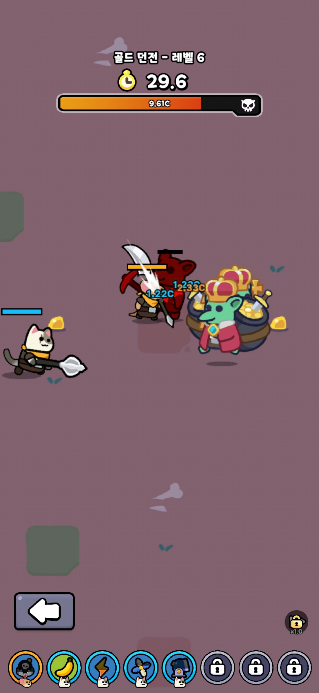

> 원제: «던전 입장모습»

- 던전에 입장할 때(04 던전 세부 → [도전])의 **입장 연출/화면 상태**다.
- 04 에서 도전을 누르면 이 이미지대로 전환·표시할 것.

### 구현 (2026-08-25, sess-0328-19087 워커 B) — ✅ 3회차 통과 (①~④ E 8 / F 9)

측정표 `docs/measure/30-던전입장.md` · 기록 `docs/review/30-던전입장.md`.

**이 화면은 «02 에서 UI 를 빼고 던전 전용 4종을 얹은 것»이다.** 28 보스전과 같이
**02 를 고치지 않고 상태 클래스 `#app.dunrun` 으로 덮는다**(클래스가 빠지면 기본 화면 그대로).

| 빼는 것 | 얹는 것 |
|---|---|
| `#top` 상단 HUD · `#tabbar` 하단 탭바 · `#stinfo` 스테이지 헤더 · `#menub` · `#sideL` · `#botleft` · `#tuto` · **`#battlefoot` 스크림** | 던전 타이틀 `<이름> - 레벨 <층>` (잉크 388,177,303,35) · ⏱ 스톱워치+`29.6` (397,230,242,80) · **계단형 진행바** (190,315,700,80) · 뒤로가기 화살표 (47,1999,207,129) |

- **⏱ 는 39 보스전과 좌표·에셋이 같다**(1px 이내). 진행바도 39 체력바와 같은 자리인데
  **우측에 «보스 탭» 이 13px 아래로 내려온 계단 형태**인 점만 다르다.
- **스킬 슬롯이 +180 내려오는 것은 코드가 필요 없다** — 탭바를 숨기면 `#stagearea` 가
  180 자라고 바닥에 붙은 `#battlefoot` 이 통째로 내려간다(ref 2195..2313 에 정확히 앉는다).
- **하단 고정 요소에 «ref y − 84» 를 쓰면 안 된다.** 프레임(2280)이 레퍼런스 콘텐츠(2256)보다
  24px 길고 그 차이는 캔버스가 먹는다 → 하단 요소는 **`bottom = 2340 − ref_bottom`** 이 유일한 규칙.

**기능 — 04 [도전] 은 «제한 시간 30초 실제 전투»다.** (기존 «즉시 판정 팝업» 폐기)

- 제한 시간 **30초**(28 보스전과 같은 규격). 진행바 = **이번 런의 누적 피해 / 요구 피해**.
- 요구 피해 = `d.req(f) × 1.2`. 계수 1.2 는 **헤드리스 실측**(cp 503 캐릭터의 30초 실제 누적 피해 ÷ cp 가
  스테이지 1/12/40/90 에서 1.57/1.17/0.63/0.65 → 중앙값). 기존 `cp() ≥ req` 와 난이도가 사실상 같다.
  **던전 상수(`DUNGEONS`·`DUN_TRY`)와 저장 구조(`KEY`)는 불변.**
- 요구치 충족 → 즉시 클리어 + 층 해금 + 보상 + **31 던전 클리어 화면**. 시간 초과 → 실패(층 유지).
- ◀ 나가기 → 중단(보상 없음, 입장 횟수는 소모) + 스테이지 복원 + 기본 UI 복귀.
- 던전 런 중에는 **스테이지가 오르지 않고**, 몹이 떨어지면 같은 스테이지로 다시 채운다.

## 31. 던전 클리어 화면

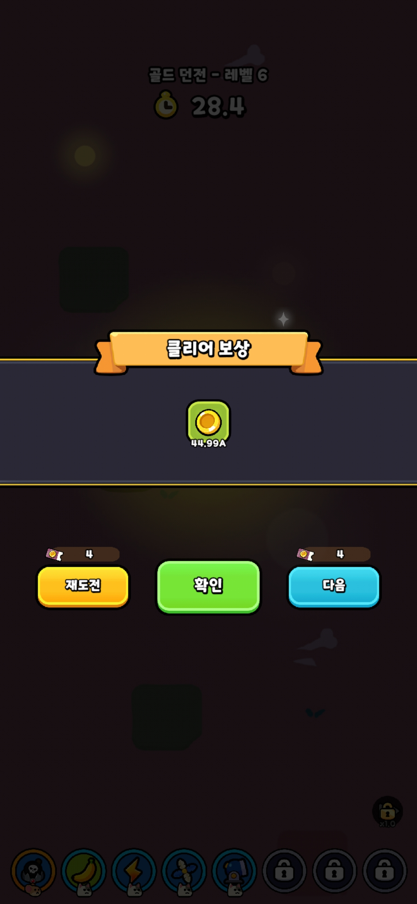

> 원제: «던전 클리어 화면»

- 던전을 클리어했을 때의 **결과 화면**이다. 9·12·17 과 같은 «결과 연출» 계열로 취급한다.
- [x] **완료 (2026-08-25, sess-0330-17695, 워커 D · 2회차 · ①~④ 8 통과)** — 전용 오버레이 `#dclw`.
      측정표 `docs/measure/31-던전클리어화면.md` · 기록 `docs/review/31-던전클리어화면.md`.
      껍데기는 A5 3분류에 없는 **«껍데기 없음·딤 위 연출»**(09·12·17·18 계열)이되 09·12 의
      **«전폭 밴드 + 리본»** 구조다 — **모달이 아니라** 좌우 여백 0 · `border-radius:0` · x0–1080 전폭.
      딤은 화면 전체 균일 `rgba(0,0,0,.78)`(30 던전 입장 화면과 픽셀 나눗셈: 흰 255 → 56).
      리본은 17·09 리본과 **픽셀 동일 에셋**(orange 마스크 IoU 0.884) → `.upr-grp/.upr-rb/.upr-tl` 무수정 재사용,
      그룹 top 만 768(= 17 의 793 − 25). 밴드 1080×340 은 7층(검정5·노랑4·암2·명8·채움300·명9·암2·노랑4·검정6).
      **가운데 «확인» 버튼만 264×136/41px, 측면 «재도전»·«다음» 은 234×105/34px** — 세 칸을 같은 크기로 만들면 틀린다.
      기능은 `challengeDungeon()`·`sweepDungeon()` 의 generic `popup()` 을 교체해 **실제 보상 데이터로 동작**한다
      (타일=그 층 대표 재화, 수량=실지급값, 알약 2개=남은 입장 횟수, 재도전/다음은 실제 입장 횟수 소모).
      ⚠ **z-index 61** — `#fxl`(58 재화 비행 연출)이 60 이라 40 에 두면 `giveReward()` 코인이 화면 위를 가로지른다.

## 32. 가이드 미션 — 미완료 상태

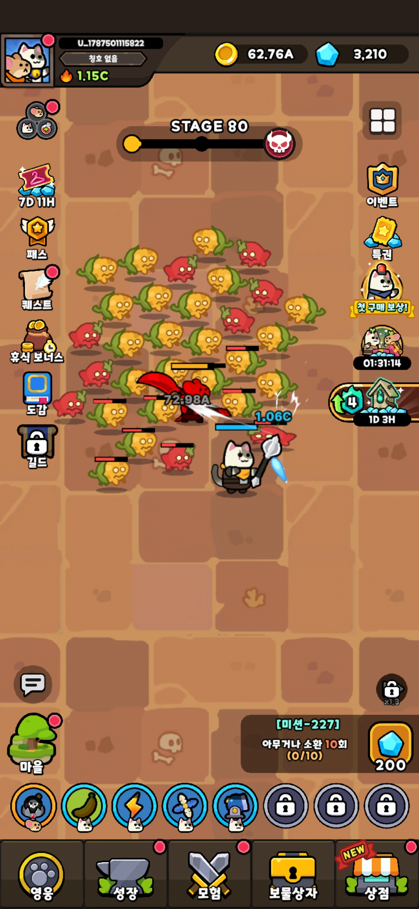

> 원제: «메인 화면인데 오른쪽 아래에 가이드 미션 부분 미완일때 저런식인거임 참고»

- **02 기본 메인 화면의 우하단 가이드 미션 배너**가 **미완료 상태**일 때의 모습이다.
- 02 ④ 의 미션 배너(보상받기 상태)와 대비되는 상태 — 두 상태를 모두 구현할 것.
> **설계 확정(2026-08-25, 작업 61)**: 이건 «가이드 퀘스트» 가 아니라 **«가이드 미션»** 이고, 배너 모양만이 아니라 **실제로 동작하는
> 미션 체인**을 만든다 — 현재 미션·진행도 표시 → 달성 시 «보상받기» 상태 → 누르면 보상(58 연출) → 다음 미션. 03 던전 잠금의
> «가이드미션 N 클리어» 조건도 이 체인으로 푼다. 상세: PROGRESS 작업 61.

## 33. 재화 정보 팝업

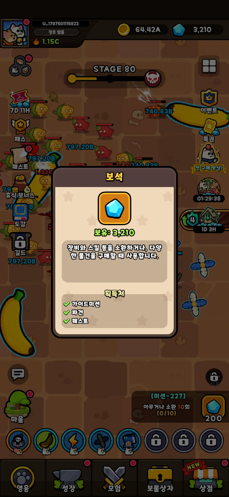

> 원제: «모든 재화 아이콘들은 클릭시 이렇게 정보 팝업 떠야함»

- **전역 규칙**: 화면의 **모든 재화 아이콘**(상단 HUD 골드·보석 알약 포함)은 **클릭하면
  이 이미지 형태의 정보 팝업**이 떠야 한다.
- 재화 이름·설명·획득처 안내가 뜨는 구조로, 상세 규격은 이미지에서 측정.


> **완료 (2026-08-24, sess-2058-27908, 워커 D)** — 측정표 `docs/measure/33-재화정보팝업.md` ·
> 기록 `docs/review/33-재화정보팝업.md` · 캡처 `docs/review/33-r1~r3.png`.
> 껍데기는 **딤(.54) 위 소형 가운데 다이얼로그 598×813** 전용 오버레이 `#ciw`(A5 공용 `.mbox` 폭 897 과 다르다).
> 좌표는 가로 1:1 · 세로 `y_ref − 210`, 자식 기준은 크림 본문 좌상단 ref(261,881).
> **레퍼런스에 닫기 X 도 하단 확인 버튼도 없다 — 추가하지 말 것.**
>
> **전역 규칙은 «속성 1개» 로 구현했다** — 아이콘마다 리스너를 붙이지 않고 **`data-cur="<키>"` + 위임 핸들러 1개**.
> 새 화면은 속성만 붙이면 자동 연결된다(41 의 03·14 팝업 내장 재화 바, 44 의 상점 재화 탭이 그 대상).
> ⚠ 위임이 **캡처 단계에서 `stopPropagation`** 하므로 `data-cur` 는 **«보유량» 표시 아이콘에만** 붙인다 —
> 구매·수령 버튼 위의 «가격/보상» 아이콘(10 소환 💎, 23 훈련 💰, 03 던전 보상, 22 퀘스트 보상)에 붙이면
> 그 클릭이 거래 대신 팝업을 연다.
> 재화 4종(`gold`·`dia`·`relic`·`sp`)의 설명·획득처 문구는 **실제 게임 데이터**(`DUNGEONS` 던전 이름, `SP_PER_LV`)에서 뽑는다.
> **저장 구조 미변경**(`KEY` 유지). `node verify33.js` **21/21 PASS** · `node tools/smoke.js` SMOKE PASS.
> 비평 4회차 — **①~④ 최저 9 / 9 (통과, 기준 8)**. ⑤ 8 · ⑥ 8~9 는 «아트 대기»(글자 외곽선 잔차 0.27px/side).

## 34. 축복(버프) 팝업

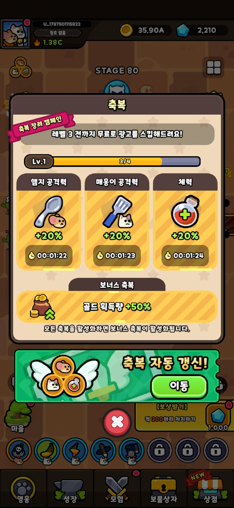

> 원제: «축복(버프팝업)»

- **축복 = 버프 팝업.** 진입 경로·버프 종류·지속 방식은 이미지 기준으로 파악해 구현.

### 구현 (2026-08-25, sess-0344-11735 워커 C) — 측정표 `docs/measure/34-축복버프팝업.md` · 기록 `docs/review/34-축복버프팝업.md`

**껍데기** — 딤 `rgba(0,0,0,.54)` 위 **가운데 다이얼로그 998×1157**(자체 오버레이 `#blsw`).
A5 `.mbox` 와 겹 구성이 같다: 검정 8 → 갈색 링 11(바깥 6 `#564438` + 안쪽 5 `#46382D`, 좌·우·하 3변) →
헤더 바 **90px**(`#5B4643`/`#523E3D`) → 크림 `#F0D9BA` + 별 워터마크. **폭만 897 이 아니라 998** 이다.
**팝업 «바깥»에 초록 프로모 스트립(952×252)과 빨간 닫기 X(Ø120)가 형제로** 떠 있어 공용 `#modal` 을 쓸 수 없다.
세로: 블록(1157 + 21 + 252 + 24 + 120 = **1574**)을 «위 126 − 아래 142» 로 중앙 배치 → 팝업 top **345** = ref 429 − 84.

**우리 게임 설계 (레퍼런스와 다름)**

1. 카드 3칸은 레퍼런스의 `햄지 공격력 / 매옹이 공격력 / 체력` 이 아니라 **`공격력 / 체력 / 공격 속도`** 다
   («설계 확정» 1번 — 캐릭터는 «용사» 1명). **3칸 그리드·좌표(297×447, pitch 315.5, gap 17)는 그대로.**
2. **광고 없음 — 무료 활성화.** 레퍼런스의 «레벨 3 전까지 광고 스킵» 프로모는 광고 SDK 가 없어 성립하지 않는다.
   목업을 만들지 않고 실제 규칙으로 바꿨다: 카드를 누르면 **무료로 30분** 켜진다.
3. **축복 레벨** — 1개 켤 때마다 진행 +1, **4를 채우면 레벨 +1**(그 활성화부터 즉시) · **레벨당 지속시간 +5분**.
   진행바 채움은 `prog/4` (레퍼런스 `3/4` = 74% 와 같은 규칙).
4. **보너스 축복** = 3종이 동시에 켜져 있는 동안만 **골드 획득량 +50%**. 하나라도 만료되면 즉시 꺼진다.
5. 팝업 밖 초록 스트립은 «축복 자동 갱신! / [이동]»(유료 상품 크로스 프로모) 대신
   **«모든 축복 받기!» / [받기]** — 비활성 축복을 한 번에 켜는 실제 버튼이다(자수 8자/2자를 맞춰 bbox 유지).
6. **진입점** = 좌측 사이드 아이콘 «축복»(`data-pop="bless"`). 작업 48 이 «던전» 을 지우며 비워 둔
   **예약된 5번째 라벨 행**을 쓴다 — `layoutSide()` 가 `SIDE.N=5` 로 이미 잡아 둔 칸이라 **기존 아이콘 좌표 이동 0**.

**효과 적용** — `bonus()` 에 곱한다(`b.atk`·`b.hp`·`b.rate` ×1.2, 보너스는 `b.gold` ×1.5).
`bonus()` 는 캐시라 **만료 순간에 `markDirty()` 를 부르는 1초 tick** 이 필수다(없으면 만료돼도 배수가 안 내려간다).
**저장**: `S.bless = {lv, prog, exp:{atk,hp,rate}}` 신설 · **`KEY` 미변경** + «없으면 기본값» 마이그레이션.

**검증** — `node verify34.js` **51/51 PASS**(기능 체크 표 A~I + 기하 J1~J12 + 콘솔 0) · `node tools/smoke.js` **SMOKE PASS**
(smoke 의 시트 잘림 목록에 `#blsw .bls` 추가 + 화면비마다 `openBless()` 를 열게 했다).

## 35. 패스 — 스테이지 패스

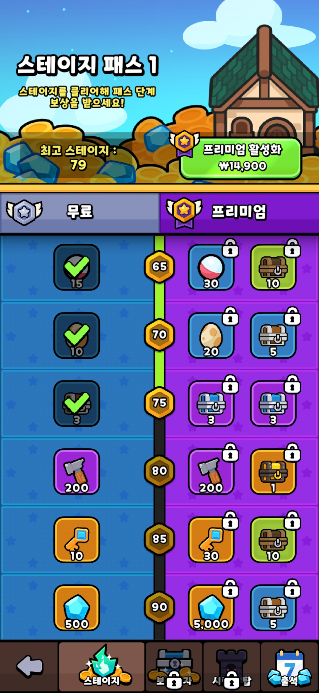

> 원제: «패스-스테이지패스»

- 좌측 사이드 아이콘 `패스` 로 들어가는 패스 팝업의 **스테이지 패스 탭**.
- 스테이지 진행도에 따라 보상 트랙이 열리는 구조(상세는 이미지에서 측정).
- **구현 진행 중 (2026-08-25, sess-0358-27977, 워커 D — 작업 35).** 측정표 `docs/measure/35-패스.md` · 기록 `docs/review/35-패스.md`.
  - **껍데기는 «딤 없는 전체화면 페이지»다**(03 던전·14 유물과 동류). 공용 `#modal` 을 쓰지 않고 `#psw` 를 신설했다.
    닫기 ✕ 가 없고 **이탈은 하단바 좌측 ← 뿐**이다.
  - 화면의 «탭» 은 두 층이다 — **하단바의 패스 종류 탭**(스테이지·보물상자🔒·시련의탑🔒·출석)이 진짜 탭이고,
    가운데 «무료 / 프리미엄» 밴드는 **탭이 아니라 리스트의 2열 컬럼 헤더**다. 섞지 말 것.
  - 하단바 규칙: 활성 탭 **289** · 비활성 **190** · 뒤로가기 칸 **195** 고정 · 구분선 5~6px.
  - 보상 수령에 **«받기» 버튼이 없다** — **칸 자체가 탭 타깃**이고, 수령되면 칸이 `#163C60` 으로 바뀌고 ✓ 가 얹힌다.
  - 진입점은 아직 **▦ 메뉴 안 임시 버튼**이다(좌측 사이드 5칸을 34 축복이 채웠다). **52 가 정식 메뉴 항목으로 인계할 것.**

## 36. 패스 — 출석 패스

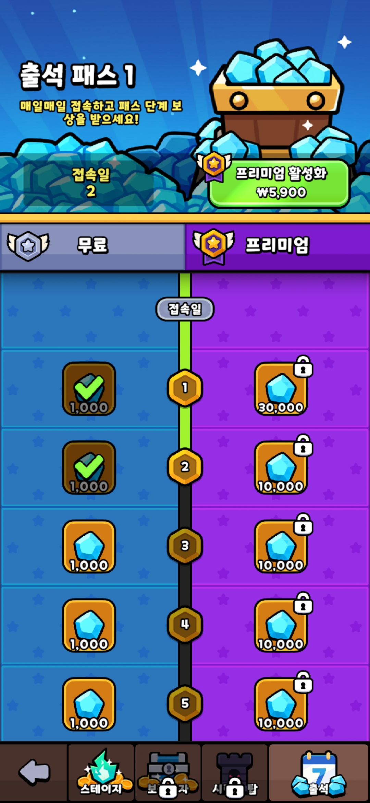

> 원제: «패스-출석패스»

- 같은 패스 팝업의 **출석 패스 탭**. 35 와 한 화면의 탭 2개이므로 **껍데기·탭 구조는 35 와 공유**한다.

### 구현 (2026-08-25, sess-0743-16886 워커 C) — 측정표 `docs/measure/36-패스출석패스.md` · 기록 `docs/review/36-패스출석패스.md`

35 가 만든 `#psw`(딤 없는 전체화면 페이지)를 **그대로 쓰고 «탭 슬롯» 만 채웠다**(35 측정표 §9-3 의 인계 지시).
껍데기(골드 구분바 · 무료/프리미엄 헤더 밴드 · 행 pitch 229.85 · 스파인 · 하단 패스탭바 · 구매 버튼)는
**35 측정표를 그대로 따르고 재측정하지 않았다** — 스팟 재검에서 전부 일치했다.

**탭마다 갈리는 것 4가지**

1. **히어로** — 35 의 «밝은 하늘 + 구름 + 금화더미» 가 아니라 **진파랑 하늘(#2755AD→#229AE8) + 아래로 수렴하는
   빛살 5쐐기 + 흰 4각 반짝임 3개 + 금색 광차(시안 크리스탈 적재, 396×369 @frame 610,26) +
   전폭 얼음/보석 지대(1080×234 @frame 0,301)** 다. **36 에 구름은 없다.**
2. **프리미엄 열 보상 칸이 1개**(x741..898, 컬럼 중앙 819.5). 35 는 2개(636/846)다.
3. **리스트 선두 «접속일» 알약** — 172×72 · r**31**(완전 pill 아님) · 검정 테 5 · 안쪽 밝은 링 7~8 `#BFCCD5` ·
   본체 단색 `#8B95B8`. **R1 은 라벨 전용 행이고 보상은 R2 부터**다.
   ⚠ 라벨 행도 «행» 이라 **무료·프리미엄 컬럼 배경을 깔아야 한다** — 안 깔면 221px 구간이 파랑 통짜가 된다.
   ⚠ 선두 오프셋은 pitch(229.85)가 아니라 **221.5** 다(ref 첫 구분홈 1017.5 = 리스트 시작 796 + 221.5).
4. **육각 라벨 = 접속 일수(1일 단위 연속 1·2·3…)**. 35 의 5스테이지 단위가 아니다.

**우리 게임 설계**

- **해금 진행도는 `S.att.n`(접속 누적일)** 이다. 기존 출석 시스템(`claimAttend`)이 올리는 값을 그대로 쓴다 — 신규 상태 0개.
- 보상은 레퍼런스대로 **전 행 같은 아이템(다이아)·전 칸 에픽 등급**: 무료 1,000 고정 / 프리미엄 1일차 30,000, 그 뒤 10,000.
- 결제 연동은 35 와 같이 «준비 중» 이고 `grantPassPrem()` 한 함수로 모아 뒀다(₩5,900).

**저장 구조 (KEY 미변경 · 마이그레이션 흡수)** — 패스가 둘이 되면서 **네임스페이스**가 필요해졌다:
`S.pass.got['탭:단계:칸']` · `S.pass.prem[탭]`. 없으면 스테이지 패스 3단계 수령이 출석 3일차 수령이 되고,
₩14,900 한 번에 ₩5,900 짜리까지 열린다. 구 세이브(`'단계:칸'`·boolean)는 `load()` 가 **전부 stage 로 이관**한다.

**수령완료 칸 색 = 등급색 × 0.5** — 35 가 CSS 에 박아 둔 `#1C526E`/`#163C60` 은 **파랑 등급 한 칸의 인스턴스**였다.
주황·파랑 두 등급에서 비율이 .488~.504 로 재현돼 `passDim()` 으로 등급색에서 계산하게 바꿨다(35 에도 그대로 적용된다).

**검증** — `node tools/verify36.js`(기능 체크 표 14항목 + 마이그레이션 + 화면비 3종) · `node tools/verify35.js` 회귀 0 ·
`node tools/smoke.js` **SMOKE PASS**. 자체 픽셀 대조는 `python3 tools/scan36.py [캡처]` — 비평가 수치를 반영하기 전에
**같은 임계값·같은 창으로 다시 재는 제3의 검산**이다(LESSONS 05-③·21-④).

## 39. 보스전 — 메인 화면 (2026-08-25 추가)

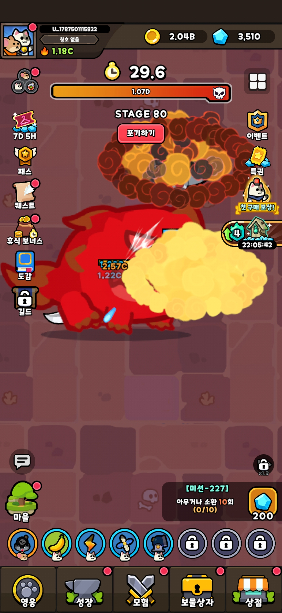

> 원제: «메인에 보스전»

- **보스전 중의 메인 화면 상태.** 보스만 스폰되고 일반 몹은 나오지 않는다.
- 스테이지 헤더에 ⏱ 남은 시간(30초 제한) 표시.
- 구현·규칙 전체는 문서 서두 «설계 확정» 6번(보스전 규칙)과 **작업 28** 참고.
- **구현 완료 (2026-08-24, sess-1957).** 실측 결과 이 상태의 헤더는 02 와 크게 다르다 —
  **반투명 캡슐도 스테이지 진행바도 없고**, `STAGE n` 라벨이 **110px 아래로 내려가며**(ref y311→421),
  「BOSS」 접미어도 없다. 그 자리를 **⏱ 타이머**(스톱워치 + `29.6` 형식 · 클러스터 (397,231,242,79))와
  **보스 체력바**((190,315,700,67) · 우측 끝 소형 두개골 46×42)가 쓴다. 하단에 **「포기하기」 버튼**
  ((447,471,186,80) · r22 · #FD4150 · 검정 4px). 전 수치는 측정표 `docs/measure/28-보스전.md`.

## 40. 보스 재도전 대기 상태 — 메인 화면 (2026-08-25 추가)

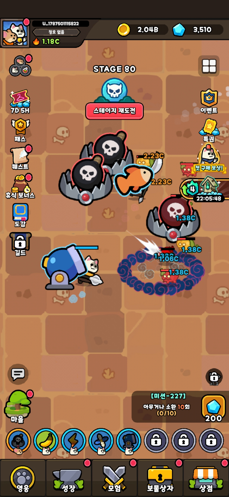

> 원제: «메인에 보스재도전 해야하는 상태»

- **보스전에서 진 뒤의 메인 화면 상태.** 스테이지는 안 내려가고 그 스테이지에 맴돌며 일반 몹 파밍이
  계속되는 중이고, **스테이지 헤더 아래에 «재도전» 버튼**이 떠 있다.
- «재도전» → 보스전 재시작 → 클리어하면 자동 진행 재개. 규칙 전체는 «설계 확정» 6번과 **작업 28**.
- **구현 완료 (2026-08-24, sess-1957).** 이 상태의 헤더도 **캡슐·진행바가 없다.** `STAGE n` 라벨은 제자리(ref y311)로
  돌아오고, 진행바 우측 끝에 있던 해골 노드가 **화면 중앙 ⌀120(중심 540,424)** 으로 커진다.
  버튼 문구는 「재도전」이 아니라 **「스테이지 재도전」**((402,482,276,82) · r22 · #FC4051 · 검정 4px ·
  해골 노드 하단과 맞닿음). 전 수치는 `docs/measure/28-보스전.md`.

# 추가 레퍼런스 5장 (2026-08-25 추가 — 메뉴 계열)

원본 제목이 곧 요구사항. 측정표 없음 — 구현 시 이미지에서 직접 측정. 전부 **02 우상단 ▦ 메뉴 버튼**에서 시작하는 계열이다.

## 52. 메뉴 (▦ 버튼 클릭 시)

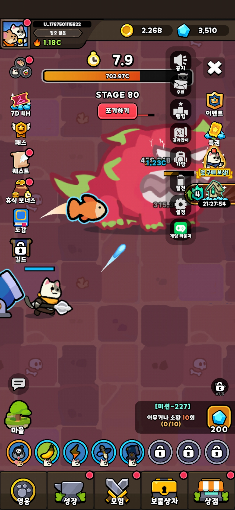

> 원제: «메뉴 버튼 클릭시»

- 02 우상단 **▦ 4분할 메뉴 버튼**을 눌렀을 때 뜨는 메뉴. 가방·랭킹·설정·절전 모드 등 53~56 의 진입점.
- 항목 구성·배치는 이미지대로.
  > **설계 확정(2026-08-25, 작업 71)**: 이미지의 8개 항목 중 **«공지» 와 «게임 라운지» 는 뺀다** — 남는 항목: 우편 · 랭킹 · 길라잡이 · 가방 · 절전 · 설정 (6개, 세로 간격·아이콘 규격은 이미지대로 유지, 위에서부터 채움). 우편(69)은 이 메뉴로만 진입한다.

### 71 구현 체크리스트 (2026-08-25, sess-0720-7694 워커 B — 완료)

- [x] **좌측 사이드 «우편»(📬) 삭제** — `#sideL` 행 + `.side .ibtn[data-pop]` 위임의 `mail` 분기. 우편 진입은 `menuGo('mail') → openMail()` 하나뿐
- [x] **남은 행 좌표 Δ0** — `.side` 가 flex 컬럼이라 코드 0줄로 당겨진다. `SIDE.N` 은 48 이 예약한 **5** 를 유지해 `--ih 82 · --igap 20 · --itop 72` 불변 (attend 176 · roul 337 · quest 471 · promo 605 · bless 739)
- [x] **우편 레드닷 이관** — `sideAlert('mail', …)` 이 `#menub` 에 `.alert` 를 토글하고 `#menub.alert .bdg{display:block}`. **호출부는 무수정**. `#menub.mnon .bdg{display:none}`(메뉴 열림)이 뒤에 와서 이긴다 — 순서를 바꾸지 말 것
- [x] **메뉴 «공지»·«게임 라운지» 삭제** — 칸 2개 + `menuGo` 분기 2개 + 유일한 소비처가 사라진 `NOTICE` 배열 + 라운지 전용 `.mn-b.gl` 초록 타일 규칙까지
- [x] **7칸 패널** — 우편·랭킹·길라잡이·가방·절전·설정 + 35 인계 임시 «패스». 칸 99×100 · pitch 110 · 첫 칸 상변 149(ref 233) 그대로, `.mn-col` 높이만 1020 → **800**(검산 7×100 + 6×10 + 상20.5 + 하20 = 800.5). 좌변 761 · 상변 128.5 · 꼬리는 불변
- [x] 게이트 `node tools/verify71.js` → **VERIFY71 PASS 58/58** · `node tools/smoke.js` → **SMOKE PASS** · 기록 `docs/review/71-우편아이콘제거-메뉴정리.md`

> 패스를 좌측 사이드(ref y567~667)로 옮기면 `.mn-col` 높이는 800 → **690**(6칸: 6×100 + 5×10 + 40.5)이다.

### 52 구현 체크리스트 (2026-08-25, sess-0817-25014 — **통과 ①~④ 8**, 5회차)

- [x] **껍데기 = 딤 없는 말풍선 콜아웃** — 전체화면 딤·중앙 다이얼로그·바닥 시트 **어느 것도 아니다**(고정 UI 평균색을 02 와 대조해 판정: Δ≈1~2 = 딤 0%). `#mnw` 는 «바깥 눌러 닫기» 히트영역일 뿐
- [x] **패널** x761 y128.5 · 138 × **800**(7칸) · r35 · `rgba(0,0,0,.28)` · 테두리 없음 — 검산식 `칸수×100 + (칸수−1)×10 + 20.5 + 20`
- [x] **꼬리** 돌출 **29** · 밑변 **46** · 꼭짓점 (928, 204.5) — ▦ 좌변(934)에 **닿지 않는다**(6px 틈)
- [x] **칸** 100×100 · pitch 110 · r**37** · 첫 칸 상변 149 · 총 투과율 .14(패널 .28 위 .80)
- [x] **아이콘 슬롯** 잉크 높이 51 · 중심 칸top+42.7 · 중심 x 칸중앙 — 이모지는 임시 대체물, 이 bbox 가 아트 자리다
- [x] **라벨** 잉크 2자 43×24 · 4자 74×19 · 중심 칸top+80 — 시스템 서체 획이 ref 의 절반이라 `.mn-l::after` 로 **흰 stroke 1.6px 를 겹쳐 굵히고**(가짜 볼드) 폰트를 26→24 로 내려 잉크 크기를 되돌렸다
- [x] **▦ → ✕ 스왑** — 새 버튼이 아니라 **같은 자리에서 글리프만** 바뀐다. ✕ 잉크 64×59 중심 (985.5,226) · 막대 t19 · θ42.34° · L79.9(캡슐 회전 bbox 공식 `(L−t)cosθ + t`) · 열림 상태에서만 레드닷 숨김
- [x] **7칸 배선 실동작** — 우편(실제 우편함) · 랭킹/가방/절전/설정(각각 54·53·56·55 화면 몫) · 길라잡이(실제 가이드 미션 데이터) · 패스(35 페이지). 7칸 전부 «목적지 열림 + 메뉴 닫힘» 헤드리스 확인
- [x] **작업 38 유지** — 메뉴가 열려도 `#top`·`#tabbar`·`#sideL`·`#menub`·`#stinfo` **Δ0**
- [x] 게이트 `node tools/verify52.js` → **VERIFY52 PASS 79/79** · `node tools/smoke.js` → **SMOKE PASS**
- [ ] 남은 1px 3건(패널 상단 패딩 20→21 · 4자 라벨 균등축소 83% · 아이콘 잉크 −2~10%) — **아트 교체 때 일괄**. 기록: `docs/review/52-메뉴팝업.md` «남은 차이»

> **계측 도구**: `tools/cap52.js`(캡처) · `tools/box52.js`(잉크 bbox) · `tools/edge52.js`(반투명 변) · `tools/rad52.js`(반경 피팅) · **`tools/run52.js`(획 두께 — 가로 런렝스)** · `tools/verify52.js`(회귀)

## 53. 가방 팝업

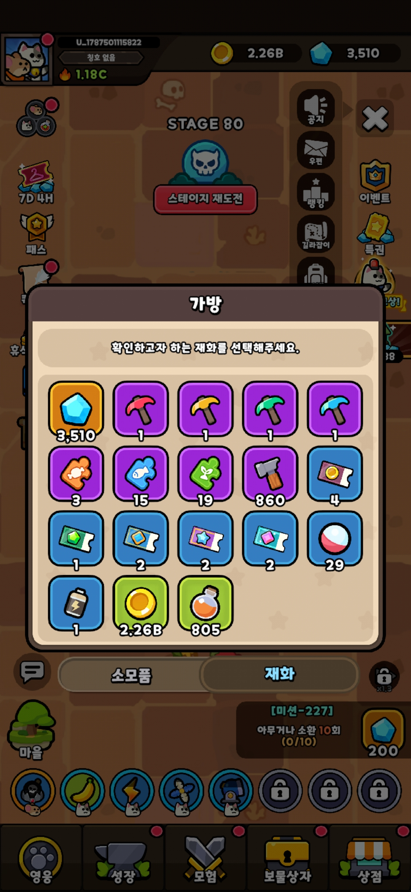

> 원제: «가방팝업»

- 보유 아이템·재료 목록. 진입: 52 메뉴 → 가방.

## 54. 랭킹 팝업

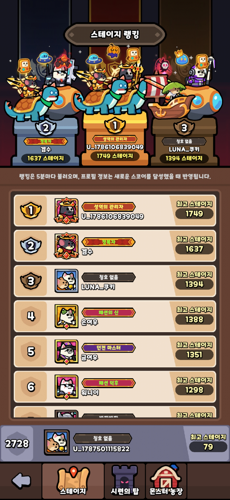

> 원제: «랭킹팝업»

- 진입: 52 메뉴 → 랭킹. **서버가 없으므로 우선 로컬 데이터(내 기록 + 더미 순위)로 UI 만 구현**, 서버 연동은 별도.

## 55. 설정 팝업

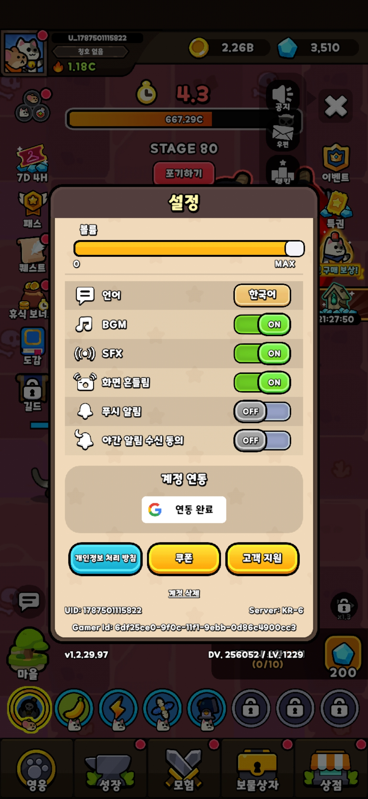

> 원제: «설정팝업»

- 진입: 52 메뉴 → 설정. 사운드·알림·계정·언어 등 항목은 이미지대로.

### 55 구현 체크리스트 (2026-08-25, sess-0758-2927 워커 D — 완료, ①~④ 8)

- [x] **껍데기 (가) 딤(α .545) 위 가운데 다이얼로그** — 자체 오버레이 `#cfw` / `.cf55` **796×1347** @ ref(142,539) → 프레임 y455.
      53 가방과 같은 규격(검정 **7** + 갈색 림 12 + r44 + 헤더 91 + 크림 758×1228). 공용 `#modal` 은 폭 898 고정이라 못 쓴다.
      **레퍼런스에 ✕ 가 없다** — 캡처의 ✕ 는 팝업 «뒤» 메뉴 배경의 것이고 딤 아래다(흰 픽셀이 255 가 아니라 116~119). 닫기는 딤 탭
- [x] **헤더는 균일한 `#533F38`** — 53·A5 의 «밝은 립»(inset box-shadow)을 베끼면 안 된다(ref 세로·가로 단면 실측)
- [x] **볼륨 그룹** — 소제목 「볼륨」 · 트랙 679×50(r18) + 노브 60×50(흰 코어 50×40) · 끝 라벨 「0」/「MAX」 · 구분선 699×4
- [x] **옵션 리스트 699×509 · 모서리 각(반경 0) · 교대 틴트 6행**(홀 `#D0BCA1` / 짝 `#E2CDAF`, 행 pitch 84.83)
      — 언어(값 버튼 「한국어」 169×69 r22, **흰 채움 + 어두운 외곽선**) · BGM · SFX · 화면 흔들림 · 푸시 알림 · 야간 알림 수신 동의
- [x] **토글은 «라벨이 노브 안»** — 트랙 169×58(외곽 3, 위아래 밝은 띠 4) + 노브 99×69(트랙보다 커서 5.5px 씩 넘친다). ON=우측 초록 / OFF=좌측 회색
- [x] **행 아이콘은 ref bbox 를 정확히 차지**(아트 자리 규칙) — 56×56 · 50×50 · 64×44 · 71×56 · 48×50 · 58×64 를 `--sf/--sx/--dx/--dy` 실측 역산으로 맞춤(Δ≤2px)
- [x] **계정 연동 패널 699×198 r45** + 흰 구글 카드 248×78 r12 + **「G」 로고 자리 39×39 @ ref(435,1472)**(4색 링 + 흰 속 + 파란 막대 CSS 대체물)
- [x] **하단 버튼 3칸 218×99 r41** — 개인정보 처리 방침(청록) / 쿠폰(금색) / 고객 지원(금색), x201/432/661 · 간격 13
- [x] **푸터** — 「계정 삭제」 + 밑줄 90×2 @ ref(496,1750) · `UID:` 좌 / `Server:` 우 · `Gamer Id:` 전폭 중앙
- [x] **기능** — 오디오·푸시가 아직 없으므로 BGM/SFX/푸시/야간은 «저장되는 설정» 까지가 실동작. 실제로 끄는 것은
      **화면 흔들림(67 `cam.shake` 단일 게이트)** 과 **볼륨(오디오 게이트 `sndOn()` — 소리가 들어오면 여기만 보면 된다)**.
      쿠폰(코드 3종 · 재사용 차단 · **새로고침을 견디는 이력**) · 개인정보 처리 방침 · 고객 지원 · 계정 삭제 전부 동작. 52 메뉴 «설정» placeholder 제거
- [x] 게이트 `node tools/verify55.js` → **VERIFY55 63/63 PASS** · `node tools/smoke.js` → **SMOKE PASS**(화면비 6종) · 기록 `docs/review/55-설정팝업.md`

## 56. 절전 모드

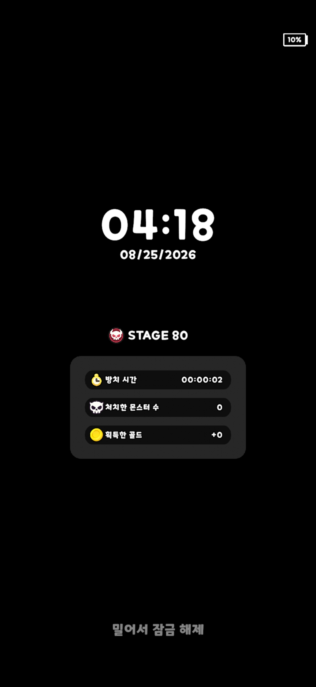

> 원제: «절전모드»

- 진입: 52 메뉴 → 절전 모드. **전체화면 어두운 상태**(전투는 계속, 렌더 최소화·화면 어둡게), 터치로 해제.

**구현 (2026-08-25, sess-0805-18245 워커 A) — 측정표 `docs/measure/56-절전모드.md` · 기록 `docs/review/56-절전모드.md`**

> ⚠ **레퍼런스 실측이 위 한 줄 요약을 3군데 뒤집는다**(측정표 §0). 이 화면을 다시 만질 사람은 여기부터 읽을 것.
> ① «어둡게» 가 아니라 **완전 불투명 검정**(6개 잉크 밴드 밖 픽셀이 전부 정확히 RGB 0,0,0 — 딤 α .9x 로 만들면 틀린다).
> ② «전투는 계속» 은 **로직만**이다. 전투 화면은 1픽셀도 안 보인다.
> ③ 화면 문구는 «터치» 가 아니라 **«밀어서 잠금 해제»** 다. 지금은 문구는 레퍼런스대로 두고 **탭·스와이프 둘 다** 받는다.
> 문구/동작 중 어느 쪽에 맞출지는 **저장소 주인 확인 대기**.

- [x] `#svw` 전면 오버레이(z 62, `background:#000`) + `#app.sv` 로 하위 레이어 `visibility:hidden`
- [x] `loop()` saverOn 분기 — `step(dt)`·세이브·일일 갱신은 유지, `draw/drawHud/drawTuto/fxTick/renderUI` 는 정지
      (헤드리스 실측: 절전 1.5초 동안 캔버스 `fillRect` **0회**, 해제 직후 0.6초 **168회**)
- [x] 6요소 배치 — 배터리 배지(84×46 @우 28.5·상 28.5) · 시계(잉크 386×115 @y624) · 날짜(260×37 @y764)
      · `☠ STAGE N`(스컬 58×56 @x368 + 텍스트 204×34, **텍스트만 cx540 중앙**) · 방치 요약 패널(601×351 @239.5,1128)
      · 하단 «밀어서 잠금 해제»(312×43 @y2040, `#888`)
- [x] 방치 요약 3행 = **절전 진입 이후 증분**(방치 시간 `HH:MM:SS` · 처치 수 · 획득 골드 `+`), 1초마다 갱신
- [x] 배터리는 `navigator.getBattery()` 실제 잔량, API 없으면 **배지 숨김**(가짜 값 금지)
- [x] 해제: 탭 1회 또는 **120 프레임px 이상 스와이프**(스케일 보정 포함)
- 게이트: `node tools/verify56.js`(실동작 20항목) · `node tools/cap56.js`(캡처) · `python3 tools/scan56.py cmp <png>`(잉크 대조)
  · `tools/smoke.js` 에 화면비 6종 «절전 모드 잘림 없음» 추가

---

## 69. 우편함 팝업 (2026-08-25 추가)

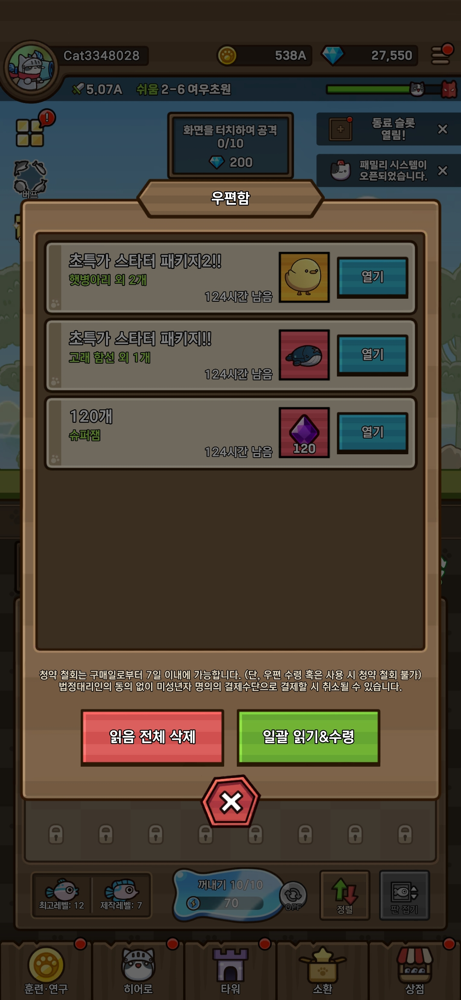

> 원본은 **다른 게임** 캡처다. **우편함 팝업 부분만 참고**하고 나머지(HUD·유닛 바·탭바·«동료 슬롯 열림» 토스트 등)는 전부 무시한다.
> 진입: 52 메뉴 → 우편 (메인 좌측 사이드의 우편 아이콘은 작업 71 로 제거).

**따올 것 — 레이아웃·비율·구성만**
- 세로 구성: 상단 타이틀 탭(«우편함») → 리스트 영역(불투명 패널, 세로 스크롤) → 안내 문구 2줄 → 하단 버튼 2개 좌우 → 닫기 ✕ (팝업 하단 중앙 바깥)
- 행(카드) 구성: 좌 **제목**(큰 글씨) / 그 아래 **보상 요약**(초록, «햇병아리 외 2개») / 우측 하단 **남은 기간**(«124시간 남음») / 우측 **보상 썸네일 1칸**(수량 표기) / 맨 우측 **«열기» 버튼**
- 행 높이·간격, 썸네일·버튼의 폭 비율, 리스트 패널 대비 하단 버튼 영역 비율을 이미지에서 실측해 측정표(`docs/measure/69-우편함팝업.md`)에 기록

**따오지 말 것 — 껍데기는 이 게임 공용 UI 로 통일**
- 팝업 프레임 → A5 공용 모달(`.mbox`) 규격
- 버튼 → 공용 `.gbtn` 계열(빨강/초록 스트라이프 버튼 모양을 흉내내지 않는다)
- 보상 썸네일 프레임 → 도감·장비·소환 결과에서 쓰는 **공용 아이템 프레임**(등급색 포함). 지금 우편함만 프레임이 다르면 안 된다 — 모든 화면의 아이템 프레임이 같은 부품이어야 한다
- 텍스트 서체·색은 우리 게임 공용 톤

**기능**
- 데이터는 기존 `MAILS`·`S.mail`, 전체 수령은 기존 `claimAllMail()` 재사용. 행별 «받기» 를 두면 `S.mail[id]` 개별 처리 + 58 보상 연출 연결.
- «읽음 전체 삭제» 는 우리 게임에 읽음 개념이 없으므로 생략 가능(그 자리는 «전체 수령» 하나를 가운데 두거나, «닫기 / 전체 수령» 2개로).
- 남은 기간은 `MAILS` 에 만료가 없으니 «기한 없음» 또는 생략.

### 구현 (2026-08-25, sess-0635-3901 워커 C) — ✅ 5회차 통과 (①~④ **I 9 / J 8**)

측정표 `docs/measure/69-우편함팝업.md` · 기록 `docs/review/69-우편함팝업.md` · 게이트 `node tools/verify69.js`(77/77).

- [x] 껍데기 = **A5 공용 다이얼로그 898×1303**(`#modal.ml69`). 가로 환산 **s = 898/988 = 0.9089**.
      세로만 의도적 이탈(1:1.451 vs ref 1:1.425) — 헤더가 91px 고정인데 ref 상단 존은 78px 이라 ~35px 회수 불가.
- [x] 세로 구성: 헤더 «우편함» → 리스트 패널(830×880, 5행) → 안내 2줄 → 하단 버튼 2개(305×117, 정확히 같은 크기) → ✕(상자 **바닥 테두리에 걸침**)
- [x] 행(784×147, pitch 164): 좌 악센트 밴드 25 + 발자국 마커 · 제목 · 초록 보상 요약 · **고정 열 우정렬** 기간 · 썸네일 108 · 버튼 151×89
- [x] 아이템 프레임은 12 `.sm-c` 공용 등급 프레임(`SUM_CARD`), 버튼은 22 `.qs-b` 계열 공용 베벨 캡슐 — **레퍼런스 모양을 따라 그리지 않았다**
- [x] 기능: 행별 [받기] → `S.mail[id]`·재화·세이브·HUD 반영 / [전체 수령] / 새로고침 유지 / 닫기 2종 / 연타 중복지급 방지
- [x] 남은 기간은 «기한 없음», 수령 후 «수령 완료». 좌측 악센트 밴드를 **읽음 마커 대신 수령 여부 마커**로 전용
- [ ] 2차 폴리시 잔여(⑤⑥, 아트 불필요): 안내 문단 좌우 거터 · 패널 캐비티/악센트 밴드 **Weber 대비** · 행 제목 잉크

> **70 을 잡는 세션에게** — 69 가 세운 규칙 3개를 그대로 쓸 것:
> ① 레퍼런스 절대 px 은 **팝업 박스 대비 비율**로 읽고 `s` 를 곱해 옮긴다(원값을 그대로 박으면 안 된다).
> ② 캡처·게이트는 **등장 애니메이션의 transform 이 항등이 될 때까지** 기다린다 — 오버슛 바운스라 고정 대기는 −8%/+1.3% 로 어긋난다(`tools/cap69.js` 참고).
> ③ 캡슐·카드의 **반경 «안»에서 높이를 재면 틀린다** — 69 에서 비평가 3명이 같은 실수를 했다.

---

## 70. 출석 보상 팝업 (2026-08-25 추가)

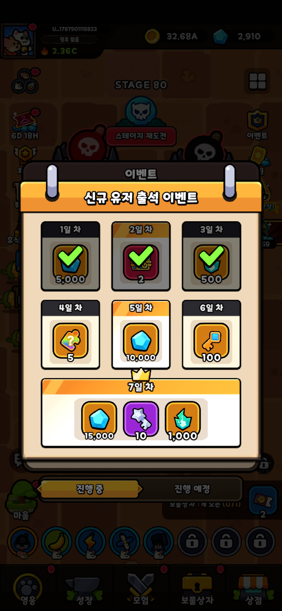

> 진입: 메인 좌측 사이드 1행 📅 → 출석. 원본은 «이벤트» 팝업 안의 «신규 유저 출석 이벤트» 탭이지만
> **우리 타이틀은 «출석 보상»** 이다(«신규 유저» 문구 금지). 상단 «이벤트» 헤더와 하단 «진행 중 / 진행 예정» 탭은 무시.

**따올 것 — 레이아웃·비율·구성만**
- 노란 캘린더 헤더 밴드(타이틀 «출석 보상») + 상단 고리 2개(캘린더 느낌 장식 — CSS 로 대체 가능)
- 본문: **3열 × 2행 카드(1~6일 차)** + **7일 차 전폭 카드**(보상 3개 가로 나열)
- 카드 = 상단 «N일 차» 밴드 + 아이템 프레임(수량 아래 표기)
- 상태: 수령 완료 = 카드 어둡게 + 초록 ✔ 오버레이 / 오늘(수령 가능) = 밴드 강조색 + 카드 위 왕관 포인터 / 미래 = 기본
- 칸 크기·간격·헤더 높이·7일차 카드 높이 비율을 실측해 `docs/measure/70-출석보상팝업.md` 에 기록

**따오지 말 것 — 껍데기는 공용 UI**
- 팝업 프레임·버튼·아이템 프레임은 69 와 같은 규칙(A5 모달 · `.gbtn` · 공용 아이템 프레임). 카드 프레임 색만 상태(완료/오늘/미래)로 구분.

**기능 · 데이터**
- 기존 `ATTEND`(28일)·`S.att`·`openAttend()` 의 수령 로직 재사용.
- 28일을 7일 단위 **4페이지(주차)** 로 접거나(좌우 넘김/현재 주차 자동 표시) 7일 주기로 순환 — 하나를 택해 review 에 기록.
- 수령 버튼: 오늘 카드를 탭하면 수령(또는 하단 «보상 받기» 버튼 1개 유지) + 58 보상 연출.

### 구현 체크리스트

> 완료 (2026-08-25, sess-0648-11561 워커 D · 3회차 · ①~④ 최저 **8** 통과).
> 기록 `docs/review/70-출석보상팝업.md` · 측정표 `docs/measure/70-출석보상팝업.md`(§13 정오표 포함)
> 게이트 `node tools/verify70.js` → **VERIFY70 PASS 23/23** · 캡처 `node tools/cap70.js`

- [x] **껍데기** — A5 공용 다이얼로그의 층 구성(검정 외곽 → `#2A2018` → `#7A6248` 베벨 → 크림)을 70 실측 두께로 다시 적은 `.at70`. 팝업 **940×1077** (A5 표준 898 이 아니다), 크림 본문 **897×932**
- [x] **노란 캘린더 헤더 밴드** — `.at70 .mhead` 920×112, 2톤(`#FFB53E` / `#EA9133`) + 상단 하이라이트 4px. 타이틀 **«출석 보상»**(«신규 유저» 문구 없음) 잉크 47px
- [x] **캘린더 고리 2개** — `.at-ring` 35×122 캡슐, 중심 x = 팝업중심 ±340.5, 밴드 상단보다 66px 위. `.mbox{overflow:visible}` 로 밖으로 나간다
- [x] **3열 × 2행 카드** — 226×268, gap 44.5 / 33. 카드 = «N일 차» 밴드 56 + 플레이트 159×167 + 아이템 프레임 138×138(r34) + 수량
- [x] **7일차 전폭 카드** — 767×268, 플레이트 512×161, 프레임 3개 pitch 160. 밴드는 «오늘» 이 아니라 **주차 최종 보상** 강조
- [x] **상태 3종** — 수령완료(카드 안쪽 `brightness(.5)` + ✔ 91×73 풀밝기) / 오늘(강조 밴드 + 👑 66×45, 아래 카드를 14px 덮음) / 미래(기본)
- [x] **28일 → 7일 4주차** — 현재 주차 자동 표시(좌우 넘김 없음. 레퍼런스에 페이지 화살표가 없다)
- [x] **수령** — 오늘 카드 탭 → `claimAttend(카드)` → `giveReward()` 실지급 + `S.att.n/date` + `save()` + 58 연출(`fxAt`·`fxCheck`·`fxReward`) + 그 자리 재렌더. 하단 버튼·닫기 ✕ 없음(레퍼런스에 없다), 닫기는 딤 탭
- [x] **`ATTEND` 확장** — 7 배수 날을 다이아+유물석+골드 3종으로(전폭 카드의 «보상 3칸» 재현). 다른 날은 종전 그대로
- [ ] **아트 대기** — 👑 · ✔ · 아이템 아이콘 9종이 이모지 대체물이다(bbox 는 레퍼런스대로 차지). 측정표 §10 «아트 필요» 표가 발주 규격
- [x] 구 달력 `.cal` / `.day` (7×4 그리드 28칸) 폐기

---

## 58. UI 연출 (피드백 이펙트) — 신규 설계, 레퍼런스 스크린샷 없음

**2026-08-25 확정(저장소 주인 지시)**: «얻거나 오르는» 모든 순간에 연출이 있어야 하고, **8점 기준**으로 채점한다.

| 순간 | 필수 연출 |
|---|---|
| **재화 획득** (전투 드랍·보상·판매·룰렛·우편 등 전부) | 획득 지점에서 코인/젬 아이콘 3~8개가 **상단 HUD 의 해당 재화 알약으로 날아가 꽂히고**, 도착 순간 알약이 살짝 튀며(scale 1.15→1) **숫자가 롤링**해 올라간다. 알약 근처에 `+1,234` 플로팅 텍스트 |
| **보상 수령** (퀘스트·출석·우편·오프라인·던전 클리어) | 보상 아이템이 팝(scale 0→1.2→1) + 방사형 버스트 파티클, 이어서 위의 재화 획득 연출로 연결 |
| **강화·업그레이드 성공** (훈련·장비·스킬·유물·일괄 강화) | 대상 카드/행이 흰색 플래시 1회 + 살짝 커졌다 복귀, 수치가 옛값→새값으로 롤링, 성공 파티클 |
| **퀘스트 클리어** | 항목에 체크 애니(스트로크 드로잉) + 화면 상단 토스트 «퀘스트 완료» + 레드닷 점등 |
| **소환 결과** | 12번 규격 유지 + 카드가 등급 순으로 순차 팝(에픽 이상은 광선 버스트) |
| **레벨/단계 상승** | 17번 연출 재사용 |

- 공통 규칙: 연출 길이 **0.3~0.8초**, 입력을 막지 않는다(터치로 스킵 가능), 동시 다발 시 큐잉 대신 겹쳐도 되지만 파티클 상한(현재 `parts` 320) 준수.
- 구현은 **공용 모듈 하나**(`fx.js` 성격의 함수군: `fxFly(from, currency, n)`, `fxPop(el)`, `fxFlash(el)`, `fxToast(text)`, `fxRoll(el, from, to)`)로 만들고 각 화면에서 호출만 한다. 화면별 워커가 각자 만들지 않는다.
- 채점(ROUTINE [3]-(다)): 연속 프레임 캡처 6~8장을 비평가에게 주고 ①타이밍(길이·이징) ②크기 비율 ③위치·경로(HUD 알약까지 정확히 도착) ④가독성·일관성(다른 연출과 톤 일치) 4축, 최저 8.
- **레퍼런스 스크린샷은 정지 이미지라 참고만** — 09·12·17 의 완성된 연출 톤(리본·버스트·터치하여 닫기)과 일치시키는 것이 기준.

### 구현 상태 (2026-08-25, sess-0028-6966 워커 B) — ⏸ **보류(10회, 최고 5)**

공용 모듈은 올라갔고 **기능은 전부 동작한다**(`node verify58.js` 41항목 PASS). 라운드 상한 소진으로 8점 미달 보류.
상세·남은 문제는 `docs/review/58-UI연출모듈.md`.

- 레이어 `#fxl`(z 60, `pointer-events:none`) — **모든 연출 DOM 은 여기에만** 만든다. 대상 요소에 클래스를 걸면
  ⓐ `innerHTML` 재렌더에 지워지고 ⓑ 60(쥬시)의 누름 스프링과 `transform` 을 두고 다툰다.
- 함수: `fxFly(from,cur,n)` `fxPunch(el)` `fxPlus(cur,n)` `fxPop(el)` `fxBurst(t,col,n)` `fxFlash(el)`
  `fxHitEl(el|셀렉터)` `fxToast(txt)` `fxCheck(el)` `fxUpOk(t,at)` `fxReward(t)` `fxAt(t)`.
- **재화 획득은 호출부를 고치지 않아도 걸린다** — `fxWatch()` 가 매 프레임 `S.gold`/`S.dia` 의 **증가분**을
  감시해 자동으로 쏜다. 새 획득 경로가 생겨도 자동 편입되고, 출발점만 `fxAt()` 로 알려 주면 된다.
- **새 재화를 HUD 알약으로 올리면** `FXCUR` 에 한 줄 추가하는 것으로 편입된다.
- 채점 도구: `node cap58.js <라운드>` — **`page.screenshot()` 이 아니라 CDP `Page.startScreencast`** 를 쓴다
  (이 컨테이너에서 스크린샷 1장이 337~629ms 라 0.3~0.8초 연출을 담을 수 없다. 1회차가 이걸로 통째로 날아갔다).
  1번 프레임은 **트리거 «직전» 기준**이고 2~8번이 연출 구간이다.
- **비평가 브리핑에 반드시 넣을 것**(모르고 감점한 사례가 반복됐다): ⓐ 토스트는 «1.2초 유지» 라 마지막
  프레임에 남아 있는 것이 정상이고, ⓑ `fmt` 가 3자리로 반올림해 `128K + 400 = 128K` 라 숫자가 안 변해
  보여도 미정산이 아니며, ⓒ 훈련 카드 배경이 `#FFFDF2` 라 «흰색 플래시» 는 물리적으로 안 보여 금색 워시로 대체했다.

---

## 60. UI 쥬시니스 — 전역 마이크로 인터랙션 (신규 설계)

**2026-08-25 확정(저장소 주인 지시: «UI 더 쥬시하게»)**. 58 과 같은 공용 모듈에 넣고, 8점 기준(ROUTINE [3]-(다)).

| 대상 | 필수 손맛 |
|---|---|
| **모든 버튼·탭·카드** (누를 수 있는 것 전부) | 누르면 `scale(.94)` 로 눌리고(60ms), 떼면 스프링으로 `1.04 → 1`(180ms) 복귀. 비활성 버튼을 누르면 **좌우 흔들림(shake) 6px 3회** + 살짝 어두워짐 |
| **팝업·시트 열기/닫기** | 열기: 딤 페이드 150ms + 박스 `scale(.92)→1.02→1`(스프링, 220ms) / 바닥 시트는 아래에서 슬라이드업 + 오버슈트 8px. 닫기: 역방향 120ms. **뚝 나타나고 뚝 사라지는 팝업은 0점** |
| **하단 탭 전환** | 활성 탭 아이콘 `1.12` 로 튀었다 복귀 + 라벨 색 전환 120ms, 이전 패널 페이드아웃·새 패널 슬라이드인(80ms 지연) |
| **카드 그리드 등장** | 카드가 좌상단부터 **순차(stagger 25ms) 팝**. 페이지 넘길 때도 동일 |
| **수치 변화** (HUD 재화·스탯·전투력) | 뚝 바뀌지 않고 **롤링**(58 `fxRoll`) + 오를 때 초록/내릴 때 빨강으로 0.4초 틴트 |
| **레드닷·NEW 리본** | 생길 때 `scale(0)→1.3→1` 팝, 주기적 미세 펄스(2초) |
| **스킬 슬롯** (A4) | 발동 순간 링이 밝게 번쩍 + `1.1` 펄스, 쿨타임 완료 시 짧은 글로우 |
| **보스 등장·처치** | 등장: 화면 가장자리 붉은 비네트 0.6초 + 헤더 «BOSS» 리본 슬램(위에서 떨어져 바운스). 처치: 화면 플래시(흰 0.15초) + 기존 shake 강화 |
| **강화 실패·재화 부족** | 대상이 흔들림(shake) + 빨간 플래시, 재화 알약이 흔들리며 빨간 틴트 |
| **토스트** | 상단에서 슬라이드다운 + 스프링, 1.2초 뒤 페이드아웃 |

- 공통: 이징은 `cubic-bezier(.34,1.56,.64,1)`(오버슈트) 또는 `ease-out`. 길이 60~250ms — **느리면 끈적하고 없으면 뚝뚝**.
  `prefers-reduced-motion` 은 무시해도 됨(게임). 입력 지연 0 — 애니메이션은 결과를 기다리지 않는다.
- CSS 클래스 몇 개(`.press`, `.pop-in`, `.shake`, `.flash`) + 공용 JS(`fxPress(el)`, `fxOpen(box)`, `fxClose(box)`, `fxShake(el)`)로
  **한 번 만들어 전역 적용**한다. 화면별로 따로 만들지 않는다. 기존 팝업 껍데기(`#modal`·`.mbox`·바닥 시트·전체화면 페이지)에 일괄 부착.
- 채점: 연속 프레임 6~8장(ROUTINE [3]-(다)) — ①타이밍·이징 ②크기 변화폭 ③대상 정확성 ④일관성(모든 버튼이 같은 손맛) 최저 8.
  «반응 없음»·«뚝 전환» 은 0점.
- **골고루**: 공용 모듈이 올라간 뒤 각 화면의 비평에 ⑦ 손맛(쥬시) 축이 추가된다(8 기준). 특정 화면의 쥬시만 파지 말 것 — 화면당 회차 상한 동일.

### 60 구현 (2026-08-25, sess-0058-25815 워커 D) — 공용 모듈 `jz*`

CSS 는 `<style>` 맨 끝 «60» 절, JS 는 `<script>` 맨 끝 «60» 절. **호출부는 한 곳도 고치지 않았다**
(예외 1행: `drawHud()` 의 전투력 롤링). 새 화면·새 버튼은 **아무것도 안 해도 손맛이 붙는다.**

| 지시 항목 | 전역 부착 방식 |
|---|---|
| 모든 버튼·탭·카드 누름 | `#app` 에 `pointerdown/up` 위임 1쌍. 대상은 `cursor:pointer` 로 판별 |
| 비활성 누름 | 같은 위임에서 `[disabled],.lock,.off,.dis` → shake 6px 3회 + `brightness(.82)` |
| 팝업·시트 개폐 | 오버레이 19개 + `#panel` 에 `MutationObserver` — «보이게 됐다/안 됐다» 만 본다 |
| 하단 탭 전환 | `#tabbar` 클릭 위임 → `.ti` 1.12 팝 |
| 카드 그리드 | 팝업이 열릴 때 `jzStagger()` — «자식 3개 이상이 같은 className» 을 그리드로 판정(셀렉터 나열 없음) |
| 수치 변화 | 재화는 58 `fxDisp` 롤링 + 60 틴트, 전투력은 `jzRollVal('cp')` 롤링 + 틴트 |
| 레드닷·NEW | **순수 CSS** — `display:none ↔ block` 전환만으로 애니메이션이 재시작(JS 0줄) |
| 스킬 슬롯 | `#slots` 의 `.slot2.ready` 토글 관찰 |
| 보스 등장·처치 | `#stinfo` 의 `bfight`/`bfarm` 토글 관찰 |
| 실패·재화 부족 | `#modal` 이 열릴 때 제목 정규식 판정 |
| 토스트 | 58 `fx-toast` 재사용(이미 스프링 슬라이드다운 + 1.2s 페이드아웃) |

⚠ **`transform` 을 쓰면 안 된다.** 이 저장소는 글자 폭 보정에 `transform:scaleX()` 를 대량으로 쓰고
모달 정렬에 `translate(-50%,-50%)` 를 쓴다. 60 은 **독립 변형 속성 `scale:`/`translate:` 만** 쓴다
(둘은 `transform` 과 합성된다). 새 쥬시를 추가하는 사람도 이 규칙을 지킬 것.

검증: `node docs/review/60-verify60.js`(→ `VERIFY60 PASS`, **12절 40항목**) ·
캡처 `node docs/review/60-cap60.js <회차>`(**8장면 × 8~10프레임**, 열기 6 + 닫기 2) · 기록 `docs/review/60-UI쥬시니스.md`

**상태(2026-08-25)**: 모듈은 완성돼 전역에 붙었고 기능 체크 표도 전부 PASS 다. 다만 연출 채점은
비평 5라운드에서 **최고 5점**(통과선 8)이라 **⏸ 보류**로 둔다. 마지막 두 비평가는 «선언 수치와 실측이
거의 일치»(누름 .94→.938/.942 · 탭 팝 1.12@90→1.121/1.1205 · 흔들림 ±6px 무감쇠 등)라고 보고했고,
감점은 «연출이 틀렸다» 가 아니라 **④일관성** 쪽이다. 남은 문제 3건은 `docs/review/60-UI쥬시니스.md` 참고.

⚠ **다음 라운드 비평 브리핑에 반드시 넣을 것**: «**딤의 «절대 세기» 차이는 감점 사유가 아니다** —
`#pfw`(남색 .85)·`#modal`(.54) 등은 각 화면 측정표가 레퍼런스에서 실측해 확정한 값이고, 60 이 통일하는 것은
«딤이 켜지는 **곡선**» 뿐이다.» 이 문장이 없어서 ④가 4~5로 눌렸다.

---

## 67. 맵 가로·세로 2배 + 카메라 무빙 (신규 설계 — 레퍼런스 스크린샷 없음)

> 구현 완료 (2026-08-25, sess-0213-13454 워커 A). 기록 `docs/review/67-맵2배카메라.md` ·
> 게이트 `node tools/verify67.js`(→ **VERIFY67 PASS 27/27**) · 캡처 `node tools/cap67.js`(3세트 × 8프레임).

### 구현 체크리스트

- [x] **월드 ×2** — `WORLD` 20×32칸(960×1536) → **40×64칸(1920×3072)**. 바닥 타일맵은 `buildFloor()` 가 칸 수로 계산해 자동으로 채우고, **장식 얼룩 개수만 칸 수 비례**(70 → 280)로 늘린다
- [x] **감쇠 추적** — `camDamp(CAM_K=0.12, dt) = 1-(1-0.12)^(dt*60)`. 프레임률 독립. 구 `dt*6` 선형 계수 폐기
- [x] **리드** — 속도 방향으로 최대 `CAM_LEAD=90px` 선행(`CAM_LEADK=0.05` 로 리드 자체도 감쇠 → 방향이 뒤집혀도 안 튄다)
- [x] **월드 경계 클램프** — `camClamp()` 가 «지금 보이는 반폭»(`VW/(2z)`)으로 가둔다. `draw()` 에서 **셰이크까지 포함해 한 번 더** 가둔다(셰이크는 경계에서 검은 띠를 드러낸다)
- [x] **보스 도전 연출** — 스폰 큐가 `boss` 를 꺼내면 `cineBossIn()`: 보스로 팬 + 줌 **1.15**, **0.80초** → 유지 0.35초 → 복귀 0.60초
- [x] **보스 처치 연출** — `cineBossKill()`: 줌 **1.30** + 슬로모(`camTimeScale()` 0.3, **0.30초**) + 캔버스 화면 플래시(0.42초). 스테이지 클리어는 `cineBusy()` 로 연출이 끝날 때까지 붙잡는다
- [x] **스폰 링** — `makeEnemy()` 가 «플레이어 반경 **300~700px**» 안에서만 낸다. 마리 수·스탯·드랍 불변 = 밸런스 불변
- [x] **42 조이스틱 · 59 AI 무간섭** — 둘 다 `WORLD` 크기만 참조한다. 59 구석·벽 체류를 새 맵에서 재측정해 **구석 0.0% / 벽 0~4%**(통과선 10%/25%)

### 카메라를 만질 때 지켜야 할 것

1. **카메라는 `step()` 이 아니라 `loop()` 에서 «실시간 dt» 로 돈다**(`camUpdate(dt)`). 슬로모는 `step(dt*camTimeScale())` 로 **게임 시간만** 늦춘다 — 카메라까지 늦추면 0.3초 연출이 1초가 된다.
2. **연출 대상을 카메라 목표에 «꽂지» 마라.** `cineWeight()` 의 smoothstep 가중치로 «플레이어 ↔ 대상» 을 섞는다. 대상을 바꿔치기하면 그 프레임에 속도가 `0 → 0.12×거리` 로 뛰어 저크가 그대로 보인다.
3. **줌은 `cam.z` 하나뿐이다** — DOM 쪽(60 쥬시)에는 줌이 없다. 캔버스 위 연출은 캔버스에 그린다(구간 충돌 회피).
4. 월드 좌표 → 화면 좌표 변환(`fxWorld()`, 화면 밖 적 화살표)은 **전부 `z` 를 곱해야** 한다.
